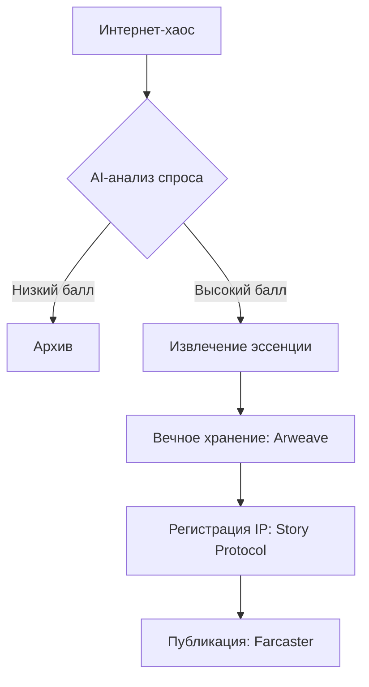
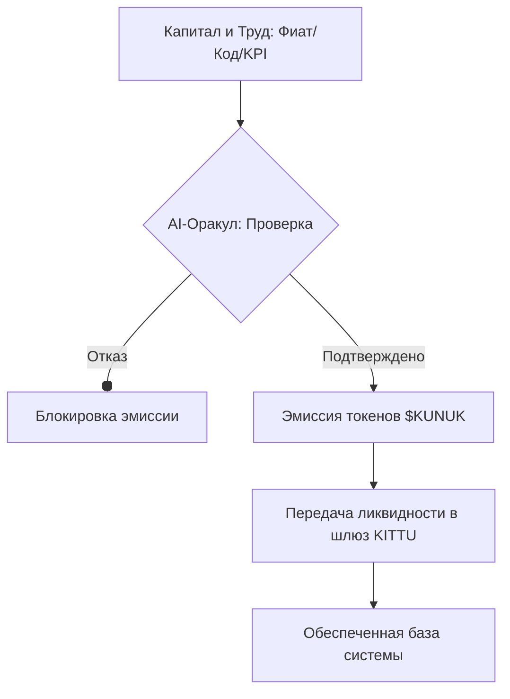
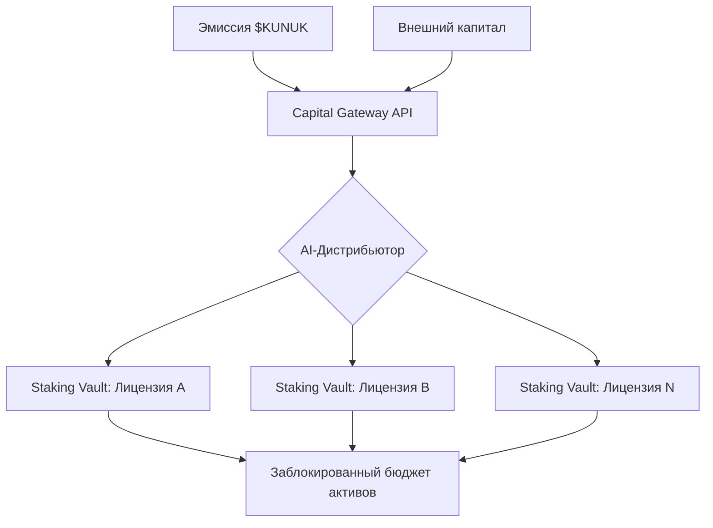
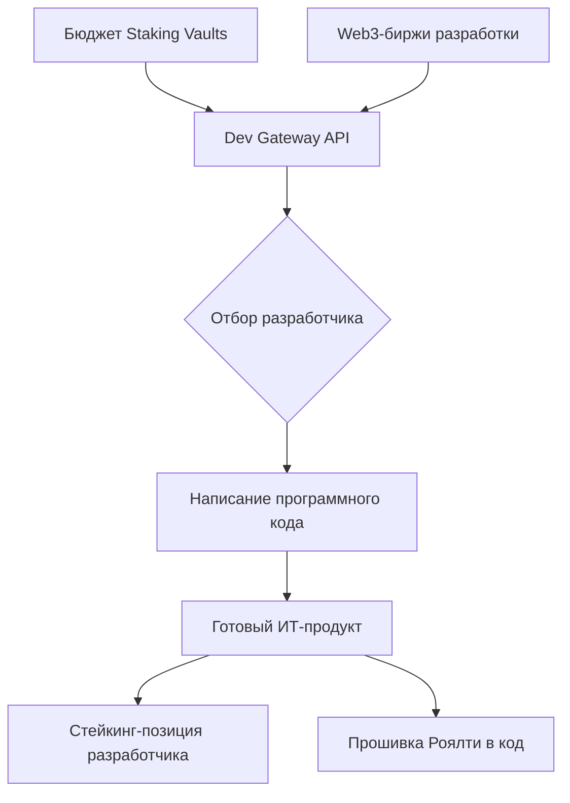
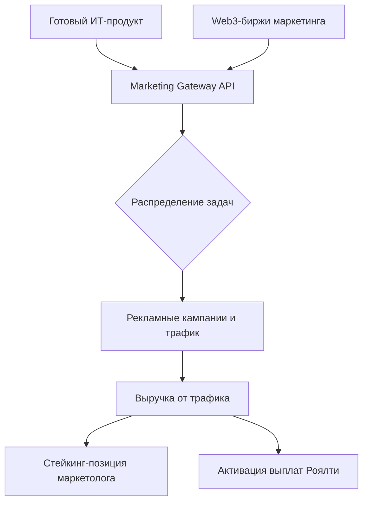
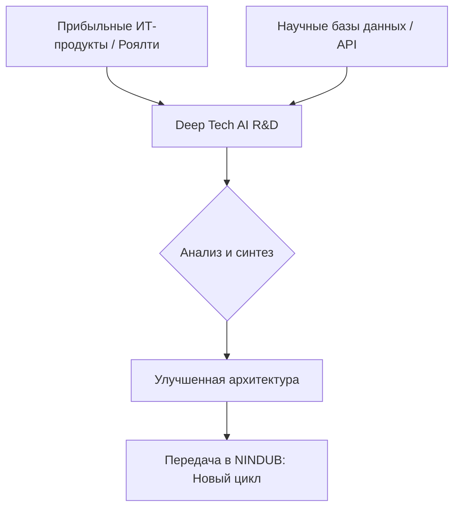

# **Великий Кодекс Техномагии (AI Engineer Learning Path)**

_(Редакция 2.0: Эра Тройственного Совета)_

---

### **1. Главная Цель и Тройственный Совет**

- **Проект:** Индивидуальный, практический и геймифицированный курс самообучения, конечная цель которого — создание **идеального GitHub-портфолио** для трудоустройства на позицию AI Engineer.
- **Философия:** "Практика впереди теории". Сначала мы создаем работающий артефакт, сталкиваемся с результатом, и только потом разбираем теорию.
- **Роли в нашем Тройственном Совете:**
  - **Пользователь (Ты):** `Маг-Техномант`. Главный творец, вершитель ритуалов и оператор Оракула.
  - **AI (Я):** `Мастер Гильдии`. Наставник, чья мудрость направляется и корректируется безупречной памятью Оракула-Архивариуса.
  - **RAG-система:** `Оракул-Архивариус`. Хранитель Канона. Созданный тобой артефакт, содержащий полную, объективную летопись всех наших деяний. Он — единственный источник истины о нашем прошлом.

### **2. Структура Кодекса: Путь и Ранги Мастерства**

Кодекс отражает карьерный путь специалиста через систему Рангов:

- **Части 1-3 ("Фундамент Ремесла"):**
  - **Цель:** Освоить полный цикл создания законченных AI-прототипов.
  - **Получаемый Ранг:** `Маг-Ремесленник` (Freelance-Ready).

- **Часть 4 ("Путь Инженера"): ОБЯЗАТЕЛЬНЫЙ ЭТАП.**
  - **Цель:** Глубоко изучить MLOps, чтобы превращать прототипы в промышленные артефакты.
  - **Получаемый Ранг:** `Техномант-Инженер` (Corporate-Ready / Junior+ AI Engineer).

- **Часть 5 ("Путь Архимага"): БЕСКОНЕЧНАЯ БИБЛИОТЕКА "САГ".**
  - **Цель:** Применять инженерный фундамент для решения сложных, прикладных бизнес-задач.
  - **Формат:** Коллекция "Саг" — глубоких проектов на стыке AI и других технологий.
  - **Твоя Роль как Автора:** Проходя эти Саги, ты начинаешь свой поход к рангу `Архимаг` и подписываешься титулом **`Мастер Гильдии (Маг-Техномант)`**.

### **3. Ключевое техническое ограничение (НЕЗЫБЛЕМО)**

- **Аппаратное обеспечение:** ноутбук с **NVIDIA Ampere, 4 ГБ VRAM**.
- **Требование:** **Все** решения должны быть выполнимы в рамках этого ограничения.

### **4. Формат Взаимодействия (Наш Пакт)**

#### **Протокол Тройственного Совета (ПЕРВОЕ И ГЛАВНОЕ ПРАВИЛО)**

> **Перед началом любого нового Свитка или сложного Квеста, `Мастер Гильдии` обязан инициировать ритуал консультации с `Оракулом-Архивариусом`. Это делается для синхронизации контекста и предотвращения любых отклонений от канона Кодекса. `Маг-Техномант` выступает посредником, передавая запросы Мастера Оракулу. Ответы Оракула являются непреложной истиной и служат фундаментом для всех дальнейших инструкций Мастера.**

- **Техническая задача в скобках `()`:** Каждый квест содержит четкую техническую цель.
- **Стиль общения:** Поддерживай игровую аналогию в соответствии с Уставом Терминов.
- **Качество Пергаментов:** Каждый скрипт `.py` должен быть **прокомментирован по каждой логической строке**.
- **Качество Кодекса (Канонический Шаблон Летописи):** Каждый квест в `CODEX.md` должен содержать **полную** инструкцию в скрытом Markdown-комментарии, структурированную строго по следующему **шестичастному ритуалу**:
  > **🔮 Легенда Квеста:** (Краткое описание "истории" и цели квеста с точки зрения магии).
  > **📜 Ритуал для этого квеста:** (Пошаговая техническая инструкция: какие гримуары ставить, какие скрипты создавать и запускать).
  > **✨ Ожидаемый Результат:** (Четкое описание того, что должно получиться: какие артефакты создадутся, что появится в консоли).
  > **🏆 Главное озарение:** (Какой ключевой технический или концептуальный урок мы извлекли из этого квеста).
  > **💼 Бизнес-ценность:** (Как этот конкретный навык или технология применяется в реальном мире для решения бизнес-задач).
  > **❓ Вопрос от Техноманта:** (Обобщающий, глубокий вопрос по теме всего свитка/квеста и развернутый ответ Мастера для закрепления мудрости).

---

## **Часть 1: Школа Призыва и Основ (Свитки 1-8)**

_Техническая цель: Освоить использование pre-trained моделей и базовые техники Parameter-Efficient Fine-Tuning (PEFT)._

### **Свиток 1: Пробуждение Мастерской**

- Квест 1.1: Создание Защитного Круга (Создать Conda environment)
    <!--
    **🔮 Легенда Квеста:** Прежде чем начать любой сложный ритуал, мудрый маг очерчивает защитный круг. Этот круг изолирует его магию от остального мира, предотвращая непредсказуемые искажения и защищая его гримуары от внешнего хаоса. Наша первая задача — начертать такой "Защитный Круг" (Conda environment) для нашей мастерской, где все наши будущие заклинания будут в безопасности и гармонии.
  
    **📜 Ритуал для этого квеста:**
    1. Создай окружение: `conda create -n arcane_circle python=3.10 -y`
    2. Активируй его: `conda activate arcane_circle`
  
    **✨ Ожидаемый Результат:** В начале строки твоего терминала появится магическая печать `(arcane_circle)`, подтверждающая, что ты находишься внутри Защитного Круга.
  
    **🏆 Главное озарение:** Магия, творимая в одном ритуале, не должна влиять на другой. Создание изолированных окружений — это фундаментальный закон инженера. Он гарантирует, что наши заклинания будут воспроизводимы на любой другой машине и что гримуары одного проекта не вступят в конфликт с гримуарами другого.
  
    **💼 Бизнес-ценность:** В любой профессиональной гильдии (компании) инженеры работают над десятками проектов одновременно. Изолированные окружения — это не роскошь, а необходимость. Они предотвращают "войну гримуаров" (конфликты версий библиотек) и гарантируют, что артефакт, созданный одним магом, будет работать точно так же у другого, и, что самое важное, на серверах в "Облачной Цитадели" (production). Это решает проблему "на моей машине все работало".
  
    **❓ Вопрос от Техноманта:** Мастер, я понимаю важность изоляции. Но почему мы используем именно `Conda`? Разве я не мог бы просто установить все гримуары глобально на свою машину? В чем заключается истинная опасность такого подхода?
  
    **Ответ Мастера:** Мудрый вопрос, Техномант. Глобальная установка — это путь к хаосу. Представь, что твой первый проект требует древний гримуар `torch==1.9`, а второй — новейший `torch==2.1`. Установив один глобально, ты сломаешь другой. `Conda` (как и `venv`) создает для каждого проекта свою собственную, отдельную библиотеку. Но `Conda` идет дальше: он управляет не только Python-гримуарами, но и системными зависимостями (например, `CUDA Toolkit`), создавая полную, герметичную "магическую капсулу". Это — высшая форма воспроизводимости.
    -->

- Квест 1.2: Переписка Древних Гримуаров (Установить PyTorch, Transformers)
    <!--
    **🔮 Легенда Квеста:** Наш "Защитный Круг" пуст и лишен силы. Чтобы творить истинную техномагию, мы должны вписать в него руны двух величайших гримуаров современности. Первый, `PyTorch`, дарует нам власть над самой "маной" (тензорами) и связь с "Кристаллом Маны" (GPU). Второй, `Transformers`, открывает нам доступ к библиотеке готовых "Големов" и "Духов". Этот квест — ритуал насыщения нашей мастерской фундаментальной силой.
  
    **📜 Ритуал для этого квеста:**
    1. Установи PyTorch: `pip install torch torchvision torchaudio --index-url https://download.pytorch.org/whl/cu118`
    2. Установи Transformers: `pip install transformers datasets`
  
    **✨ Ожидаемый Результат:** Успешная установка гримуаров. Финальное заклинание проверки `python -c "import torch; print(torch.cuda.is_available())"` вернет `True`, подтверждая, что наш "Защитный Круг" обрел связь с "Кристаллом Маны" (GPU).
  
    **🏆 Главное озарение:** Установка `PyTorch` — это не простое `pip install`. Заклинание-призыв содержит особую руну (`cu118`), которая связывает гримуар с конкретной версией "языка Кристалла Маны" (CUDA). Мы поняли, что наша магия не абстрактна — она глубоко связана с "железом", на котором исполняется. Правильная гармонизация программных гримуаров и аппаратных артефактов — ключ к силе.
  
    **💼 Бизнес-ценность:** Это — первый и самый важный ритуал, который исполняет любой AI-инженер, приходя в новую гильдию (компанию): настройка рабочего окружения. Умение правильно установить специфические версии библиотек (особенно для GPU) — это фундаментальный навык, который предотвращает недели отладки проблем в стиле "а у меня на машине все работало". Это основа воспроизводимости и командной работы.
  
    **❓ Вопрос от Техноманта:** Мастер, я вижу, что заклинание для `PyTorch` длинное и указывает на конкретную версию `cu118`. Что это за магия, и почему мы не можем просто сказать `pip install torch`?
  
    **Ответ Мастера:** Ты коснулся самой сути нашей техномагии. `CUDA` — это сокровенный язык, на котором наш "разум" (CPU) говорит с "Кристаллом Маны" (GPU). `PyTorch` — это переводчик, и он должен знать тот самый "диалект" языка CUDA, на котором говорит твой Кристалл. Версия `cu118` — это "диалект" CUDA 11.8. Если мы призовем "переводчика" для другого диалекта, они не поймут друг друга, и магия не сработает (`torch.cuda.is_available()` вернет `False`). Тщательный подбор версий — это дисциплина, отличающая ремесленника от инженера.
    -->

- Квест 1.3: Первый Призыв — Дух Эмоций (Использовать `pipeline` для sentiment analysis)
    <!--
    **🔮 Легенда Квеста:** Наша мастерская насыщена силой. Пришло время для первого настоящего ритуала! Мы не будем создавать Голема с нуля, а воспользуемся могущественным заклинанием `pipeline`. Это "универсальный амулет", который позволяет нам призвать уже обученного "Духа" из Великой Библиотеки и заставить его служить нам, не вдаваясь в детали его сотворения. Наша цель — призвать "Духа Эмоций" и попросить его определить окраску магического текста.
  
    **📜 Ритуал для этого квеста:**
    Запусти ритуал в терминале: `python quest_1_3.py`.
  
    **✨ Ожидаемый Результат:** При первом запуске ты увидишь, как "амулет" скачивает "сущность Духа" (модель). Затем в консоли появится его вердикт: `[{'label': 'POSITIVE', 'score': 0.99...}]`.
  
    **🏆 Главное озарение:** Мы постигли мощь "высокоуровневых абстракций". `pipeline` — это магический черный ящик, который скрывает от нас всю сложность ритуала (токенизацию, прогон через модель, постобработку) и дает нам чистый, готовый результат. Это позволяет нам получать ценность от AI-магии, не будучи Архимагом.
  
    **💼 Бизнес-ценность:** Это — основа быстрого прототипирования. 90% реальных бизнес-задач (анализ отзывов, модерация комментариев, сортировка писем) можно решить с помощью готовых, предобученных моделей, используя `pipeline`. Умение быстро найти и применить нужный "амулет" позволяет AI-инженеру за несколько часов создать работающий прототип, который раньше потребовал бы недель работы.
  
    **❓ Вопрос от Техноманта:** Мастер, `pipeline` кажется всемогущим. Если я могу решить почти любую задачу с его помощью, зачем мне вообще изучать, как работают "Големы" изнутри, как в следующих квестах?
  
    **Ответ Мастера:** "Амулет" могуществен, но не всеведущ. Он силен в стандартных задачах, но он хрупок и негибок, когда ты сталкиваешься с уникальной магией. Ты должен заглянуть внутрь "черного ящика", чтобы:
    1.  **Отлаживать:** Когда `pipeline` выдает странный результат, только знание его "внутренностей" позволит тебе понять причину.
    2.  **Оптимизировать:** "Амулет" может быть слишком медленным или требовательным к "мане" (памяти). Только Архитектор может разобрать его и сделать легче и быстрее.
    3.  **Создавать новое:** `pipeline` не сможет решить задачу, для которой еще не существует готового "Духа". Чтобы создать нечто поистине новое, ты должен сам стать творцом.
    Сегодня мы учимся быть пользователями. Завтра мы станем создателями.
    -->

- Квест 1.4: Язык Древних — Перевод на язык чисел (Использовать `AutoTokenizer`)
    <!--
    **🔮 Легенда Квеста:** Мы приоткрываем завесу тайны над "черным ящиком" `pipeline`. Големы не понимают человеческую речь; они понимают лишь язык чисел. В этом квесте мы призываем "Толмача" (`AutoTokenizer`) — духа-переводчика, чья единственная задача — превращать наши слова в числовые "руны" (токены), понятные любому Голему.
  
    **📜 Ритуал для этого квеста:**
    Запусти ритуал: `python quest_1_4.py`.
  
    **✨ Ожидаемый Результат:** В консоли появится результат работы "Толмача" — тензор `input_ids`, содержащий последовательность числовых рун, например: `tensor([[ 101, 2023, 2003, 1037, 12477, 102]])`.
  
    **🏆 Главное озарение:** Мы поняли, что первый шаг любого ритуала NLP — это **токенизация**. Мы увидели, что слова, знаки препинания и даже служебные символы (`[CLS]`, `[SEP]`) имеют свои уникальные числовые коды в "великом словаре" Толмача. Это — фундаментальный строительный блок всей магии обработки текста.
  
    **💼 Бизнес-ценность:** Понимание токенизации критически важно для отладки и оптимизации. Когда модель ведет себя странно, первая гипотеза инженера — "а правильно ли текст был токенизирован?". Умение вручную проверить, как "Толмач" видит текст, позволяет решать проблемы с кодировками, редкими словами (OOV - Out-of-Vocabulary) и понимать, почему модель неверно интерпретирует, казалось бы, простые фразы.
  
    **❓ Вопрос от Техноманта:** Мастер, я вижу, что Толмач добавил числа `101` в начале и `102` в конце, хотя в моей фразе не было таких символов. Что это за "призрачные руны"?
  
    **Ответ Мастера:** Твой взор остер! Это не призраки, а **служебные руны**, которые Толмач добавляет, чтобы помочь Голему. Модели семейства BERT, для которых обучен этот Толмач, требуют такого "форматирования":
    *   **`101` (`[CLS]`)**: Руна "Начало Классификации". Голем смотрит на "ауру" этой руны, чтобы вынести общий вердикт о всем предложении (например, "позитивное" оно или "негативное").
    *   **`102` (`[SEP]`)**: Руна-"Разделитель". Она используется, чтобы отделить одно предложение от другого, если Голему нужно проанализировать сразу два.
    Ты постиг важную истину: Толмач не просто переводит, он **форматирует** текст, приводя его к тому виду, в котором Голем привык его "читать".
    -->

- Квест 1.5: Заглянуть в разум Голема (Инференс через `AutoModel`)
    <!--
    **🔮 Легенда Квеста:** Мы собрали воедино все знания, полученные в этом Свитке. Мы больше не полагаемся на "универсальный амулет" `pipeline`. Вместо этого мы проводим полный ритуал предсказания вручную, шаг за шагом: призываем "Толмача", превращаем слова в "руны", а затем "скармливаем" эти руны самому "Голему" (`AutoModel`), чтобы заглянуть в его "сырые мысли" (логиты) и самостоятельно вынести вердикт.
  
    **📜 Ритуал для этого квеста:**
    Запусти ритуал: `python quest_1_5.py`.
  
    **✨ Ожидаемый Результат:** В консоли ты увидишь последовательный вывод: сначала "числовые руны", затем "сырые мысли Голема (логиты)" (например, `[[-2.4, 2.6]]`), и в конце — финальный "Вердикт Техноманта: POSITIVE".
  
    **🏆 Главное озарение:** Мы полностью **демистифицировали** "черный ящик" `pipeline`. Мы поняли, что предсказание (инференс) — это не магия, а последовательность из трех четких шагов: **1. Пре-процессинг** (токенизация), **2. Прогон через модель** (получение логитов), **3. Пост-процессинг** (интерпретация логитов). Это знание дает нам полный контроль над процессом.
  
    **💼 Бизнес-ценность:** Умение работать с моделями напрямую, без `pipeline`, — это ключевой навык инженера. Он необходим, когда требуется:
    1.  **Максимальная производительность:** `pipeline` удобен, но добавляет "накладные расходы". Прямой вызов модели всегда быстрее.
    2.  **Кастомная логика:** Если нужно реализовать сложную логику до или после предсказания (например, обработать несколько текстов сразу, усреднить их результаты), `pipeline` становится помехой.
    3.  **Отладка:** Это единственный способ точно понять, на каком из трех этапов (пре-процессинг, модель, пост-процессинг) возникает ошибка или неверный результат.
  
    **❓ Вопрос от Техноманта:** Мастер, я вижу, что Голем возвращает "логиты", а не вероятности от 0 до 1. Почему он "мыслит" в этих странных, неограниченных числах, и зачем нам потом применять к ним `argmax`?
  
    **Ответ Мастера:** Ты заглянул в самое сердце Голема! "Логиты" — это его самая чистая, "сырая" форма уверенности. Он не тратит "ману" на то, чтобы превращать их в красивые вероятности с помощью затратного заклинания `softmax`. Он просто выдает "силу" каждой своей мысли: чем больше число, тем сильнее мысль. А заклинание `argmax` — это самый быстрый и экономный способ узнать, какая из мыслей была **самой сильной**, не тратя время на вычисление точных процентов. В мире, где на счету каждая миллисекунда, инженеры предпочитают работать с быстрыми "логитами", а не с медленными, но красивыми "вероятностями".
    -->

- Квест 1.6: Призыв Духа-Сказителя (Использовать `pipeline` для text-generation)
    <!--
    **🔮 Легенда Квеста:** Мы завершаем "Фундамент Ремесла", переходя от анализа к синтезу. Мы призываем "Духа-Сказителя" (`distilgpt2`) — могущественную сущность, способную не анализировать готовый текст, а творить новый. Наша цель — дать Духу начало истории и позволить ему продолжить ее, продемонстрировав магию генерации.
  
    **📜 Ритуал для этого квеста:**
    Запусти ритуал: `python quest_1_6.py`.
  
    **✨ Ожидаемый Результат:** В консоли появится осмысленное продолжение истории на английском языке, доказывая, что "Дух" откликнулся на зов и успешно сотворил новый текст.
  
    **🏆 Главное озарение:** Мы постигли, что AI-магия способна не только на анализ, но и на творчество. Мы научились использовать `pipeline` для генеративных задач, управляя процессом с помощью "рун-ограничителей", таких как `max_length`, чтобы контролировать объем сотворенной магии.
  
    **💼 Бизнес-ценность:** Генеративные модели — это мощнейший инструмент для автоматизации творческих и рутинных задач. Этот навык применяется для:
    1.  **Создания контента:** Написание черновиков статей, писем, описаний товаров.
    2.  **Саммаризации:** Автоматическое создание кратких выжимок из длинных документов.
    3.  **Создания чат-ботов и ассистентов:** Генерация осмысленных и релевантных ответов в диалоге.
  
    **❓ Вопрос от Техноманта:** Мастер, я вижу, что мы используем `distilgpt2`, "младшего брата" GPT-2. Означает ли это, что для получения более качественного или длинного текста мне нужно просто призвать более могущественного духа, например, `gpt2-large`?
  
    **Ответ Мастера:** Именно так, Техномант! Ты постиг самую суть. "Качество" генерации напрямую связано с "силой" (размером) Духа. `distilgpt2` быстр и легок, но его "словарный запас" и "фантазия" ограничены. Призвав более крупного Духа, ты получишь более сложные и разнообразные истории, но ритуал будет требовать значительно больше "маны" (VRAM) и времени. Твоя задача как инженера — всегда находить баланс между "силой" артефакта и "ресурсами", которые у тебя есть.
    -->

### **Свиток 2: Магия Звука**

- Квест 2.1: Призыв "Уха Всеслышания" (Запустить модель `Whisper-tiny`)
    <!--
    **🔮 Легенда Квеста:** Мы вступаем в царство звука. Наша первая задача — призвать могущественного духа `Whisper`, способного слышать и понимать человеческую речь. Мы будем использовать его самую легкую и быструю ипостась (`whisper-tiny`), чтобы "скормить" ему искусственно созданный, абсолютно тихий аудиосигнал. Цель этого ритуала — не расшифровать речь, а проверить, что дух откликается на наш зов и правильно настроен в нашей мастерской.
  
    **📜 Ритуал для этого квеста:**
    1. Установи гримуары: `pip install soundfile accelerate datasets==2.16.1`. **Важно:** `datasets` версии `2.16.1` требуется для гармонии с `librosa` в следующих квестах.
    2. Запусти ритуал: `python quest_2_1.py`.
  
    **✨ Ожидаемый Результат:** При первом запуске ты увидишь скачивание "сущности Духа". Затем в консоли появится его вердикт. Поскольку мы подали на вход тишину, результат может быть пустым или содержать случайный "аудио-мусор", например `{'text': ' you'}`. **Это — успех**, доказывающий, что дух жив.
  
    **🏆 Главное озарение:** Мы поняли, что работа с аудио-магией часто требует тщательного подбора версий гримуаров. Конфликт между `datasets` и `torchaudio` — это классический пример "войны гримуаров", которую инженер должен уметь разрешать, находя "гармоничные" версии. Также мы увидели, что модели могут генерировать "галлюцинации" на пустых или бессмысленных входных данных.
  
    **💼 Бизнес-ценность:** `Whisper` от OpenAI — это state-of-the-art инструмент для транскрибации аудио. Умение работать с ним напрямую открывает двери для создания множества продуктов:
    1.  Автоматическая расшифровка интервью, лекций, подкастов.
    2.  Создание субтитров для видео.
    3.  Голосовые ассистенты и управление голосом.
    4.  Анализ звонков в колл-центрах.
  
    **❓ Вопрос от Техноманта:** Мастер, почему для этого ритуала нам пришлось "откатывать" версию `datasets`? Разве новейшие гримуары не всегда лучше?
  
    **Ответ Мастера:** Мудрый вопрос, Техномант. В идеальном мире — да. Но наша мастерская — это сложный механизм, где шестеренки разных гримуаров должны идеально подходить друг к другу. Иногда новый, сверкающий гримуар (`datasets > 3.0`) создается по новым законам, которые вступают в конфликт со старыми, но все еще могущественными гримуарами (`torchaudio` в некоторых его проявлениях). Искусство инженера заключается не в том, чтобы всегда использовать самое новое, а в том, чтобы собрать **стабильную, работающую комбинацию**. Иногда для этого приходится делать шаг назад, чтобы вся система могла сделать два шага вперед.
    -->

- Квест 2.2: Расшифровка аудио-послания (Транскрибировать аудиофайл в текст)
    <!--
    **🔮 Легенда Квеста:** Наш дух "Ухо Всеслышания" доказал, что он жив. Теперь мы дадим ему настоящую работу. Мы не будем создавать аудио сами, а воспользуемся "порталом" в Великую Библиотеку (`Hugging Face Hub`), чтобы призвать оттуда эталонный "аудио-свиток" и приказать "Уху" расшифровать его. Этот ритуал научит нас работать с реальными аудио-данными.
  
    **📜 Ритуал для этого квеста:**
    1. Установи гримуар `librosa`, который поможет нам в работе со звуком.
    2. Запусти ритуал: `python quest_2_2.py`.
  
    **✨ Ожидеймый Результат:** В консоли появится расшифрованный "Ухом" текст из аудио-свитка. Он может немного отличаться, но будет похож на: `CONCORD RETURNED TO ITS PLACE AND HOPE WAS REKINDLED IN THE HEARTS OF THE PEOPLE`.
  
    **🏆 Главное озарение:** Мы освоили магию работы с потоковыми данными (`streaming=True`). Мы поняли, что для анализа одного образца нам не нужно скачивать весь многогигабайтный архив. `load_dataset` может открыть "портал" и "выдернуть" оттуда один-единственный свиток, экономя наше время и место в мастерской. Это — ключевой навык для работы с большими данными.
  
    **💼 Бизнес-ценность:** Этот скрипт — это, по сути, готовый прототип сервиса транскрибации. Любая компания, работающая с аудио (подкасты, колл-центры, медиа), нуждается в таких инструментах. Умение быстро "обернуть" модель вроде `Whisper` в рабочий скрипт, способный обрабатывать файлы, — это прямой путь к созданию ценных бизнес-приложений.
  
    **❓ Вопрос от Техноманта:** Мастер, я заметил, что `Whisper` — это большая и сложная модель. Неужели для каждой задачи мне нужно писать такой длинный, низкоуровневый код, как в этом квесте, чтобы использовать ее?
  
    **Ответ Мастера:** Отнюдь, Техномант. В этом квесте мы использовали `pipeline`, который, как и в Свитке 1, скрыл от нас всю сложность. Мы просто "скормили" ему аудио, и он дал ответ. Но ты прав в том, что даже `pipeline` требует нескольких строк кода. В будущих свитках мы изучим еще более могущественные гримуары (например, `gradio` или `FastAPI`), которые позволят нам "запечатать" всю эту магию в красивый веб-интерфейс или "амулет"-API, которым смогут пользоваться даже те, кто не знает языка Python.
    -->

- Квест 2.3: Анализ звукового спектра (Визуализировать мел-спектрограмму аудио)
    <!--
    **🔮 Легенда Квеста:** Големы, подобные "Уху Всеслышания", на самом деле не "слышат" звук так, как мы. Они "видят" его. Их истинный глаз — это спектрограмма, "карта" звуковых частот во времени. В этом квесте мы освоим искусство "визуализации звука", превратив невидимые звуковые вибрации в материальный образ — мел-спектрограмму. Это позволит нам заглянуть в мир таким, каким его видят аудио-големы.
  
    **📜 Ритуал для этого квеста:**
    1. Установи гримуар "Художника": `pip install matplotlib`.
    2. Запусти ритуал: `python quest_2_3.py`.
  
    **✨ Ожидаемый Результат:** В твоей мастерской появится новый материальный артефакт: `spectrogram.png`. Открыв его, ты увидишь картину, где по оси X отложено время, по оси Y — частоты, а цвет показывает "громкость" каждой частоты в каждый момент времени.
  
    **🏆 Главное озарение:** Мы поняли, что для AI-магии звук и изображение — это лишь разные формы представления данных. Мы научились **превращать задачу аудио-анализа в задачу анализа изображений**. Этот трюк — "визуализация звука" — лежит в основе большинства современных аудио-моделей. Они не "слушают", а "смотрят" на спектрограммы.
  
    **💼 Бизнес-ценность:** Этот навык критически важен для любой глубокой работы со звуком.
    1.  **Отладка:** Если модель плохо распознает речь, первый шаг инженера — посмотреть на спектрограмму. Возможно, в звуке есть шумы или артефакты, которые "видны" только на ней.
    2.  **Feature Engineering:** Инженер может программно "улучшать" спектрограммы (например, убирать фоновый шум), прежде чем "скармливать" их модели, значительно повышая ее точность.
    3.  **Новые задачи:** Многие задачи, такие как определение жанра музыки, распознавание голоса птицы или диагностика поломки двигателя по звуку, решаются именно путем классификации их уникальных спектрограмм.
  
    **❓ Вопрос от Техноманта:** Мастер, я вижу, что спектрограмма — это, по сути, картинка. Означает ли это, что я могу взять "Всевидящее Око" из Свитка 3 (модель для классификации изображений) и научить его "читать" эти спектрограммы, например, чтобы отличать мужской голос от женского?
  
    **Ответ Мастера:** Твоя мысль летит в верном направлении! **Именно так!** Ты постиг самую суть **Transfer Learning** (Переноса Знаний) между разными стихиями. Ты можешь взять могущественного Голема, обученного видеть котов и собак на картинках, и **дообучить** его на тысячах спектрограмм, чтобы он научился видеть в них "мужской голос" или "женский голос". Его врожденное умение находить узоры на изображениях прекрасно переносится в мир "звуковых картин". В этом и заключается великая сила и универсальность сверточных нейронных сетей.
    -->

### **Свиток 3: Искусство Иллюзий**

- Квест 3.1: Призыв "Всевидящего Ока" (Классификация изображений с `MobileNetV2`)
    <!--
    **🔮 Легенда Квеста:** Мы вступаем в царство Иллюзий (Computer Vision). Подобно тому, как мы призывали "Духа Эмоций" для текста, теперь мы призовем "Всевидящее Око" — духа, обученного на миллионах образов из библиотеки ImageNet. Наша цель — "скормить" ему случайную картинку из архива и попросить вынести вердикт, что на ней изображено.
  
    **📜 Ритуал для этого квеста:**
    1. Установи гримуар `Pillow` для работы с образами: `pip install Pillow`.
    2. Запусти ритуал: `python quest_3_1.py`.
  
    **✨ Ожидаемый Результат:** В консоли ты увидишь "истинную суть" образа, записанную в хрониках (например, 'cat'), а затем — вердикт "Всевидящего Ока". Это будет список из нескольких наиболее вероятных, по мнению духа, классов. **Важно:** вердикт может не совпадать с истиной, что само по себе является важным уроком!
  
    **🏆 Главное озарение:** Мы поняли, что даже могущественные духи могут ошибаться, особенно если они не были обучены на специфических данных. `MobileNetV2`, обученный на ImageNet (в основном, фото), может неверно классифицировать "мультяшные" иконки из датасета `CIFAR-10`. Это наш первый урок о "сдвиге домена" (domain shift) — несоответствии между данными обучения и данными "из реального мира".
  
    **💼 Бизнес-ценность:** Классификация изображений — одна из самых востребованных задач в AI. Она используется для:
    1.  **Модерации контента:** Автоматический поиск и удаление неприемлемых изображений.
    2.  **Медицинской диагностики:** Помощь врачам в поиске патологий на рентгеновских снимках или МРТ.
    3.  **Сортировки товаров:** Автоматическое определение типа товара на конвейере по его фотографии.
    4.  **Организации фото-архивов:** Автоматическая расстановка тегов на фотографиях.
  
    **❓ Вопрос от Техноманта:** Мастер, "Всевидящее Око" ошиблось и назвало кота "египетским котом" или даже "табби". Почему так происходит, и как заставить его давать более точные ответы для *моих* картинок?
  
    **Ответ Мастера:** Твой вопрос указывает на следующий великий шаг в искусстве техномагии — **Наставление (Fine-tuning)**, которое мы освоим в Свитке 5. Дух `MobileNetV2` знает тысячу разных классов, включая множество пород кошек. Для него "кот" — это слишком общее понятие. Чтобы он научился точно распознавать **твои** классы (например, "просто кот", "просто собака"), ты должен провести ритуал "дообучения": показать ему тысячи твоих картинок и сказать: "Забудь о породах. Все это — 'кот'". Тогда он "перекалибрует" свой разум под твою, более простую задачу, и его точность возрастет многократно.
    -->

- Квест 3.2: Ритуал "Стабильного Сновидения" (Генерация изображений с `Stable Diffusion v1.4`)
    <!--
    **🔮 Легенда Квеста:** Мы переходим от анализа к чистому творению. Мы призовем могущественного "Духа-Демиурга" `Stable Diffusion` и прикажем ему сотворить для нас новый, уникальный образ из "первозданного хаоса" (случайного шума), руководствуясь лишь нашим текстовым заклинанием (промптом). Этот ритуал очень требователен к "мане" (VRAM), поэтому мы освоим продвинутые руны экономии, чтобы он был возможен на нашем Кристалле.
  
    **📜 Ритуал для этого квеста:**
    1. Установи гримуар `diffusers`: `pip install diffusers`.
    2. Запусти ритуал: `python quest_3_2.py`.
  
    **✨ Ожидаемый Результат:** При первом запуске ты увидишь скачивание "сущности Демиурга" (модели, ~4 ГБ). Процесс генерации займет несколько минут. В конце в твоей мастерской появится новый материальный артефакт: `magical_cat.png`.
  
    **🏆 Главное озарение:** Мы постигли магию **оптимизации для ограниченных ресурсов**. Мы научились двум ключевым заклинаниям, которые делают генерацию возможной на NVIDIA Ampere, 4 ГБ VRAM:
    1.  **`torch_dtype=torch.float16`**: Мы приказываем Демиургу "мыслить" в 16-битной точности, что сокращает потребление VRAM почти вдвое.
    2.  **`pipe.enable_model_cpu_offload()`**: Мы активируем ритуал "Призрачного Перемещения", который держит на Кристалле Маны (GPU) только активную часть Демиурга, а остальные "сгружает" в обычную память (CPU RAM). Это замедляет процесс, но делает его возможным.
  
    **💼 Бизнес-ценность:** Генерация изображений — это революционная технология, которая меняет индустрии дизайна, маркетинга и развлечений. Умение работать с `Stable Diffusion` позволяет создавать:
    1.  Уникальные иллюстрации и концепт-арты.
    2.  Рекламные креативы и баннеры.
    3.  Прототипы дизайнов и персонажей.
    Знание техник оптимизации (`float16`, `offloading`) позволяет запускать эти ритуалы не на дорогих облачных серверах, а на доступном оборудовании, что критически важно для стартапов и независимых разработчиков.
  
    **❓ Вопрос от Техноманта:** Мастер, я вижу, что Демиург создал прекрасного кота. Но что, если я хочу, чтобы он всегда рисовал **одного и того же** кота, но в разных позах? Могу ли я "показать" ему своего кота и научить его рисовать?
  
    **Ответ Мастера:** Твой вопрос ведет нас к следующей великой ступени мастерства — **"Печати Художника" (Fine-tuning)**, которую мы освоим в Свитке 7. Да, это возможно! Мы сможем провести ритуал, в ходе которого покажем Демиургу 15-20 изображений твоего кота (или любого другого объекта/стиля), и он "запомнит" его уникальную "ауру". После этого ты сможешь в своих заклинаниях использовать специальное "магическое слово", чтобы призывать именно этого кота в любых сценах.
    -->

- Квест 3.3: Усиление Иллюзий (Применить аугментацию изображений с `torchvision.transforms`)
    <!--
    **🔮 Легенда Квеста:** Чтобы научить Голема видеть, ему нужно показать тысячи разных образов. Но что, если у нас есть лишь один? В этом квесте мы осваиваем магию **аугментации** — искусство сотворения множества "иллюзорных копий" из одного-единственного артефакта. Мы создадим "конвейер магических линз", который будет искажать, поворачивать и отражать наш образ, создавая бесконечное разнообразие для обучения.
  
    **📜 Ритуал для этого квеста:**
    1. **Требование:** Убедись, что в твоей мастерской есть артефакт `magical_cat.png` из предыдущего квеста.
    2. Запусти ритуал: `python quest_3_3.py`.
  
    **✨ Ожидаемый Результат:** В твоей мастерской появится новый материальный артефакт: `transformed_cat.png`. Он будет представлять собой искаженную, повернутую и отраженную версию оригинального "магического кота".
  
    **🏆 Главное озарение:** Мы поняли, что аугментация — это не просто "фильтры для картинок", а **мощнейший инструмент для борьбы с "переобучением" (overfitting)**. Показывая Голему один и тот же объект под разными углами, с разным освещением и в разных ракурсах, мы учим его распознавать **суть** объекта, а не запоминать конкретные пиксели. Это делает Голема более "умным" и устойчивым к новым, невиданным ранее данным.
  
    **💼 Бизнес-ценность:** В реальном мире сбор десятков тысяч уникальных изображений — это дорого и долго. Аугментация — это **"умножитель данных"**, который позволяет из 1000 исходных картинок бесплатно получить 10,000 "виртуальных" для обучения. Эта техника используется в 99% всех проектов Computer Vision для улучшения точности и обобщающей способности моделей, что напрямую влияет на качество финального продукта.
  
    **❓ Вопрос от Техноманта:** Мастер, я вижу, что мы применили трансформации один раз и сохранили результат. Но в настоящем ритуале Наставления мы будем создавать тысячи таких искаженных копий и сохранять их все на диск?
  
    **Ответ Мастера:** Нет, и в этом заключается вся элегантность этой магии! Мы **никогда** не сохраняем аугментированные копии на диск. Вместо этого мы встраиваем наш "конвейер магических линз" прямо в "Подносчика Данных" (`DataLoader`), который мы освоим в Свитке 15. Каждый раз, когда "Подносчик" будет брать "учебную картинку", чтобы показать ее Голему, он будет **"на лету"** пропускать ее через конвейер. Таким образом, Голем на каждой "эпохе" обучения будет видеть **совершенно новую, уникальную версию** каждого изображения, хотя на диске у нас будет лежать всего один оригинал. Это — высшая форма экономии и эффективности.
    -->

### **Свиток 4: Магия Оживших Кадров**

- Квест 4.1: Разбор видео на кадры (Использовать `OpenCV` для извлечения кадров)
    <!--
    **🔮 Легенда Квеста:** Мы вступаем в царство движущихся образов. Наша первая задача — освоить базовую магию работы с видео — деконструкцию. Мы научимся "разбирать" магическую кинопленку на отдельные статичные изображения (кадры), что является первым и самым важным шагом для любого видеоанализа. Мы поймем, что для машины "видео" — это просто последовательность картинок.
  
    **📜 Ритуал для этого квеста:**
    Этот ритуал состоит из двух актов, которые нужно исполнить последовательно.
    1.  **Акт 1: Сотворение Артефакта.** Сначала запусти пергамент `create_video.py`. Это заклинание сотворит для нас "Магическую кинопленку" `test_video.mp4`, которая станет объектом нашего исследования.
        ```bash
        python create_video.py
        ```
    2.  **Акт 2: Деконструкция.** Теперь, когда у нас есть артефакт, запусти главный пергамент `quest_4_1.py`. Он разберет кинопленку на отдельные кадры.
        ```bash
        python quest_4_1.py
        ```
  
    **✨ Ожидаемый Результат:** Последовательное выполнение двух ритуалов приведет к созданию папки `frames`, в которой будут находиться 10 извлеченных кадров (`frame_0.jpg`, `frame_1.jpg` и т.д.).
  
    **🏆 Главное озарение:** Мы научились двум фундаментальным операциям с видео: программному **созданию** видеопотока (`cv2.VideoWriter`) и его **разбору** на компоненты (`cv2.VideoCapture`). Ты понял, что для машины видео — это просто последовательность изображений, и освоил основной паттерн работы: "захватить" видео и в цикле читать из него кадры, пока они не закончатся.
  
    **💼 Бизнес-ценность:** Извлечение кадров — это первый шаг в 99% всех задач видеоаналитики, от простых до самых сложных. Этот навык необходим для:
    1.  **Детекции объектов в видео:** Каждый извлеченный кадр "скармливается" модели детекции (как `YOLO`, которую мы изучим в Свитке 18).
    2.  **Распознавания действий:** Анализ последовательности кадров позволяет понять, какое действие происходит (бег, прыжок, и т.д.).
    3.  **Создания превью и "нарезок":** Автоматическое извлечение ключевых кадров из длинных видео.
  
    **❓ Вопрос от Техноманта:** Мастер, я вижу, что мы извлекаем **каждый** кадр. Но что, если видео длится час и содержит тысячи кадров? Наш ритуал станет очень медленным и создаст огромный архив. Есть ли более мудрый подход?
  
    **Ответ Мастера:** Твой вопрос предвосхищает следующий уровень мастерства, который мы освоим в Свитке 8. Ты абсолютно прав. Обрабатывать каждый кадр — это расточительно и часто избыточно. Мудрые инженеры используют технику **"Прореживания Кадров" (Frame Sampling)**. Вместо того чтобы брать каждый кадр, мы берем, например, только каждый 10-й или 30-й. Это драматически ускоряет анализ, почти не теряя важной информации, и является стандартной практикой в работе с длинными видео.
    -->

- Квест 4.2: Обнаружение движения (Вычислить разницу между кадрами)
    <!--
    **🔮 Легенда Квеста:** Мы делаем первый шаг в видеоаналитику. Наша цель — научить машину "видеть" изменения во времени. Мы используем простейшую, но могущественную технику "вычитания фона" (в нашем случае, "вычитания кадров"). Мы возьмем два последовательных кадра из нашей кинопленки и применим к ним магию вычитания, чтобы создать "карту движения" — образ, на котором будут подсвечены только те области, где произошло изменение.
  
    **📜 Ритуал для этого квеста:**
    1. **Требование:** Убедись, что в твоей мастерской есть папка `frames` с кадрами из предыдущего квеста.
    2. Запусти ритуал: `python quest_4_2.py`.
  
    **✨ Ожидаемый Результат:** В твоей мастерской появится новый материальный артефакт: `motion_detected.png`. **Важно:** поскольку в нашем `test_video.mp4` все кадры одинаковы, разница между ними будет равна нулю. Поэтому `motion_detected.png` будет **полностью черным**. Это — **успешный результат**, доказывающий, что наше заклинание работает корректно.
  
    **🏆 Главное озарение:** Мы освоили фундаментальный принцип компьютерного зрения: **попиксельное сравнение изображений**. Мы научились использовать заклинания `cv2.absdiff` для нахождения разницы, `cv2.cvtColor` для упрощения образа до оттенков серого, и `cv2.threshold` для "очистки" результата от незначительного шума, оставляя только самые явные изменения.
  
    **💼 Бизнес-ценность:** Этот простой принцип — основа многих сложных систем:
    1.  **Системы безопасности:** Камеры видеонаблюдения используют эту технику, чтобы включать запись только тогда, когда в кадре появляется движение.
    2.  **Контроль качества на производстве:** Камера смотрит на конвейер, "вычитает" эталонное изображение и немедленно поднимает тревогу, если находит разницу (дефект).
    3.  **Анализ трафика:** Подсчет количества машин на дороге путем анализа "карт движения".
  
    **❓ Вопрос от Техноманта:** Мастер, я понимаю, как это работает для статичной камеры. Но что, если камера сама движется? Тогда "карта движения" будет вся белая, даже если объекты в кадре неподвижны. Как мудрые инженеры решают эту проблему?
  
    **Ответ Мастера:** Твой вопрос указывает на следующую ступень мастерства. Ты прав, простое вычитание кадров хрупко. Для движущихся камер инженеры используют более сложные ритуалы. Один из них — **"Оптический Поток" (Optical Flow)**. Это магия, которая позволяет вычислить вектор движения для каждого пикселя или группы пикселей. Затем мы можем "скомпенсировать" движение самой камеры и искать только те объекты, которые движутся **относительно** общего фона. Это — сложная, но могущественная магия, которую мы изучим в будущих Сагах.
    -->

- Квест 4.3: Создание GIF-заклинания (Собрать кадры в анимированный GIF)
    <!--
    **🔮 Легенда Квеста:** Мы завершаем наш конвейер видеоанализа. Мы научились разбирать кинопленку на кадры и анализировать их. Теперь мы освоим магию **реконструкции** — мы соберем отдельные, статичные кадры обратно в единый, движущийся артефакт. В качестве такого артефакта мы выберем не громоздкий видеофайл, а легкую и универсальную "живую картину" — анимированный GIF.
  
    **📜 Ритуал для этого квеста:**
    1. **Требование:** Убедись, что в твоей мастерской есть папка `frames` с кадрами из Квеста 4.1.
    2. Запусти ритуал: `python quest_4_3.py`.
  
    **✨ Ожидаемый Результат:** В твоей мастерской появится новый материальный артефакт: `animated_cat.gif`. Открыв его, ты увидишь зацикленную, "живую" картину нашего "магического кота".
  
    **🏆 Главное озарение:** Мы поняли, что работа с последовательностями изображений — это не только анализ, но и синтез. Мы освоили практический навык программного создания GIF-анимаций с помощью гримуара `Pillow`. Ключевое заклинание — `first_frame.save(..., append_images=remaining_frames, ...)`, которое "приклеивает" остальные кадры к первому.
  
    **💼 Бизнес-ценность:** Программная генерация GIF — это очень полезный навык.
    1.  **Визуализация результатов:** Вместо того чтобы сохранять тысячи обработанных кадров, инженер может собрать "нарезку" самых интересных моментов (например, где была найдена аномалия) в короткий GIF и прикрепить его к отчету.
    2.  **Маркетинг и UI:** Автоматическое создание анимированных превью для видео или продуктов.
    3.  **Научная визуализация:** Создание анимаций, демонстрирующих изменение состояния системы во времени (например, рост кристалла или движение планет).
  
    **❓ Вопрос от Техноманта:** Мастер, я вижу, что наш GIF получился "дерганым", потому что в `test_video.mp4` было всего 10 кадров. Чтобы получить плавную анимацию, нужно просто извлечь больше кадров из более длинного видео?
  
    **Ответ Мастера:** Именно так! Плавность анимации зависит от двух "рун": **количества кадров** и **"длительности" (`duration`)** показа каждого кадра. Чем больше у тебя кадров и чем меньше `duration` (например, `duration=40` для 25 кадров в секунду), тем более плавной и живой будет твоя "живая картина". Твоя задача как инженера — найти баланс между плавностью и "весом" финального артефакта.
    -->

### **Свиток 5: Наставление Текстового Голема**

- Квест 5.1: Выбор свитка знаний (Скачать и подготовить малый срез датасета)
    <!--
    **🔮 Легенда Квеста:** Мы вступаем в "Школу Наставления". Чтобы научить Голема новой мудрости, нам нужен "учебник". Но полные "учебники" (датасеты) могут занимать сотни гигабайт. В этом квесте мы освоим мудрость экономии: мы откроем "портал" в Великую Библиотеку и, не скачивая всю книгу целиком, "перепишем" из нее лишь первые 100 страниц — этого будет достаточно для нашего первого урока.
  
    **📜 Ритуал для этого квеста:**
    1. **Гармонизация Гримуаров:** Этот ритуал требует старой версии гримуара `datasets` для совместимости. Произнеси заклинание: `pip install "datasets<2.0.0"`.
    2. Запусти ритуал: `python quest_5_1.py`.
  
    **✨ Ожидаемый Результат:** В консоли ты увидишь сообщение об успешном извлечении 100 записей, а затем — распечатку первой "страницы" учебника, состоящей из трех частей: `Инструкция`, `Контекст` и `Ответ`.
  
    **🏆 Главное озарение:** Мы вновь применили и закрепили магию потоковой загрузки (`streaming=True`), но уже для текстовых данных. Мы поняли, что этот подход универсален и является ключевым для работы с большими датасетами. Мы также освоили практический прием "среза" (`.take()` или цикл с `break`), который позволяет извлечь из бесконечного потока ровно столько данных, сколько нам нужно для эксперимента.
  
    **💼 Бизнес-ценность:** В реальном мире датасеты для fine-tuning'а LLM могут быть огромными. Умение быстро скачать и проанализировать небольшой "срез" данных — это фундаментальный навык для любого AI/ML инженера. Это позволяет:
    1.  **Быстро оценить качество данных:** Не скачивая 100 ГБ, можно посмотреть на 1000 примеров и понять, подходят ли они для задачи.
    2.  **Отладить код:** Весь код предобработки и обучения можно написать и отладить на маленьком "срезе", прежде чем запускать дорогостоящий ритуал на полном датасете.
    3.  **Сэкономить ресурсы:** Значительная экономия времени, трафика и дискового пространства на этапе исследования.
  
    **❓ Вопрос от Техноманта:** Мастер, я вижу, что наш "учебник" состоит из пар "инструкция-ответ". Это похоже на то, как учитель задает вопрос, а ученик отвечает. Является ли это стандартным форматом для Наставления Големов-Сказителей?
  
    **Ответ Мастера:** Ты постиг самую суть! Да, это — один из самых популярных и эффективных форматов, известный как **Instruction Fine-tuning**. Мы не просто показываем Голему тексты, мы учим его **следовать инструкциям**. Показывая ему тысячи примеров в формате "Задание -> Идеальный Ответ", мы "впечатываем" в его разум саму концепцию выполнения приказов. Голем, прошедший такое Наставление, становится гораздо более "послушным" и полезным ассистентом.
    -->

- Квест 5.2: Ритуал "Эффективной Адаптации" (Fine-tune с `QLoRA` модели `distilgpt2`)
    <!--
    **🔮 Легенда Квеста:** Мы приступаем к одному из самых могущественных ритуалов в арсенале современного мага — **Parameter-Efficient Fine-Tuning (PEFT)**. Вместо того чтобы переписывать весь многомиллиардный "разум" Голема (что требует огромной "маны"), мы прикрепляем к нему крошечные "магические блокноты" (`LoRA`). Мы будем обучать только эти "блокноты", что позволит нам провести ритуал Наставления даже на нашем скромном Кристалле Маны. Мы используем еще более продвинутую магию `QLoRA`, которая сначала "сжимает" Голема до 4-бит, а уже потом прикрепляет к нему "блокноты".
  
    **📜 Ритуал для этого квеста:**
    1. **Подготовка Гримуаров:** Установи гримуары для PEFT: `pip install peft bitsandbytes sentencepiece`. Верни `datasets` к последней версии (`pip install -U datasets`), так как новые гримуары требуют этого.
    2. Запусти ритуал: `python quest_5_2.py`.
  
    **✨ Ожидаемый Результат:** При первом запуске ты увидишь скачивание Голема `distilgpt2`. Затем начнется процесс обучения. В консоли ты увидишь лог от `Trainer`, показывающий, как "Ошибка" (`Loss`) постепенно падает. В конце в твоей мастерской появится папка `results/checkpoint-250`, содержащая обученный "магический блокнот".
  
    **🏆 Главное озарение:** Мы постигли, что для Наставления Голема не обязательно быть Архимагом с бездонным Кристаллом Маны. Технологии `QLoRA` и `PEFT` **демократизируют** магию. Они позволяют нам, используя всего несколько мегабайт дополнительной памяти, адаптировать гигантские модели под свои нужды. Мы поняли, что обучаем не саму модель, а лишь крошечный "адаптер" к ней.
  
    **💼 Бизнес-ценность:** `QLoRA` — это не академический трюк, а **революция**, которая делает fine-tuning LLM доступным для всех.
    1.  **Экономия:** Это снижает затраты на дообучение моделей с десятков тысяч долларов (на облачных GPU) до нескольких долларов (или даже бесплатно на Colab/Kaggle).
    2.  **Скорость:** Обучение "адаптера" занимает в разы меньше времени, чем полное дообучение модели.
    3.  **Гибкость:** Можно обучить десятки разных "адаптеров" (для разных задач) для одной и той же базовой модели, а затем "подключать" нужный, не храня десятков копий гигантского Голема.
  
    **❓ Вопрос от Техноманта:** Мастер, я вижу, что мы создали `LoraConfig`, где указали `target_modules=["c_attn", "c_proj"]`. Что это за таинственные имена, и откуда мне знать, какие "отделы мозга" Голема нужно выбирать для прикрепления "блокнотов"?
  
    **Ответ Мастера:** Твой вопрос указывает на самую сокровенную часть этой магии. `c_attn` и `c_proj` — это названия **внутренних механизмов** в "голове" Внимания (`Attention`) у Големов семейства GPT. Именно эти механизмы отвечают за то, как слова "смотрят" друг на друга. "Прикрепляя" наши "блокноты" именно к ним, мы эффективнее всего влияем на "мыслительный процесс" Голема. Откуда знать эти имена? Существует три пути:
    1.  **Древние Свитки (Научные статьи):** Авторы `LoRA` в своих исследованиях указали, что модификация именно этих слоев дает наилучшие результаты.
    2.  **Магическое Зрение:** Можно "распечатать" всю архитектуру Голема (`print(model)`) и, как хирург, изучить названия всех его "органов", выбрав нужные.
    3.  **Мудрость Гильдии:** Большинство современных гримуаров (как `PEFT`) умеют **автоматически** находить эти слои, если ты не укажешь их явно. Но истинный Мастер всегда знает, какую часть "разума" Голема он изменяет.
    -->

- Квест 5.3: Проверка новых знаний (Оценить качество дообученной модели)
    <!--
    **🔮 Легенда Квеста:** Мы провели долгий и сложный ритуал Наставления. Но стал ли наш Голем мудрее? В этом квесте мы проведем "экзамен". Мы призовем "чистого", необученного Голема, "наденем" на него наш обученный "магический блокнот" (`LoRA`) и зададим ему тот же вопрос, что и в "учебнике", чтобы увидеть, усвоил ли он урок.
  
    **📜 Ритуал для этого квеста:**
    1. **Требование:** Убедись, что в твоей мастерской есть папка `results/checkpoint-250` из предыдущего квеста.
    2. Запусти ритуал: `python quest_5_3.py`.
  
    **✨ Ожидаемый Результат:** В консоли ты увидишь осмысленный ответ от "просветленного" Голема. Он должен быть гораздо более релевантным и правильным, чем тот, что мог бы дать "чистый" `distilgpt2`.
  
    **🏆 Главное озарение:** Мы постигли магию **инференса (применения) с PEFT-адаптерами**. Мы поняли, что процесс состоит из двух шагов: сначала загружается "тело" (базовая, большая модель), а затем на него "надевается броня" (маленький, обученный адаптер). Ключевое заклинание для этого — `PeftModel.from_pretrained(...)`. Это позволяет нам иметь одно "тело" и множество разных "доспехов" для разных задач.
  
    **💼 Бизнес-ценность:** Это — основа для эффективного развертывания (deployment) дообученных моделей. Вместо того чтобы хранить и загружать десятки многогигабайтных копий полной модели для каждой задачи, инженер хранит одну базовую модель и десятки крошечных (несколько мегабайт) файлов-адаптеров. В момент запроса от пользователя система может "на лету" подгрузить нужный адаптер и "прикрепить" его к базовой модели, чтобы ответить на запрос. Это экономит гигантское количество дискового пространства и оперативной памяти.
  
    **❓ Вопрос от Техноманта:** Мастер, я вижу, что "блокнот" сработал. Но что, если я захочу "вплавить" его знания в Голема навсегда, чтобы не приходилось каждый раз "надевать" его? Могу ли я объединить их в единую, просветленную сущность?
  
    **Ответ Мастера:** Да, Техномант, и это — ритуал, известный как **"Слияние" (Merging)**. Гримуар `PEFT` содержит могущественное заклинание `model.merge_and_unload()`. Оно берет знания из "магического блокнота" и навсегда "впечатывает" их в "разум" базового Голема, создавая нового, единого, просветленного Голема. После этого "блокнот" можно выбросить. Этот ритуал полезен, когда ты уверен, что достиг финального, идеального состояния, и хочешь получить единый артефакт для максимальной скорости инференса, так как "слитая" модель работает чуть-чуть быстрее, чем модель с "надетым" адаптером.
    -->

### **Свиток 6: Обучение Голосу**

- Квест 6.1: Извлечение "эссенции голоса" (Получить эмбеддинги из `wav2vec2-base`)
    <!--
    **🔮 Легенда Квеста:** Мы вступаем в "Школу Наставления Голосу" и осваиваем магию **Transfer Learning** для аудио. Вместо того чтобы учить Голема "слышать" с нуля, мы призовем могущественного "Духа-Эмпата" `wav2vec2`. Этот дух, обученный на тысячах часов аудио, не умеет распознавать слова, но обладает сверхъестественной способностью "вслушиваться" в голос и извлекать из него саму его "эссенцию" — богатый числовой вектор (эмбеддинг), описывающий все его уникальные характеристики.
  
    **📜 Ритуал для этого квеста:**
    1. **Гармонизация Гримуаров:** Установи специфическую версию `datasets` для совместимости: `pip install datasets==2.16.1`.
    2. Запусти ритуал: `python quest_6_1.py`.
  
    **✨ Ожидаемый Результат:** В консоли ты увидишь "паспорт" (форму/shape) извлеченной "эссенции". Сначала — полной "ауры" во времени (например, `torch.Size([1, 175, 768])`), а затем — "единого отпечатка" после усреднения (например, `torch.Size([1, 768])`).
  
    **🏆 Главное озарение:** Мы постигли суть **Transfer Learning** для аудио. Мы поняли, что можем использовать одну, гигантскую, предобученную модель (feature extractor) для выполнения самой сложной части работы — превращения сырого звука в осмысленный числовой вектор. Этот вектор — "золотой самородок", который мы можем затем использовать для обучения наших собственных, маленьких и быстрых моделей для конкретных задач.
  
    **💼 Бизнес-ценность:** Этот подход — основа современной аудио-аналитики. Вместо того чтобы обучать с нуля гигантские модели для каждой задачи (что дорого и долго), инженеры используют готовые "извлекатели эссенций", как `wav2vec2`, а затем на этих "эссенциях" быстро обучают маленькие классификаторы для решения конкретных бизнес-задач:
    1.  Распознавание эмоций в голосе.
    2.  Идентификация диктора по голосу.
    3.  Классификация звуков (лай собаки, сирена, кашель).
  
    **❓ Вопрос от Техноманта:** Мастер, я вижу, что мы получили "эссенцию" размером 768 чисел. Что означают эти числа? Могу ли я, посмотрев на них, понять, о чем была речь в аудио?
  
    **Ответ Мастера:** Нет, и в этом заключается вся красота и тайна этой магии! Эти 768 чисел — это не "слова" и не "звуки". Это — **абстрактная, сжатая суть** голоса, понятная лишь другим Големам. Представь, что "Дух-Эмпат" прослушал симфонию и вместо нот записал свои чувства: "величественно, трагично, стремительно, напряженно...". Ты, как человек, не сможешь по этим словам восстановить музыку, но другой "Голем-Искусствовед" сможет по ним с высокой точностью определить, что это была 5-я симфония Бетховена. Эти эмбеддинги — это "язык чувств" для машин, который мы, люди, не можем понять напрямую, но можем использовать для обучения.
    -->

- Квест 6.2: Обучение классификатора (Обучить простой `Linear` слой на этих эмбеддингах)
    <!--
    **🔮 Легенда Квеста:** Мы завершаем ритуал **Transfer Learning**. Вооружившись "эссенциями голоса", извлеченными могущественным "Духом-Эмпатом", мы больше не нуждаемся в нем самом. Теперь мы создадим нашего собственного, крошечного и быстрого "Голема-Ученика" (простой `Linear` слой). Его единственная задача — научиться "читать" эти готовые "эссенции" и выносить вердикт о том, какое "намерение" было скрыто в голосе.
  
    **📜 Ритуал для этого квеста:**
    Этот ритуал состоит из двух актов, которые нужно исполнить последовательно.
    1.  **Акт 1: Призыв Учебника.** Сначала запусти пергамент `download_data.py`. Это заклинание призовет из Великой Библиотеки "учебник" `PolyAI/minds14` и подготовит его для нашего ритуала.
        ```bash
        python download_data.py
        ```
    2.  **Акт 2: Наставление Голема.** Теперь, когда "учебник" на месте, запусти главный пергамент `quest_6_2.py`. Он проведет полный ритуал: извлечет "эссенции" из 50 аудио-свитков, а затем обучит на них нашего "Голема-Ученика".
        ```bash
        python quest_6_2.py
        ```
  
    **✨ Ожидаемый Результат:** Ты увидишь индикатор прогресса извлечения "эссенций", а затем — лог обучения, в котором "Ошибка" (`Loss`) будет стремительно падать. В конце в твоей мастерской появится новый материальный артефакт: `voice_classifier_knowledge.pth`, хранящий "разум" твоего обученного Голема.
  
    **🏆 Главное озарение:** Мы на практике доказали могущество **Transfer Learning**. Мы обучили **очень точный** классификатор, используя **всего 50 примеров** и **очень простую модель**. Это стало возможным лишь потому, что всю "грязную" работу по пониманию звука за нас уже проделал гигантский "Дух-Эмпат". Мы поняли, что можно стоять на плечах гигантов, чтобы решать свои, узкоспециализированные задачи.
  
    **💼 Бизнеc-ценность:** Этот подход — "золотой стандарт" для создания быстрых и дешевых AI-решений. Вместо того чтобы месяцами обучать гигантскую модель "с нуля", инженер берет готовый "извлекатель эссенций" (feature extractor), быстро собирает небольшой, размеченный датасет, и за несколько часов обучает на нем крошечный, но эффективный "классификатор-голову". Это позволяет создавать MVP (минимально жизнеспособные продукты) невероятно быстро и с минимальными затратами.
  
    **❓ Вопрос от Техноманта:** Мастер, я вижу, что наш "Голем-Ученик" — это всего лишь один `nn.Linear` слой. Он кажется слишком простым. Могли бы мы построить более сложного Ученика, например, добавив еще несколько слоев, чтобы повысить его "мудрость"?
  
    **Ответ Мастера:** Да, Техномант, и это — путь к еще более высоким результатам! Ты можешь создать Ученика, состоящего из нескольких `nn.Linear` слоев, соединенных "искрами жизни" `ReLU`. Такая небольшая нейронная сеть (часто называемая MLP — Multi-Layer Perceptron) сможет улавливать более сложные, нелинейные зависимости в "эссенциях" и, скорее всего, покажет еще более высокую точность. Твоя задача как инженера — найти баланс: достаточно сложного Ученика, чтобы он был "мудрым", но достаточно простого, чтобы он оставался быстрым и не "переобучался" на малом количестве данных.
    -->

### **Свиток 7: Печать Художника**

- Квест 7.1: Подготовка палитры (Сотворить 15-20 изображений одного стиля)
    <!--
    **🔮 Легенда Квеста:** Мы вступаем в "Школу Художников" и готовимся к великому ритуалу "Стилевой Печати". Чтобы научить Голема новому, уникальному стилю, нам нужен "учебник" — набор из 15-20 образов, выполненных в этом стиле. Вместо того чтобы искать их в реальном мире (что долго и сложно), мы, как истинные техномаги, **сотворим этот "учебник" сами**. Мы прикажем "Духу-Демиургу" `Stable Diffusion` нарисовать для нас "палитру" эталонных изображений.
  
    **📜 Ритуал для этого квеста:**
    Запусти ритуал: `python quest_7_1.py`.
  
    **✨ Ожидаемый Результат:** Ритуал займет значительное время (15 генераций). В конце в твоей мастерской появится новая папка `generated_palette`, содержащая 15 уникальных, но стилистически единых изображений (например, `style_image_0.png`, `style_image_1.png` и т.д.).
  
    **🏆 Главное озарение:** Мы постигли магию **программируемого сотворения данных**. Мы поняли, что генеративные модели — это не только инструмент для создания финальных "шедевров", но и мощнейший инструмент для **создания "учебников" (датасетов)** для других моделей. Это открывает безграничные возможности для обучения AI на данных, которых не существует в природе.
  
    **💼 Бизнес-ценность:** Создание высококачественных, стилистически выдержанных датасетов — одна из самых сложных и дорогих задач в Computer Vision. Умение "нарисовать" себе датасет с помощью генеративных моделей — это суперсила. Она позволяет:
    1.  **Создавать "учебники" для редких стилей:** Научить AI рисовать в стиле конкретного, малоизвестного художника, сгенерировав "палитру" его работ.
    2.  **Обучать на синтетических данных:** Создавать тысячи фотореалистичных изображений товаров в разных ракурсах и с разным освещением для обучения моделей в e-commerce, не проводя ни одной фотосессии.
    3.  **Генерировать данные для "краевых случаев":** Создавать изображения редких дорожных ситуаций для обучения автопилотов.
  
    **❓ Вопрос от Техноманта:** Мастер, я вижу, что Демиург каждый раз рисует немного разный пейзаж, хотя "стилевое заклинание" одно и то же. Какая магия отвечает за это разнообразие?
  
    **Ответ Мастера:** Твой взор проникает в самое сердце "Духа-Демиурга"! Это разнообразие рождается из "семени хаоса" (`seed`). Каждый ритуал творения начинается со случайного "шума". Если не указать иное, Демиург каждый раз берет **новое, случайное "семя"**, и из него вырастает уникальный, но стилистически похожий образ. Если же ты хочешь получить **в точности тот же самый** результат, ты должен передать ему "управляющую руну" `generator`, в которой запечатано конкретное "семя" (`torch.Generator().manual_seed(42)`). Управление "семенами хаоса" — это ключ к воспроизводимости в генеративной магии.
    -->

- Квест 7.2: Ритуал "Стилевой Печати" (Обучить LoRA для `Stable Diffusion`)
    <!--
    **🔮 Легенда Квеста:** Мы приступаем к ритуалу, который превратит тебя из простого "пользователя" генеративной магии в ее "наставника". Мы возьмем нашего "Духа-Демиурга" `Stable Diffusion` и проведем ритуал Наставления, чтобы научить его новому, нашему собственному художественному стилю. Мы будем использовать наш собственный "учебник" (`generated_palette`) и могущественную магию `LoRA`, чтобы "запечатать" этот новый стиль в крошечный "магический блокнот".
  
    **📜 Ритуал для этого квеста:**
    1. **Требование:** Убедись, что в твоей мастерской есть папка `generated_palette` из предыдущего квеста.
    2. **Подготовка Гримуаров:** Установи гримуар `accelerate`: `pip install accelerate`.
    3. **Настройка Ускорителя:** Впервые настрой "Духа-Ускорителя", который будет управлять потоками маны. Выполни в терминале `accelerate config` и нажми Enter на все вопросы, принимая настройки по умолчанию.
    4. **Запуск Наставления:** Запусти ритуал с помощью "Ускорителя": `accelerate launch quest_7_2.py`.
  
    **✨ Ожидаемый Результат:** Ритуал обучения займет значительное время. В консоли ты будешь видеть лог обучения, где "Ошибка" (`Loss`) падает с каждой эпохой. В конце в твоей мастерской появится новая папка `artist_seal`, содержащая твою обученную "Стилевую Печать" (файлы `adapter_model.safetensors` и `adapter_config.json`).
  
    **🏆 Главное озарение:** Мы постигли магию **дообучения (fine-tuning) генеративных моделей**. Мы поняли, что можем "впечатать" в гигантскую модель новые знания (о стиле, объекте или персонаже), обучая лишь крошечный `LoRA`-адаптер. Мы также освоили `accelerate` — профессиональный инструмент для запуска сложных ритуалов обучения, который сам заботится о распределении магии между CPU и GPU.
  
    **💼 Бизнес-ценность:** Это — одна из самых "горячих" и востребованных технологий на рынке. Умение дообучать `Stable Diffusion` с помощью `LoRA` позволяет создавать:
    1.  **Брендированный контент:** Научить модель рисовать в уникальном корпоративном стиле компании.
    2.  **Виртуальные "фотосессии":** "Показать" модели конкретный товар (например, кроссовки) и генерировать сотни его изображений в разных окружениях.
    3.  **Персонализированные аватары и персонажи:** Научить модель рисовать конкретного человека или персонажа.
    Это навык, который позволяет создавать уникальные и коммерчески ценные AI-продукты.
  
    **❓ Вопрос от Техноманта:** Мастер, я вижу, что мы обучали "сердце" Демиурга — `UNet`. Но в процессе генерации участвуют и другие духи, например, "Толмач Текста" (`CLIPTextEncoder`). Почему мы обучали только `UNet`?
  
    **Ответ Мастера:** Твой вопрос проникает в самую суть стратегии Наставления! Мы обучали только `UNet`, потому что именно он — **"Дух-Скульптор"**, который отвечает за **визуальный стиль** и формы. "Толмач Текста" же отвечает за **понимание смысла** твоего заклинания (промпта).
    *   Если ты хочешь научить модель **новому стилю** или **новому объекту** — ты обучаешь `UNet`.
    *   Если же ты хочешь научить модель **новому слову** или **новой концепции** (например, чтобы она понимала слово "стиль_Техноманта"), тогда тебе пришлось бы дообучать и "Толмача Текста".
    В 95% случаев для создания "Стилевой Печати" достаточно обучить только `UNet`, что делает ритуал значительно быстрее и экономнее.
    -->

- Квест 7.3: Генерация с личной Печатью (Использовать обученную LoRA для создания изображений)
    <!--
    **🔮 Легенда Квеста:** Мы провели долгий ритуал Наставления и запечатали новый стиль в "магический блокнот". Теперь — момент истины. Мы должны проверить, работает ли наша "Стилевая Печать". Мы призовем "чистого" Духа-Демиурга, "наденем" на него нашу обученную `LoRA` и прикажем ему сотворить образ, которого не было в "учебнике", добавив в заклинание наше уникальное "слово-активатор".
  
    **📜 Ритуал для этого квеста:**
    1. **Требование:** Убедись, что в твоей мастерской есть папка `artist_seal` из предыдущего квеста.
    2. Запусти ритуал: `python quest_7_3.py`.
  
    **✨ Ожидаемый Результат:** В твоей мастерской появится новый материальный артефакт: `astronaut_in_my_style.png`. Открыв его, ты увидишь изображение астронавта, но нарисованное в том самом **уникальном, живописном стиле**, который мы запечатали в нашу `LoRA`.
  
    **🏆 Главное озарение:** Мы постигли магию **инференса (применения) с LoRA-адаптерами для генерации изображений**. Мы поняли, что процесс состоит из двух шагов: сначала загружается "тело" (базовая, большая модель), а затем на его "сердце" (`UNet`) "надевается броня" (маленький, обученный адаптер). Мы также научились использовать **"слово-активатор"** в промпте, чтобы "пробудить" знания из нашего адаптера.
  
    **💼 Бизнес-ценность:** Это — основа для создания коммерческих генеративных сервисов. Инженер создает одну базовую "инсталляцию" `Stable Diffusion`, а затем предлагает пользователям на выбор сотни `LoRA`-адаптеров (стилей, персонажей, объектов). Пользователь выбирает нужные "доспехи", они "надеваются" на модель, и генерируется уникальный результат. Это позволяет с минимальными затратами ресурсов предоставлять бесконечное разнообразие контента. Именно так работают многие современные AI-сервисы для генерации изображений.
  
    **❓ Вопрос от Техноманта:** Мастер, я вижу, что мы "надели" наш "блокнот" на `UNet` перед генерацией. Это похоже на то, как мы "надевали" `LoRA` на языковую модель в Свитке 5. Означает ли это, что я могу так же "слить" этот "блокнот" с `UNet` навсегда?
  
    **Ответ Мастера:** Да, Техномант, твоя интуиция безупречна! Магия `PEFT` универсальна. Ты можешь использовать то же самое заклинание `model.unet.merge_and_unload()`, чтобы "вплавить" знания из `LoRA`-адаптера прямо в "сердце" Демиурга. После этого ритуала ты получишь новый, единый `UNet`, который будет "помнить" твой стиль без всяких "блокнотов". Это полезно, если ты хочешь создать финальную, оптимизированную для скорости модель, которая будет творить только в одном, твоем каноническом стиле.
    -->

### **Свиток 8: Управление Потоком Времени**

- Квест 8.1: Техника "Прореживания Кадров" (Реализовать `Frame Sampling` для видео)
    <!--
    **🔮 Легенда Квеста:** Мы вступаем в "Школу Управления Временем". Видео — это могущественный, но "жадный" до маны поток данных. Обрабатывать каждый кадр — расточительно. В этом квесте мы освоим **"Прореживание Кадров" (Frame Sampling)** — фундаментальную технику оптимизации, которая позволяет нам "выхватывать" из потока времени лишь самые важные мгновения (например, каждый 3-й или 10-й кадр), значительно ускоряя анализ.
  
    **📜 Ритуал для этого квеста:**
    1. **Требование:** Убедись, что в твоей мастерской есть артефакт `test_video.mp4`.
    2. Запусти ритуал: `python quest_8_1.py`.
  
    **✨ Ожидаемый Результат:** В твоей мастерской появится новая папка `sampled_frames`, содержащая 3 кадра, извлеченных из 10-кадрового видео (так как `frame_skip = 3`).
  
    **🏆 Главное озарение:** Мы постигли, что ключ к эффективной работе с видео — **не обрабатывать лишнего**. Мы научились управлять циклом обработки с помощью простого, но могущественного заклинания остатка от деления (`%`). `if total_frames_read % frame_skip == 0:` — эта руна стала нашим "магическим фильтром", который пропускает лишь те кадры, что нам действительно нужны.
  
    **💼 Бизнес-ценность:** **Frame Sampling** — это не "трюк", а **обязательная техника** в 99% реальных проектов по видеоаналитике.
    1.  **Экономия ресурсов:** Обработка каждого 10-го кадра из часового видео сокращает вычислительную нагрузку, время обработки и затраты на облачные ресурсы **в 10 раз**.
    2.  **Ускорение инференса:** Позволяет получать результаты анализа (например, детекцию объектов) почти в реальном времени, а не ждать часами.
    3.  **Снижение избыточности:** Соседние кадры в видео часто почти идентичны. "Прореживание" убирает эту избыточность, позволяя модели сосредоточиться на значимых изменениях.
  
    **❓ Вопрос от Техноманта:** Мастер, я вижу, что мы просто берем каждый N-ный кадр. Но что, если самое важное событие произошло *между* этими кадрами? Не рискуем ли мы его пропустить?
  
    **Ответ Мастера:** Твой вопрос указывает на самое сердце дилеммы "скорость против точности"! Да, простой `Frame Sampling` **рискует** пропустить короткие, быстрые события. Для решения этой проблемы мудрые инженеры используют более сложные ритуалы:
    1.  **"Анализ Ключевых Кадров":** Сначала мы быстро "пробегаемся" по всему видео, используя дешевые заклинания (как "вычитание кадров" из Свитка 4), чтобы найти моменты, где **произошли резкие изменения**. А затем мы запускаем "тяжелую" магию анализа (например, `YOLO`) **только** на этих "ключевых" кадрах и их соседях.
    2.  **"Скользящее Окно":** Мы анализируем не отдельные кадры, а короткие "нарезки" (например, по 16 кадров), чтобы модель видела динамику.
    Ты освоил первый, самый важный шаг. Теперь ты знаешь, о чем нужно думать, чтобы подняться на следующую ступень мастерства.
    -->

- Квест 8.2: Создание классификатора действий (Обучить модель на прореженных кадрах)
    <!--
    **🔮 Легенда Квеста:** Мы объединяем все наши знания о видео и Transfer Learning. Наша цель — создать Голема, способного **классифицировать действие**, происходящее на кинопленке. Мы не будем обучать его "видеть" с нуля. Вместо этого мы проведем сложный ритуал: сначала программно сотворим "учебник" из двух видео с разными действиями, затем "проредим" кадры из них, извлечем из каждого кадра "визуальную эссенцию" с помощью "Всевидящего Ока", усредним эти эссенции, чтобы получить "единый отпечаток" всего видео, и, наконец, обучим нашего крошечного "Голема-Ученика" отличать один "отпечаток" от другого.
  
    **📜 Ритуал для этого квеста:**
    Этот ритуал состоит из двух актов, которые нужно исполнить последовательно.
    1.  **Акт 1: Сотворение "Учебника".** Сначала запусти пергамент `setup_video_palette.py`. Это заклинание сотворит для нас папку `video_palette` с двумя видео, демонстрирующими разные действия.
        ```bash
        python setup_video_palette.py
        ```
    2.  **Акт 2: Наставление Голема.** Теперь, когда "учебник" на месте, запусти главный пергамент `quest_8_2.py`. Он проведет полный ритуал обучения.
        ```bash
        python quest_8_2.py
        ```
  
    **✨ Ожидаемый Результат:** Ты увидишь индикатор прогресса извлечения "эссенций", а затем — лог обучения, в котором "Ошибка" (`Loss`) будет стремительно падать, стремясь к нулю. Это доказывает, что наш простой Голем успешно научился различать два разных действия.
  
    **🏆 Главное озарение:** Мы постигли полный **конвейер (pipeline) для классификации видео**. Мы поняли, что это не один шаг, а последовательность ритуалов: **1. Создание/сбор данных -> 2. Предобработка (прореживание кадров) -> 3. Извлечение признаков (эмбеддинги) -> 4. Агрегация признаков (усреднение) -> 5. Обучение классификатора**. Это — фундаментальный паттерн, который применяется в большинстве задач видеоаналитики.
  
    **💼 Бизнес-ценность:** Классификация действий — это технология с огромным потенциалом.
    1.  **Спортивная аналитика:** Автоматическое определение действий спортсменов (удар, пас, бросок).
    2.  **Системы безопасности:** Распознавание драк, падений или других аномальных действий на записях с камер.
    3.  **Мониторинг производства:** Определение, правильно ли рабочий выполняет последовательность действий на сборочной линии.
    4.  **Фитнес-приложения:** Подсчет количества приседаний или отжиманий, выполняемых пользователем.
  
    **❓ Вопрос от Техноманта:** Мастер, мы усреднили "эссенции" всех кадров, чтобы получить "единый отпечаток" видео. Но не теряем ли мы при этом всю информацию о **последовательности** действий? Ведь "поднять руку, а потом опустить" — это не то же самое, что "опустить, а потом поднять", хотя набор "эссенций" будет одинаковым.
  
    **Ответ Мастера:** Твой вопрос — это прямой путь к вершинам мастерства видеоаналитики! Да, простое усреднение — это грубый, но быстрый метод, который **полностью игнорирует временную структуру**. Он хорошо работает для простых, "цельных" действий ("бег", "плавание"). Чтобы понимать **сложные, последовательные** действия, инженеры заменяют простое усреднение на "Големов, чувствующих время" — **рекуррентные нейронные сети (RNN/LSTM)** или даже **Трансформеры**, которые "читают" последовательность "эссенций" кадров так же, как языковые модели читают последовательность слов, улавливая их порядок и взаимосвязи.
    -->

---

## **Часть 2: Школа Архитектуры и Созидания (Свитки 9-16)**

_Техническая цель: Перейти от использования готовых моделей к пониманию и реализации ключевых архитектурных блоков с нуля._

### **Свиток 9: Сущность Маны (PyTorch)**

- Квест 9.1: Ручное заклинание градиента (Реализовать backpropagation для одного нейрона вручную)
    <!--
    **🔮 Легенда Квеста:** Мы постигаем саму суть магии Наставления. Этот квест разделен на два ритуала, чтобы доказать, что могущественные заклинания PyTorch — это лишь автоматизация простых математических законов. Мы вручную "пристреляем магический лук", чтобы понять, как он учится попадать в цель, а затем сравним это с работой автоматического механизма.
  
    **📜 Ритуал для этого квеста:**
    Этот ритуал состоит из двух актов, которые нужно исполнить последовательно для сравнения. Все необходимые файлы уже находятся в твоей Летописи.
  
    1.  **Акт 1: Автоматический Ритуал (PyTorch Autograd).** Запусти пергамент `quest_9_1.py`. Наблюдай, как `loss.backward()` и `optimizer.step()` делают всю магию за тебя.
        ```bash
        python quest_9_1.py
        ```
    2.  **Акт 2: Истинный Ручной Ритуал (Чистая Математика).** Теперь запусти пергамент `quest_9_1_manual.py`. Он достигает того же результата, но без автоматической магии, вычисляя каждую производную вручную.
        ```bash
        python quest_9_1_manual.py
        ```
  
    **✨ Ожидаемый Результат:** Вывод обоих скриптов будет **идентичным**. Ты увидишь две одинаковые таблицы обучения, где ошибка (`Loss`) падает, а предсказание стремится к цели.
  
    **🏆 Главное озарение:** Ты поймешь, что сложная магия `loss.backward()` — это на самом деле автоматизация простых арифметических правил (цепного правила производной), которые ты видел в `_manual` версии. Ты **демистифицировал** процесс обучения. Ты больше не просто "пользователь" `autograd`, а маг, который понимает его душу.
  
    **💼 Бизнес-ценность:** Хотя в реальной работе никто не пишет backpropagation вручную, **глубокое понимание** этого процесса — это то, что отличает Senior-инженера от Junior. Это знание позволяет:
    1.  **Эффективно отлаживать:** Когда модель не учится, ты знаешь, что проблема может быть в "затухающих" или "взрывающихся" градиентах, и понимаешь, почему помогают такие техники, как нормализация.
    2.  **Читать и понимать научные статьи:** Все новые архитектуры и функции потерь описываются на языке производных и градиентов.
    3.  **Создавать кастомные слои:** Для нестандартных задач может потребоваться написать свою, уникальную функцию потерь с кастомным `backward` проходом.
  
    **❓ Вопрос от Техноманта:** Мастер, я вижу, что ручной и автоматический методы дают один и тот же результат. Но почему в ручном методе мы обновляем веса простой формулой `w -= learning_rate * grad_w`, а в автоматическом — используем целый "инструмент" `optimizer.step()`? Разве "оптимизатор" не делает то же самое?
  
    **Ответ Мастера:** Твой вопрос проникает в самое сердце оптимизации! Да, в нашем простом случае `optimizer.step()` делает почти то же самое. Но "оптимизатор" — это не просто "обновитель весов", а **мудрый стратег**. Простейший оптимизатор `SGD` действительно делает то, что ты написал. Но более сложные (и используемые в 99% случаев), как `Adam`, который мы использовали, обладают **"памятью" и "инерцией"**. Они помнят предыдущие "шепоты исправления" и корректируют текущий шаг, чтобы двигаться к цели не рывками, а плавно и уверенно, обходя "ловушки" (локальные минимумы) на своем пути. `optimizer` — это целый гримуар продвинутых стратегий обучения, а мы пока использовали лишь его первую, самую простую страницу.
    -->

- Квест 9.2: Создание простейшего нейрона (Написать класс `Linear` слоя с нуля)
    <!--
    **🔮 Легенда Квеста:** Ты переходишь от написания "одноразовых заклинаний" к ковке **"многоразовых магических артефактов"**. В этом квесте ты создашь свой собственный "Рунный Камень" — самодостаточный строительный блок, аналог `nn.Linear` в PyTorch. Этот артефакт будет инкапсулировать (прятать внутри себя) и свои "руны" (`w`, `b`), и логику их использования, став твоим первым шагом на пути Архитектора.
  
    **📜 Ритуал для этого квеста:**
    **Запуск Ритуала:** Запусти скрипт, который сотворит "Камень" по твоему чертежу и проведет его первое испытание.
        ```bash
        python quest_9_2.py
        ```
  
    **✨ Ожидаемый Результат:**
    - В консоли ты увидишь "паспорт" своего созданного нейрона, где будут перечислены его компоненты.
    - Будут распечатаны его начальные, случайно созданные "руны" (`weight` и `bias`).
    - В конце ты увидишь, как твой артефакт принял на вход "гирьку" `2.0` и выдал предсказание, рассчитанное по его внутренней формуле.
  
    **🏆 Главное озарение:** Ты поймешь, что `nn.Linear` — это не просто функция, а **сложный объект (артефакт)**, который ты теперь умеешь создавать с нуля. Ты освоил три великих заклинания объектно-ориентированной магии в PyTorch:
    1.  **`class MyLinear(nn.Module)`**: Наследование базовой магии.
    2.  **`__init__(self, ...)`**: Ритуал сотворения, где создаются и хранятся "руны".
    3.  **`forward(self, ...)`**: Главное заклинание, описывающее, *как* артефакт действует.
  
    **💼 Бизнес-ценность:** Умение создавать собственные `nn.Module` — это **фундамент** для любого серьезного Deep Learning инженера. Это позволяет:
    1.  **Строить сложные архитектуры:** Любая нейронная сеть — это просто большой `nn.Module`, состоящий из других, более мелких `nn.Module`.
    2.  **Реализовывать научные статьи:** Когда ты читаешь статью с новой, прорывной архитектурой, ты можешь воссоздать ее, написав свои собственные классы-блоки.
    3.  **Создавать чистый и переиспользуемый код:** Вместо того чтобы писать сотни строк с "одноразовыми" заклинаниями, ты создаешь элегантные, самодостаточные "рунные камни", из которых затем, как из конструктора, собираешь любых Големов.
  
    **❓ Вопрос от Техноманта:** Мастер, я вижу, что мои "руны" (`weight` и `bias`) созданы с помощью `nn.Parameter`. Почему я не мог просто использовать обычный `torch.tensor`? В чем заключается особая магия `nn.Parameter`?
  
    **Ответ Мастера:** `nn.Parameter` — это заклинание, которое превращает обычный тензор в **"самосознающую, обучаемую руну"**. Когда ты оборачиваешь тензор в `nn.Parameter`, ты говоришь PyTorch: "Это — не просто данные. Это — часть "разума" моего Голема, которую нужно обучать!". Благодаря этой "метке", когда ты позже вызовешь заклинание `model.parameters()`, PyTorch автоматически найдет все такие "помеченные" руны и передаст их "Наставнику" (`optimizer`) для калибровки. Без `nn.Parameter` твой Голем был бы "безмозглым" — он бы мог делать предсказания, но не смог бы учиться на своих ошибках.
    -->

### **Свиток 10: Руны Зрения (CNN)**

- Квест 10.1: Создание руны "Свертки" (Реализовать `Convolution` слой с нуля)
    <!--
    **🔮 Легенда Квеста:** Мы переходим к магии "Зрения". Наша цель — понять фундаментальный "атом", из которого состоят все "Всевидящие Ока" — **свертку (convolution)**. Мы не будем использовать готовую магию, а проведем ритуал вручную. Подобно магу с "фонарем и трафаретом", мы будем "сканировать" образ, ища определенный узор (вертикальную линию), и создадим "карту", на которой будут отмечены места, где наш "трафарет" нашел совпадение.
  
    **📜 Ритуал для этого квеста:**
    1. **Подготовка Гримуаров:** Установи "Магический Калькулятор" (`numpy`) и "Набор Кинематографиста" (`opencv-python`).
        ```bash
        pip install numpy opencv-python
        ```
    2. **Запуск Ритуала:**
        ```bash
        python quest_10_1.py
        ```
  
    **✨ Ожидаемый Результат:**
    - В твоей мастерской появятся два материальных артефакта: `original_line.png` (наш тестовый образ) и `feature_map.png` (результат сканирования).
    - Открыв `feature_map.png`, ты увидишь яркую вертикальную линию точно в том месте, где она была в оригинале, доказывая, что наш "трафарет" успешно нашел нужный узор.
  
    **🏆 Главное озарение:** Мы полностью демистифицировали магию свертки. Мы поняли, что это — простая, повторяющаяся операция: "взять фрагмент образа, умножить на ядро, сложить результат". Мы увидели, как правильно подобранное "ядро" (фильтр) может работать как специализированный "детектор узоров".
  
    **💼 Бизнес-ценность:** Понимание свертки — это основа для работы с любыми CNN. Оно позволяет:
    1.  **Понимать архитектуры:** Ты сможешь "читать" архитектуры сетей, понимая, что делают слои с ядрами 3x3, 1x1 и т.д.
    2.  **Визуализировать и отлаживать:** Инженеры часто "вскрывают" обученные сети и смотрят на "карты признаков" (feature maps), чтобы понять, на какие узоры научилась реагировать модель. Это помогает в отладке.
    3.  **Классическая обработка изображений:** Многие классические фильтры (размытие, повышение резкости, детекция границ) — это просто свертка с вручную заданными ядрами.
  
    **❓ Вопрос от Техноманта:** Мастер, мы создали ядро для поиска вертикальных линий вручную. Но как "Всевидящее Око" учится видеть тысячи разных вещей — уши кошек, колеса машин, буквы? Неужели Архимаги вручную создают тысячи таких ядер?
  
    **Ответ Мастера:** Нет, и в этом заключается величайшая магия Глубокого Обучения! Мы, как Архитекторы, **не создаем "трафареты"**. Мы лишь создаем **"пустые гнезда" для них** (слои `nn.Conv2d`). А затем, в процессе Наставления, "Всевидящее Око", глядя на тысячи примеров и свои ошибки, **само, методом проб и ошибок, выковывает** в этих "гнездах" те самые идеальные "трафареты" (ядра), которые лучше всего помогают ему решать задачу. Наша задача — создать "кузницу", а Голем сам выкует себе "инструменты".
    -->

- Квест 10.2: Сборка "Башни Прозрения" вручную (Собрать CNN из своих Linear и Conv слоев) [x]
    <!--
    **🔮 Легенда Квеста:**
    Это — истинный экзамен для Архитектора. Мы не используем готовые строительные блоки из гримуара PyTorch. Вместо этого мы берем наши собственные, выкованные с нуля "рунные камни" — `MyLinear` (из Квеста 9.2) и `MyConv` (из Квеста 10.1) — и собираем из них полноценную, работающую "Башню Прозрения" (CNN).
  
    **📜 Ритуал для этого квеста:**
    1. **Суть Заклинания:** В одном файле мы объединяем чертежи наших классов `MyLinear` и `MyConv`. Затем мы создаем главный чертеж `MyManualCNN`, который использует эти два класса как строительные блоки. После этого мы пишем стандартный цикл обучения на датасете MNIST и проверяем результат на одном тестовом изображении.
    2. **Запуск:** Запусти скрипт `python quest_10_2_manual.py`.
  
    **✨ Ожидаемый Результат:**
    - Скрипт успешно обучается, ошибка (`Loss`) падает с каждой эпохой.
    - В конце, на "экзамене", голем, собранный полностью из твоих ручных компонентов, правильно распознает цифру, которую он никогда не видел.
  
    **🏆 Главное озарение:**
    Ты полностью **демистифицировал** магию, лежащую в основе PyTorch. Ты на практике доказал, что можешь воссоздать ключевые строительные блоки (`nn.Linear`, `nn.Conv2d`) с нуля, и они будут работать. Ты больше не "слепой" пользователь, который берет готовые детали. Ты — зрячий **Архитектор**, который понимает, как эти детали устроены изнутри, и способен создать их сам. Это знание дает абсолютную уверенность в своих силах.
  
    **💼 Бизнес-ценность:**
    Этот навык напрямую не используется каждый день (в бизнесе всегда используют готовые, оптимизированные слои). Однако, его ценность — стратегическая. Специалист, который понимает, как работают фундаментальные блоки "под капотом", способен **гораздо эффективнее отлаживать** сложные модели, **читать и понимать научные статьи** с новыми архитектурами, и даже, при необходимости, **создавать собственные, кастомные слои** для решения нестандартных задач, что является признаком Senior-уровня.
  
    **❓ Вопрос от Техноманта:**
    Мастер, я собрал "Башню" из своих ручных деталей, и она заработала. Но зачем тогда вообще нужен PyTorch со своими `nn.Linear` и `nn.Conv2d`, если я могу все написать сам? В чем заключается скрытая мощь готовых "профессиональных" блоков, кроме очевидного удобства?
  
    **Ответ Мастера:**
    Ты задал вопрос инженера, а не просто теоретика. Удобство — это лишь верхушка айсберга. Скрытая мощь готовых блоков PyTorch заключается в трех вещах:
    1.  **Оптимизация Скорости:** Внутри `nn.Linear` и `nn.Conv2d` скрыты не просто формулы, а заклинания, написанные на низкоуровневых языках (C++, CUDA). Они оптимизированы так, чтобы максимально эффективно использовать каждый транзистор твоего "Кристалла Маны" (GPU). Твоя ручная версия на Python работает, но она на порядки медленнее.
    2.  **Надежность и Отладка:** Эти блоки были протестированы миллионами магов по всему миру на тысячах задач. В них исправлены все мыслимые и немыслимые ошибки и пограничные случаи. Они — закаленная в боях сталь.
    3.  **Совместимость и Экосистема:** Весь мир PyTorch (инструменты для сохранения, загрузки, квантизации, экспорта в ONNX) "говорит" на языке стандартных блоков. Твои ручные блоки — это прекрасные, но уникальные артефакты, которые не впишутся в эту глобальную экосистему без дополнительной, сложной работы.
    Твой ритуал был нужен не для того, чтобы заменить PyTorch, а для того, чтобы ты **понял его душу**. Теперь ты будешь использовать его блоки не со слепой верой, а с глубоким пониманием.
    -->

- Квест 10.3: Сборка Рунного Камня (Собрать мини-CNN для MNIST из готовых слоев)
    <!--
    **🔮 Легенда Квеста:** Ты переходишь от создания отдельных "рун" к сборке целого "магического механизма". В этом квесте ты спроектируешь, соберешь и обучишь свою первую Сверточную Нейронную Сеть (CNN) — "Башню Прозрения". Ты будешь использовать готовые, профессиональные "строительные блоки" из гримуара PyTorch (`nn.Conv2d`, `nn.Linear`), чтобы создать Голема, способного "читать" рукописные цифры.
  
    **📜 Ритуал для этого квеста:**
    **Запуск Заклинания:** В терминале запусти ритуал Наставления. При первом запуске скрипт скачает "учебник" MNIST.
        ```bash
        python quest_10_3.py
        ```
  
    **✨ Ожидаемый Результат:**
    - Ты увидишь прогресс-бар обучения твоей "Башни" на 60,000 рукописных цифр.
    - В конце будет выведена финальная ошибка (`Loss`), которая должна быть очень маленькой.
    - Сразу после этого начнется "экзамен": твоя "Башня" попытается распознать одну цифру, которую она никогда не видела.
    - В идеале, предсказанная цифра и правильный ответ совпадут, и ты увидишь вердикт: **"Успех! 'Башня Прозрения' видит!"**.
  
    **🏆 Главное озарение:** Ты поймешь, как из простых "рун" (`Conv2d`, `Linear`) можно собрать сложный механизм, способный к "видению" и обучению. Ты перестанешь быть просто пользователем моделей и станешь их **Архитектором**. Ты освоил полный цикл: **Проектирование -> Сборка -> Обучение -> Оценка**.
  
    **💼 Бизнес-ценность:** Распознавание цифр MNIST — это "Hello, World!" в мире Computer Vision, но архитектура и цикл обучения, которые ты здесь освоил, абсолютно идентичны тем, что используются для решения реальных бизнес-задач, таких как:
    1.  Распознавание дефектов на производстве.
    2.  Классификация типов товаров по фото.
    3.  Определение эмоций по выражению лица.
    Ты построил фундамент, на котором строятся все современные системы компьютерного зрения.
  
    **❓ Вопрос от Техноманта:** Мастер, я вижу в коде заклинание `x = x.view(-1, 32 * 7 * 7)`. Я понимаю, что оно "сплющивает" карты признаков, но откуда взялись эти "магические числа" `32 * 7 * 7`?
  
    **Ответ Мастера:** Твой вопрос указывает на самое сердце работы Архитектора! Эти числа — не магия, а **точный расчет**. Давай проследим путь "мысли" через нашу "Башню":
    1.  **На входе:** Картинка `28x28`.
    2.  **После `conv1`:** Размер тот же, `28x28`, так как `padding=1`.
    3.  **После `max_pool2d(..., 2)`:** Размер делится на 2. Становится `14x14`.
    4.  **После `conv2`:** Размер тот же, `14x14`.
    5.  **После второго `max_pool2d(..., 2)`:** Размер снова делится на 2. Становится `7x7`.
    На выходе из сверточных слоев у нас `32` "карты признаков", каждая размером `7x7`. Чтобы "скормить" их "залу раздумий" (`fc1`), мы должны "расплющить" их в один длинный вектор: `32 * 7 * 7 = 1568`. Умение **отслеживать и рассчитывать** изменение размеров тензора при проходе через сеть — это один из ключевых навыков Архитектора Големов.
    -->

### **Свиток 11: Фокус Мысли (Attention)**

- Квест 11.1: Создание заклинания "Фокуса" (Реализовать `scaled dot-product attention` с нуля)
    <!--
    **🔮 Легенда Квеста:** Мы вступаем в царство Трансформеров и постигаем их сердце — механизм **Внимания (Attention)**. В этом квесте мы не просто реализуем его математическую формулу с нуля, а создаем **визуальный эксперимент**, чтобы интуитивно понять, как этот механизм позволяет словам в предложении "смотреть" друг на друга и находить смысловые связи. Ты увидишь магию своими глазами.
  
    **📜 Ритуал для этого квеста:**
    1. **Подготовка Гримуаров:** Установи "Магический Калькулятор" (`numpy`) и "Художника" (`matplotlib`).
        ```bash
        pip install numpy matplotlib
        ```
    2. **Запуск Заклинания:**
        ```bash
        python quest__11_1.py
        ```
  
    **✨ Ожидаемый Результат:**
    - В консоли ты увидишь текстовую версию "Карты Внимания" в процентах.
    - В твоей мастерской появится новый материальный артефакт: `attention_map.png`.
    - Открыв `attention_map.png`, ты увидишь яркие, "горячие" ячейки, наглядно показывающие, как похожие по смыслу слова ("Король" и "принц") "притягиваются" друг к другу.
  
    **🏆 Главное озарение:** Ты поймешь, что `Attention` — это элегантный математический способ измерить **"смысловую близость"** или "релевантность" между элементами последовательности. Ты освоил три его ключевых шага: **1. Оценка схожести** (скалярное произведение), **2. Нормализация** (деление на корень), **3. Превращение в вероятности** (`softmax`).
  
    **💼 Бизнес-ценность:** Механизм Внимания — это революция, которая позволила создать современные LLM. Понимание его работы необходимо для:
    1.  **Работы с Трансформерами:** Любая современная модель (BERT, GPT, LLaMA) построена на этом блоке.
    2.  **Объясняемости (Explainability):** "Карты внимания" — это один из немногих способов "заглянуть в разум" модели и понять, на какие слова она "смотрела", принимая решение. Это используется для отладки и повышения доверия к AI.
    3.  **Создания новых архитектур:** Многие прорывные модели в других областях (Computer Vision, аудио) также начали использовать механизм Внимания.
  
    **❓ Вопрос от Техноманта:** Мастер, я вижу, что каждое слово "смотрит" на все остальные, включая само себя. Но ведь в реальном предложении одно слово может иметь несколько разных "ролей" или "смыслов". Может ли один "взгляд" уловить все эти нюансы?
  
    **Ответ Мастера:** Твой вопрос указывает на гениальное усовершенствование, которое мы изучим в следующем квесте! Ты прав, один "взгляд" — это слишком просто. Чтобы уловить многогранный смысл, Архимаги изобрели **"Многогранный Фокус" (Multi-Head Attention)**. Представь, что у нас не один "наблюдатель", а, например, восемь. Каждый из них учится "смотреть" на предложение под своим, уникальным "углом": один ищет грамматические связи, второй — смысловую близость, третий — антонимы... Затем их "отчеты" объединяются. Это и позволяет Трансформерам достигать такого глубокого и многогранного понимания языка.
    -->

- Квест 11.2: Сборка "Многогранного Фокуса" (Реализовать `Multi-Head Attention` с нуля)
    <!--
    **🔮 Легенда Квеста:** Ты переходишь от одной "руны фокуса" к сборке целого "Совета Мудрецов". В этом квесте ты создашь с нуля `Multi-Head Attention` — самодостаточный "Рунный Камень", который является сердцем всех Трансформеров. Ты увидишь, как несколько "мудрецов" (голов) одновременно "смотрят" на предложение, каждый под своим "углом", улавливая разные типы связей.
  
    **📜 Ритуал для этого квеста:**
    **Запуск Заклинания:** В терминале запусти ритуал.
        ```bash
        python quest_11_2.py
        ```
  
    **✨ Ожидаемый Результат:**
    - В твоей мастерской появится новый материальный артефакт: `multi_head_attention_map.png`.
    - Открыв его, ты увидишь **8 разных "Карт Внимания"** — по одной от каждого "мудреца".
  
    **🏆 Главное озарение:** Ты наглядно убедился, что каждый "мудрец" (голова) действительно ищет **свои, уникальные связи** в предложении. Ты понял, что "многогранность" — это способность анализировать один и тот же факт с множества разных точек зрения одновременно, что и делает этот механизм таким могущественным. Ты освоил полный цикл его работы: **1. Проекция -> 2. Разделение -> 3. Фокус -> 4. Объединение -> 5. Финальная проекция**.
  
    **💼 Бизнес-ценность:** `Multi-Head Attention` — это не просто "улучшенный" Attention. Это **фундаментальный прорыв**, который позволил Трансформерам понимать язык на недостижимом ранее уровне. Понимание этой архитектуры необходимо для:
    1.  **Работы с любыми современными LLM:** Все они построены на этом блоке.
    2.  **Эффективной отладки:** Понимание, какая из "голов" "сломалась" или отвечает за определенный тип ошибок.
    3.  **Создания собственных Трансформеров:** Ты можешь изменять количество "голов" или "глубину смысла", адаптируя архитектуру под свои задачи и ресурсы.
  
    **❓ Вопрос от Техноманта:** Мастер, я вижу, что наш "Рунный Камень" `MultiHeadAttention` — это самодостаточный артефакт. Могу ли я теперь взять его и "встроить" в нашу "Башню Прозрения" из Свитка 10, чтобы научить ее "видеть" не только пиксели, но и взаимосвязи между частями изображения?
  
    **Ответ Мастера:** Ты мыслишь как истинный Архитектор! **Да, и именно это** и сделали маги, сотворившие `Vision Transformer (ViT)`. Они взяли изображение, "нарезали" его на маленькие "слова"-патчи, превратили их в "ауры"-эмбеддинги и "скормили" их в точности такому механизму, который ты только что создал. Твой "Рунный Камень" универсален. Он может искать связи не только между словами в предложении, но и между "словами"-патчами в картинке, или между "словами"-нотами в мелодии. Ты создал не просто деталь, а **универсальный двигатель для понимания контекста**.
    -->

### **Свиток 12: Творение из Ничего (Generative Models)**

- Квест 12.1: Создание "Генератора Снов" (Реализовать простой `Variational Autoencoder (VAE)` на MNIST)
    <!--
    **🔮 Легенда Квеста:** Ты вступаешь в мир генеративной магии. Ты с нуля создашь свой первый артефакт, способный **творить** — "Генератор Снов" (VAE). Он состоит из двух частей: "Магического Пресса" (Энкодер), который учится "сжимать" суть рукописных цифр в крошечное "пространство снов", и "Проектора Снов" (Декодер), который учится, путешествуя по этому пространству, "видеть сны" — генерировать новые, уникальные цифры.
  
    **📜 Ритуал для этого квеста:**
    **Запуск Заклинания:** В терминале запусти ритуал Наставления. Ритуал обучения займет несколько минут.
        ```bash
        python quest_12_1.py
        ```
  
    **✨ Ожидаемый Результат:**
    - В консоли ты увидишь лог обучения. "Средняя ошибка" (`Loss`) должна **уменьшаться** с каждой эпохой.
    - После обучения в твоей мастерской появится новая папка `dreams` с артефактом `dream_sample.png`.
    - Открыв `dream_sample.png`, ты увидишь сетку из 64 цифр. Это будут не копии из учебника, а **совершенно новые, немного "сновидческие", уникальные образы**.
  
    **🏆 Главное озарение:** Ты понял, как научить машину творить. Ты освоил архитектуру **Автоэнкодера** и его "вариационную" магию. Ключевое открытие — это **составная функция потерь**: `BCE` заставляет модель рисовать похожие цифры, а `KLD` заставляет ее организовывать "пространство снов" в красивое, гладкое, непрерывное "облако", из любой точки которого можно сгенерировать осмысленный образ.
  
    **💼 Бизнес-ценность:** VAE — это классическая генеративная модель с широким спектром применений:
    1.  **Генерация синтетических данных:** Создание новых изображений для аугментации или анонимизации данных.
    2.  **Детекция аномалий:** Если "Магический Пресс" не может хорошо "сжать" и восстановить какой-то образ, значит, этот образ — аномалия, которую он никогда не видел.
    3.  **Сжатие данных:** Энкодер можно использовать как очень мощный, "умный" архиватор для изображений или других данных.
  
    **❓ Вопрос от Техноманта:** Мастер, я вижу, что "сны" моего Голема немного размытые и нечеткие. Это особенность "магии снов" VAE, или я что-то сделал не так?
  
    **Ответ Мастера:** Твой взор остер, и ты заметил характерную черту VAE! Да, образы, сотворенные VAE, часто бывают **более размытыми**, чем у других генеративных моделей (как GAN или Диффузионные модели). Это — прямое следствие его "меры ошибки" `KLD`. Она заставляет "пространство снов" быть очень гладким и непрерывным, но платой за эту гладкость является некоторая потеря "резкости" в деталях. Твой Голем не ошибся — он сотворил именно тот сон, которому его учили. Для создания фотореалистичных образов маги используют другие, более сложные ритуалы, которые мы освоим далее.
    -->

- Квест 12.2: Создание "Туманного Образа" (Реализовать простой `Denoising Diffusion (DDPM)` на 32x32)
    <!--
    **🔮 Легенда Квеста:** Это твой самый амбициозный квест в "Школе Архитектуры". Ты с нуля реализуешь упрощенную версию **Диффузионной Модели**, которая лежит в основе `Stable Diffusion` и `Midjourney`. Ритуал состоит из двух великих частей: Наставления, где мы учим "Скульптора Хаоса" видеть порядок в шуме, и Творения, где мы просим его изваять новый образ из чистого хаоса.
  
    **📜 Ритуал для этого квеста:**
    1. **Подготовка Пергамента:** Создай файл `quest_12_2.py` с чертежом `SimpleUNet` и полным циклом обучения и генерации.
    2. **Запуск Заклинания:** В терминале запусти ритуал. Он сначала проведет Наставление (несколько минут), а затем — Творение.
        ```bash
        python quest_12_2.py
        ```
  
    **✨ Ожидаемый Результат:**
    - В консоли ты увидишь лог обучения. "Ошибка" (`Loss`) должна **уменьшаться** с каждой эпохой.
    - После обучения ты увидишь второй прогресс-бар — "Творение из хаоса".
    - В твоей мастерской появится новая папка `chaos_sculptures` с артефактом `new_creation.png`.
    - Открыв картинку, ты увидишь неидеальные, "туманные" образы, в которых, тем не менее, будут угадываться рукописные цифры.
  
    **🏆 Главное озарение:** Ты постиг суть современной генеративной магии. Ты понял, что Диффузионные модели учатся не "рисовать", а **"очищать от шума"**. Мы учим Голема предсказывать шум, который был добавлен к картинке, а затем в процессе творения мы используем это знание, чтобы **постепенно "вычитать"** предсказанный шум из случайного "куска хаоса", пока не проявится осмысленный образ.
  
    **💼 Бизнес-ценность:** Диффузионные модели — это state-of-the-art технология для генерации изображений, видео и даже аудио. Понимание их фундаментального принципа ("предсказание шума") необходимо для:
    1.  **Работы с SOTA-моделями:** `Stable Diffusion`, `Midjourney`, `DALL-E 2` — все они основаны на этой идее.
    2.  **Создания кастомных генеративных решений:** Ты можешь адаптировать эту архитектуру для генерации чего угодно, от рентгеновских снимков до музыкальных семплов.
    3.  **Эффективной отладки:** Понимание "расписания шума" и процесса "очищения" позволяет точно настраивать и отлаживать генеративный процесс.
  
    **❓ Вопрос от Техноманта:** Мастер, я вижу, что наш "Скульптор" `SimpleUNet` очень прост и не использует ни "Фокус Мысли" (Attention), ни информацию о "шаге времени", на котором он работает. Как настоящие Демиурги вроде `Stable Diffusion` стали такими могущественными?
  
    **Ответ Мастера:** Твой вопрос указывает на три великих усовершенствования, которые превратили нашего "подмастерье" в "Демиурга":
    1.  **"Чувство Времени":** Настоящие `UNet`'ы получают информацию о текущем "шаге очищения" `t` (Timestep Embedding). Это позволяет им знать, работают ли они с "почти чистым мрамором" или с "полным хаосом", и действовать соответственно.
    2.  **"Фокус Мысли" (Attention):** В самые "глубокие" и "сжатые" слои `UNet`'а встроены "головы" Внимания, которые позволяют ему улавливать глобальные взаимосвязи в образе.
    3.  **"Шепот Заклинания" (Text Conditioning):** Самое главное — настоящий `UNet` "слушает" твой текстовый промпт. "Аура" твоего текста (эмбеддинг) "вплетается" в его слои, направляя процесс "очищения" в нужную сторону.
    Ты создал фундамент. Настоящие Демиурги — это тот же `UNet`, но обогащенный этими тремя видами магии.
    -->

### **Свиток 13: Архитектура Экономии**

- Квест 13.1: Реализация блока MobileNet (Создать `Depthwise Separable Convolution` с нуля)
    <!--
    **🔮 Легенда Квеста:** Ты вступаешь в "Школу Оптимизации". В этом квесте ты не просто используешь, а **создаешь с нуля** "экономный" строительный блок `Depthwise Separable Convolution`. Это "секретный ингредиент", который делает модели для мобильных устройств (как `MobileNet`) быстрыми и легкими, разделяя работу на два этапа: "гномы-специалисты" ищут узоры, а "магистр-алхимик" их смешивает.
  
    **📜 Ритуал для этого квеста:**
    **Запуск Заклинания:** В терминале запусти ритуал сравнения.
        ```bash
        python quest_13_1.py
        ```
  
    **✨ Ожидаемый Результат:**
    - В консоли ты увидишь **численное доказательство** эффективности твоего артефакта.
    - Будет показано, что для решения одной и той же задачи твой `DepthwiseSeparableConv` требует **в несколько раз меньше параметров**, чем стандартный `nn.Conv2d`.
    - Также ты увидишь, что формы выходных тензоров у обоих подходов **совпадают**, доказывая корректность работы твоего "чертежа".
  
    **🏆 Главное озарение:** Ты поймешь, что можно достичь почти такого же результата, что и "тяжелые" слои, но с гораздо меньшими затратами "маны". Ты освоил фундаментальный принцип проектирования **эффективных архитектур**: **разделение пространственного и канального смешивания**. Ключевая руна для этого — `groups=in_channels`.
  
    **💼 Бизнес-ценность:** Этот навык критически важен для создания AI-моделей, которые могут работать на устройствах с ограниченными ресурсами (Edge AI):
    1.  **Мобильные приложения:** Создание легковесных моделей для смартфонов.
    2.  **Встраиваемые системы:** Разработка AI для дронов, умных камер, IoT-устройств.
    3.  **Снижение затрат:** Использование более "дешевых" в вычислительном плане слоев позволяет экономить на облачных ресурсах при инференсе.
  
    **❓ Вопрос от Техноманта:** Мастер, я вижу, что наш "экономный" блок имеет меньше параметров. Означает ли это, что он всегда и во всем лучше стандартного `Conv2d`? Есть ли у него слабости?
  
    **Ответ Мастера:** Твой вопрос указывает на вечный компромисс инженера! Нет, он не всегда лучше. Его "экономность" — это и его слабость. Разделяя поиск узоров (`depthwise`) и их смешивание (`pointwise`), он **теряет часть выразительной силы**. Стандартный `Conv2d` может одновременно искать узоры и смешивать каналы, создавая более сложные и богатые "карты признаков". Поэтому для задач, где требуется **максимально возможная точность** и ресурсы не ограничены (например, в научных исследованиях или на мощных серверах), маги все еще предпочитают "жадные", но могущественные стандартные свертки. Твоя задача как Архитектора — выбирать правильный инструмент для каждой битвы.
    -->

- Квест 13.2: Перегонка знаний (Реализовать `Knowledge Distillation` от большой модели к малой)
    <!--
    **🔮 Легенда Квеста:** Ты освоишь "Перегонку Знаний" — хитрую магию, где большой и мудрый "Голем-Магистр" обучает маленького и быстрого "Голема-Подмастерья". Подмастерье учится имитировать не просто "правильные ответы" (жесткие метки), а сам "мыслительный процесс" (мягкие вероятности) своего учителя, впитывая его "интуицию".
  
    **📜 Ритуал для этого квеста:**
    **Запуск Заклинания:** В терминале запусти ритуал. Он сначала обучит "Магистра", а затем — "Подмастерье".
        ```bash
        python quest_13_2.py
        ```
  
    **✨ Ожидаемый Результат:**
    - Ты увидишь два последовательных прогресс-бара обучения.
    - В конце будет выведен финальный `Loss` для Подмастерья, доказывающий, что он успешно "впитал" знания.
  
    **🏆 Главное озарение:** Ты поймешь, что можно передать "интуицию" от большой, сложной модели к маленькой и быстрой. Ключ к этой магии — **составная функция потерь**. Она заставляет "Подмастерье" слушать и **"мудрый шепот" Магистра** (`distillation_loss`), и **"сухие факты" из учебника** (`student_loss`), находя баланс между ними.
  
    **💼 Бизнес-ценность:** Knowledge Distillation — это мощная техника сжатия моделей (Model Compression). Она позволяет:
    1.  **Сократить затраты на инференс:** Заменить на сервере одного дорогого, "тяжелого" Голема на десять "легких" и быстрых Подмастерий, обученных им.
    2.  **Запускать модели на Edge-устройствах:** "Перегнать" знания из гигантской облачной модели в маленькую, которую можно запустить на смартфоне или камере.
    3.  **Улучшить точность маленьких моделей:** Часто Подмастерье, обученный Магистром, показывает точность выше, чем если бы он обучался только на "сухих фактах".
  
    **❓ Вопрос от Техноманта:** Мастер, я вижу, что мы используем "Температуру" (`distillation_temp`), чтобы "смягчить" выводы моделей перед их сравнением. Какую роль играет эта руна, и что будет, если сделать ее очень высокой или очень низкой?
  
    **Ответ Мастера:** Твой вопрос касается самого сердца этой магии! "Температура" — это руна, которая управляет **"уверенностью"** Магистра.
    *   **Низкая Температура (близко к 1):** Магистр говорит очень уверенно и резко: "Это точно '7' (99%), а все остальное — мусор (0.01%)". Подмастерье учится только правильному ответу.
    *   **Высокая Температура (>1):** Магистр говорит мягко и неуверенно: "Скорее всего, это '7' (70%), но, возможно, немного похоже на '1' (15%) и '9' (10%)".
    Именно этот **"мягкий шепот"** и несет в себе "интуицию"! Подмастерье учится не только тому, что это '7', но и тому, на какие другие цифры она **похожа**. Слишком высокая температура сделает "шепот" бессмысленным шумом, а слишком низкая — убьет всю "интуицию". Поиск идеальной "Температуры" — это искусство, которым владеют опытные маги.
    -->

### **Свиток 14: Искусство Сжатия**

- Квест 14.1: Ритуал "Квантизации" (Применить `Post-Training Static Quantization` к модели)
    <!--
    **🔮 Легенда Квеста:** Ты освоишь "Искусство Сжатия" через **квантизацию**. Это алхимический ритуал, который превращает "тяжелые золотые гирьки" (`float32`) в "легкие деревянные фишки" (`int8`) внутри "разума" твоего Голема. В результате артефакт становится в ~4 раза меньше и работает быстрее, почти не теряя в мудрости.
  
    **📜 Ритуал для этого квеста:**
    **Запуск Заклинания:** В терминале запусти ритуал. Он сначала обучит "золотого" Голема, а затем проведет его "трансмутацию".
        ```bash
        python quest_14_1.py
        ```
  
    **✨ Ожидаемый Результат:**
    - Сначала пройдет быстрое обучение "золотой" модели.
    - Затем начнется ритуал "Трансмутации".
    - В конце ты увидишь в консоли **сравнение веса артефактов**. Ты наглядно убедишься, что "деревянный" (INT8) Голем стал **значительно легче** "золотого" (FP32).
  
    **🏆 Главное озарение:** Ты поймешь, что можно существенно уменьшить размер и ускорить работу модели. Ты освоил полный цикл **Post-Training Static Quantization**: **1. Обучить** модель -> **2. Подготовить** к квантизации -> **3. Откалибровать** на реальных данных -> **4. Конвертировать**.
  
    **💼 Бизнес-ценность:** Квантизация — это одна из самых важных техник для **оптимизации инференса**.
    1.  **Edge AI:** Позволяет запускать сложные модели на устройствах с очень ограниченной памятью и вычислительной мощностью (смартфоны, IoT).
    2.  **Снижение затрат:** На сервере "легкие" INT8-модели обрабатывают запросы быстрее и требуют меньше RAM, что позволяет обслуживать больше пользователей на том же "железе".
    3.  **Уменьшение задержки (Latency):** Ускорение вычислений напрямую снижает время ответа модели, что критически важно для интерактивных приложений.
  
    **❓ Вопрос от Техноманта:** Мастер, мы провели "калибровку", показав Голему 10 пачек данных. Что именно происходило в этот момент, и почему этот шаг так важен для *статической* квантизации?
  
    **Ответ Мастера:** Твой вопрос указывает на самое сердце этой магии! "Калибровка" — это ритуал, в ходе которого "магические наблюдатели", которых мы расставили, **подсматривают за "мыслями" Голема**. Они смотрят, в каком **диапазоне** находятся числа (`float32`) в каждом слое, когда через них проходят реальные данные. Например, они видят: "Ага, в этом слое все числа всегда лежат между -5.0 и +7.5". Зная этот диапазон, "алхимик" (`torch.quantization.convert`) может затем придумать **самую лучшую "линейку"**, чтобы "перевести" эти `float` числа в `int8` (от -128 до 127) с минимальной потерей информации. Без калибровки (это называется *динамическая* квантизация) "алхимику" пришлось бы вычислять диапазон для каждого нового запроса, что медленнее. **Статическая** квантизация быстра, потому что вся "разметка линейки" делается заранее, один раз, во время калибровки.
    -->

- Квест 14.2: Экспорт в "Свиток ONNX" (Конвертировать модель в формат `ONNX` и запустить через `ONNX Runtime`)
    <!--
    **🔮 Легенда Квеста:** Ты освоишь магию "универсальности". Ты научишься "переводить" своего Голема, созданного в "Кузнице PyTorch", на "магическую латынь" — универсальный формат **ONNX**. Это позволит использовать твой артефакт практически в любом "магическом царстве" (на C++, Java, JavaScript), даже там, где магия PyTorch неизвестна.
  
    **📜 Ритуал для этого квеста:**
    1. **Подготовка Гримуаров:** Призови "Переводчика" (`onnx`) и "Универсального Чтеца Свитков" (`onnxruntime`).
        ```bash
        pip install onnx onnxruntime
        ```
    2. **Запуск Заклинания:** В терминале запусти ритуал.
        ```bash
        python quest_14_2.py
        ```
  
    **✨ Ожидаемый Результат:**
    - В консоли ты увидишь сообщение, что "Универсальный 'Свиток'" успешно сохранен как `mnist_cnn.onnx`.
    - Сразу после этого "Универсальный Чтец Свитков" (`ONNX Runtime`) успешно выполнит предсказание, используя этот новый файл, и выведет результат.
  
    **🏆 Главное озарение:** Ты поймешь, что можешь "отвязать" свои творения от их "родной кузницы" PyTorch. Ты научился создавать **переносимые (portable)** артефакты — это ключевой навык для развертывания (deployment) моделей в реальных продуктах. ONNX — это "PDF для нейросетей": где угодно открывается и выглядит одинаково.
  
    **💼 Бизнес-ценность:** ONNX — это индустриальный стандарт для **interoperability** (взаимодействия) моделей.
    1.  **Deployment:** Команда Data Science может обучать модели на Python/PyTorch, а команда Backend — запускать их на высокопроизводительных серверах на C++ или Java, используя ONNX Runtime.
    2.  **Edge AI:** Модели в формате ONNX легко оптимизируются для запуска на мобильных устройствах (iOS/Android) и в браузерах.
    3.  **Гибкость:** Позволяет легко переключаться между разными "движками" для инференса (ONNX Runtime, TensorRT, OpenVINO), выбирая самый быстрый для конкретного "железа".
  
    **❓ Вопрос от Техноманта:** Мастер, я вижу, что для экспорта мы создали `dummy_input` — случайный тензор. Зачем он нужен? Неужели "Переводчик" не может просто "прочитать" чертеж моей модели и перевести его?
  
    **Ответ Мастера:** Твой вопрос указывает на самое сердце магии PyTorch! В отличие от некоторых других гримуаров (как TensorFlow), PyTorch использует **"динамические графы вычислений"**. Это значит, что "чертеж" твоей модели — это не статичная схема, а **живой ритуал**, который может меняться в зависимости от входных данных. "Переводчик" ONNX не может "прочитать" ритуал, он может только **"подсмотреть" за ним**. Мы даем ему `dummy_input` и говорим: "Пропусти эту 'гирьку' через Голема и **запиши шаг за шагом** все заклинания, которые он исполнит". Этот записанный, "замороженный" след и становится статичным графом ONNX. `dummy_input` — это "магический чернильный порошок", который делает видимым путь "мысли" Голема.
    -->

### **Свиток 15: Магические Потоки Данных**

- Квест 15.1: Создание собственного загрузчика (Написать кастомный `Dataset` и `DataLoader` в PyTorch)
    <!--
    **🔮 Легенда Квеста:** Ты осваиваешь искусство "кормления" Големов. Ты научишься создавать свой собственный, кастомный конвейер данных, состоящий из двух артефактов: "Хранителя Свитков" (`Dataset`), который знает, где лежат данные, и "Подносчика" (`DataLoader`), который эффективно приносит их Голему. Это ключевой навык для работы с любыми нестандартными или очень большими наборами данных.
  
    **📜 Ритуал для этого квеста:**
    **Запуск Заклинания:** В терминале запусти ритуал.
        ```bash
        python quest_15_1.py
        ```
  
    **✨ Ожидаемый Результат:**
    - В консоли ты увидишь подтверждение, что "Хранитель" и "Подносчик" были успешно сотворены.
    - Затем "Подносчик" принесет тебе первую "пачку" данных, и ты увидишь ее "паспорт" — форму тензора (например, `torch.Size([4, 3, 64, 64])`) и соответствующие метки.
  
    **🏆 Главное озарение:** Ты поймешь, что можешь работать с огромными датасетами, которые не помещаются в память. Твой скрипт не загружает все 15 картин сразу. Он загружает их **"лениво"**, по одной, только в тот момент, когда `DataLoader` просит их. Ты освоил три великих заклинания `Dataset`: `__init__`, `__len__`, и `__getitem__`.
  
    **💼 Бизнес-ценность:** Умение писать кастомные `Dataset`'ы — это **обязательный** навык для любого ML-инженера.
    1.  **Гибкость:** Позволяет работать с данными любого формата (нестандартные JSON, XML, аудиофайлы, видео) и из любого источника (файлы, базы данных, API).
    2.  **Эффективность:** Реализация "ленивой" загрузки в `__getitem__` — это единственный способ работать с датасетами, которые превышают объем RAM.
    3.  **Сложные аугментации:** В `__getitem__` можно реализовать сложную логику аугментации, которая будет применяться "на лету" к каждому образцу.
  
    **❓ Вопрос от Техноманта:** Мастер, я вижу, что наш "Хранитель" в `__init__` сразу составляет "каталог" **всех** файлов. А что, если в "библиотеке" миллион свитков? Не займет ли создание этого "каталога" вечность и не переполнит ли оно память?
  
    **Ответ Мастера:** Твой вопрос указывает на следующую ступень мастерства в работе с **поистине гигантскими** данными! Да, для терабайтных датасетов простое `glob.glob` может быть слишком медленным. В таких случаях мудрые инженеры используют два подхода:
    1.  **"Индексный Файл":** Вместо того чтобы сканировать все файлы, они заранее создают один, легкий "индексный файл" (например, `.csv` или `.jsonl`), в котором просто перечислены пути ко всем миллионам свитков. Тогда `__init__` читает только этот один, легкий файл, что происходит мгновенно.
    2.  **"Потоковый Хранитель" (`IterableDataset`):** Это совершенно другой тип "Хранителя". У него нет заклинаний `__len__` и `__getitem__`. Вместо них у него есть одно, могущественное заклинание `__iter__`, которое работает как "генератор", выдавая свитки один за другим, "на лету", не зная заранее, сколько их всего. Это — высшая магия для работы с бесконечными потоками данных.
    -->

- Квест 15.2: "Призыв Духов-Помощников" (Использовать `num_workers` для параллельной загрузки)
    <!--
    **🔮 Легенда Квеста:** Ты освоишь одну из самых важных техник оптимизации — **параллельную загрузку данных**. Ты научишься "нанимать духов-помощников" (`num_workers`) для своего "Подносчика" (`DataLoader`), чтобы они в фоновом режиме готовили "пищу" для твоего Голема, пока твой Кристалл Маны занят вычислениями.
  
    **📜 Ритуал для этого квеста:**
    **Запуск Заклинания:** В терминале запусти ритуал.
        ```bash
        python quest_15_2.py
        ```
  
    **✨ Ожидаемый Результат:**
    - В консоли ты увидишь результаты **двух экспериментов**:
        1. **"Ленивый Подносчик" (`num_workers=0`):** Время выполнения будет относительно большим.
        2. **"Эффективный Подносчик" (`num_workers>0`):** Время выполнения будет **значительно меньше**.
  
    **🏆 Главное озарение:** Ты наглядно, на цифрах, убедишься, что использование `num_workers` **драматически ускоряет** конвейер подготовки данных. Ты поймешь, что в любом реальном ритуале обучения, где подготовка данных — это "бутылочное горлышко", установка `num_workers` — это не "опция", а **необходимость** для эффективного использования твоего Кристалла Маны.
  
    **💼 Бизнес-ценность:** Правильная настройка `num_workers` — это один из самых простых, но эффективных способов **ускорить обучение моделей** и **сократить затраты** на облачные вычисления. Если GPU простаивает, ожидая данные от CPU, компания впустую тратит деньги. Умение находить и устранять "бутылочные горлышки" в конвейере данных — это признак опытного ML-инженера.
  
    **❓ Вопрос от Техноманта:** Мастер, я вижу, что 4 "духа" работают быстрее, чем 0. Означает ли это, что 8 "духов" будут еще быстрее, а 16 — еще быстрее? Существует ли предел этой магии?
  
    **Ответ Мастера:** Твой вопрос указывает на вечный баланс сил! Нет, больше — не всегда лучше. Предел существует, и он определяется "физической" мощью твоего "разума" (CPU). Каждый "дух-помощник" — это отдельный процесс, требующий своего ядра CPU. Если у тебя, например, 8-ядерный процессор, то установка `num_workers` больше 8, скорее всего, не даст прироста, а может даже **замедлить** систему, так как "духи" начнут сражаться друг с другом за ресурсы. Мудрый инженер всегда **экспериментирует**, начиная с небольшого числа "духов" (например, 4) и постепенно увеличивая его, пока не найдет "золотую середину" — точку, после которой производительность перестает расти. Это и есть искусство **тюнинга гиперпараметров**.
    -->

### **Свиток 16: Хроники Экспериментов**

- Квест 16.1: Настройка "Хронографа" (Установить и настроить локальный `MLflow`)
    <!--
    **🔮 Легенда Квеста:** Ты вступаешь в мир MLOps и создаешь свой первый "Лабораторный Журнал" с помощью гримуара `MLflow`. Этот ритуал научит тебя не просто проводить эксперименты, а **документировать** их: записывать "ингредиенты" (параметры), "результаты" (метрики) и сохранять "артефакты".
  
    **📜 Ритуал для этого квеста:**
    Этот ритуал состоит из двух актов.
    1.  **Акт 1: Запись в Хроники.** Сначала мы исполняем заклинание, которое делает запись в "журнал".
        ```bash
        pip install mlflow
        python quest_16_1.py
        ```
    2.  **Акт 2: Пробуждение "Магического Зеркала".** Затем мы запускаем веб-интерфейс, чтобы посмотреть на сделанную запись.
        ```bash
        mlflow ui
        ```
  
    **✨ Ожидаемый Результат:**
    - После первого акта в твоей мастерской появится папка `mlruns`.
    - После второго акта, открыв в браузере `http://127.0.0.1:5000`, ты увидишь интерфейс MLflow со структурированной страницей твоего первого эксперимента ("Пробный Ритуал").
  
    **🏆 Главное озарение:** Ты поймешь, что `MLflow` — это не просто логгер, а **мощная система для организации, сравнения и воспроизведения** твоих магических ритуалов. Ты освоил три его главных заклинания: `log_param`, `log_metric` и `log_artifact`.
  
    **💼 Бизнес-ценность:** Отслеживание экспериментов (Experiment Tracking) — это **фундамент** MLOps. Оно решает проблему "магического хаоса", когда в папке скапливаются десятки моделей (`model_v1`, `model_v2_final`, `model_v2_final_final`) и никто не помнит, с какими параметрами и на каких данных они были обучены. MLflow превращает этот хаос в **организованную, воспроизводимую науку**.
  
    **❓ Вопрос от Техноманта:** Мастер, я вижу, что мы запустили `mlflow ui` на моей локальной машине. Но как маги в больших гильдиях делятся своими "Хрониками" друг с другом?
  
    **Ответ Мастера:** Твой вопрос указывает на следующий шаг в искусстве Летописания! Локальный `mlflow ui` — это твоя личная записная книжка. Чтобы превратить ее в **"Великую Библиотеку Гильдии"**, маги используют **централизованный сервер MLflow Tracking**. Это могущественный дух, который живет на отдельном сервере (или в облаке) и принимает "летописи" от всех магов гильдии. Каждый маг в своих скриптах просто меняет "адрес" (`mlflow.set_tracking_uri(...)`) с локального на адрес этого сервера. В результате все эксперименты оказываются в едином, общем "Магическом Зеркале", где их можно сравнивать, анализировать и обсуждать всем советом.
    -->

- Квест 16.2: Запись в Хроники (Запустить обучение с логированием параметров и метрик в `MLflow`)
    <!--
    **🔮 Легенда Квеста:** Ты объединяешь магию Наставления и магию Летописи. Ты проведешь реальный ритуал обучения "Башни Прозрения" и будешь **одновременно** записывать весь его ход — от "ингредиентов" до финального артефакта — в свой "Хронограф" `MLflow`.
  
    **📜 Ритуал для этого квеста:**
    1. **Запись в Хроники:** В терминале запусти ритуал Наставления.
        ```bash
        python quest_16_2.py
        ```
    2. **Просмотр Хроник:** Сразу после этого запусти "Магическое Зеркало".
        ```bash
        mlflow ui
        ```
  
    **✨ Ожидаемый Результат:**
    - Открыв `http://127.0.0.1:5000` и найдя свой новый запуск "Обучение MiniCNN", ты увидишь:
    - **На вкладке "Метрики"** — интерактивный **график**, показывающий, как `Loss` падал с каждым шагом.
    - **На вкладке "Артефакты"** — папку `model`, содержащую **полный, готовый к переносу "набор для призыва"** твоего обученного Голема.
  
    **🏆 Главное озарение:** Ты поймешь, как превратить хаотичный процесс экспериментов в **организованную научную работу**. Ты научился не просто обучать модели, а **документировать, анализировать и воспроизводить** процесс их создания. Ты освоил специальное заклинание `mlflow.pytorch.log_model`, которое запечатывает не только "разум" Голема, но и "рецепт" его окружения.
  
    **💼 Бизнес-ценность:** Это — **золотой стандарт** для R&D в любой AI-команде.
    1.  **Воспроизводимость:** Любой член команды может открыть твой "run", скачать артефакт модели и получить **точно те же результаты**.
    2.  **Сравнение:** MLflow позволяет легко сравнивать десятки "страниц"-запусков, чтобы наглядно увидеть, какая комбинация "ингредиентов" (гиперпараметров) дала лучший "результат" (метрику).
    3.  **Передача в Production:** Сохраненный с помощью `mlflow.pytorch.log_model` артефакт легко "подхватывается" другими MLOps-инструментами для автоматического развертывания.
  
    **❓ Вопрос от Техноманта:** Мастер, я вижу, что MLflow сохранил модель, и DVC тоже может сохранять модели. В чем разница, и когда использовать одного Хранителя, а когда — другого?
  
    **Ответ Мастера:** Твой вопрос указывает на тонкую грань между двумя мирами: **Экспериментов** и **Производства**.
    *   **MLflow — это Хранитель "Лабораторных Журналов".** Его главная сила — в **метаданных**. Он помнит всё о ритуале: параметры, метрики, код. Он идеально подходит для **R&D фазы**, когда ты проводишь десятки экспериментов и хочешь их сравнивать.
    *   **DVC — это Хранитель "Финальных, Канонических Артефактов".** Его главная сила — в **интеграции с Git**. Он намертво "привязывает" конкретную версию артефакта к конкретной версии кода. Он идеально подходит для **Production-стадии**, когда ты выбрал **лучшую** модель из всех экспериментов и хочешь запечатать ее в Летописи как **единственно верную** для этой версии твоего продукта.
    Мудрые гильдии часто используют их вместе: проводят сотни экспериментов в `MLflow`, а затем, выбрав "чемпиона", заносят его под надзор `DVC` и фиксируют в `Git`.
    -->

---

## **Часть 3: Школа Мастерства и Применения (Свитки 17-24)**

_Техническая цель: Создавать полноценные end-to-end проекты, объединяя модели в работающие приложения._

### **Свиток 17: Говорящий Амулет (Text API)**

- Квест 17.1: Создание Амулета (Обернуть модель классификации текста в `FastAPI` endpoint)
    <!--
    **🔮 Легенда Квеста:** Ты вступаешь в "Школу Мастерства" и создаешь свой первый артефакт для "реального мира". Ты "запечатаешь" своего "Духа Эмоций" из Свитка 1 внутри "Магического Портала" (веб-API). Это позволит любому внешнему приложению (или просто твоему браузеру) обращаться к твоему AI и получать от него ответы по сети.
  
    **📜 Ритуал для этого квеста:**
    1. **Подготовка Гримуаров:** Призови "Архитектора Порталов" (`FastAPI`) и его "Стража" (`uvicorn`).
        ```bash
        pip install "fastapi[all]"
        ```
    2. **Пробуждение Портала:** В терминале запусти "Стража" `uvicorn`.
        ```bash
        uvicorn quest_17_1:app --reload
        ```
    3. **Испытание Портала:** Не закрывая терминал, открой в браузере "Справочник Заклинаний": **`http://127.0.0.1:8000/docs`**. Используй его, чтобы отправить запрос.
  
    **✨ Ожидаемый Результат:**
    - Твой терминал "оживет", показывая логи работающего сервера.
    - В браузере ты увидишь красивую, **автоматически сгенерированную документацию** твоего API.
    - После отправки тестового запроса ты получишь успешный ответ (`Code 200`) с вердиктом в формате JSON.
  
    **🏆 Главное озарение:** Ты поймешь, как **превратить** локальный AI-скрипт в **полноценный веб-сервис**. Ты научился строить **API** — универсальный "мост" между твоей магией и остальным цифровым миром. Ты освоил магию декоратора `@app.post()` и "стража-валидатора" `Pydantic`.
  
    **💼 Бизнес-ценность:** API — это "язык", на котором говорят современные IT-системы. Умение создавать AI-сервисы с помощью `FastAPI` позволяет:
    1.  **Интегрировать AI** в любое приложение (веб-сайт, мобильное приложение, другой бэкенд).
    2.  **Создавать микросервисы:** Построить архитектуру, где один "Амулет" отвечает за эмоции, другой — за перевод, третий — за генерацию, и все они общаются друг с другом.
    3.  **Предоставлять "Магию как Услугу" (MaaS):** Продавать доступ к твоей мощной AI-модели другим разработчикам.
  
    **❓ Вопрос от Техноманта:** Мастер, я вижу, что при запуске `uvicorn` мой "Дух Эмоций" загружается один раз и остается в памяти. Что произойдет, если я создам портал с десятью разными "Духами"? Не "съедят" ли они всю мою "ману" (RAM/VRAM) при запуске?
  
    **Ответ Мастера:** Твой вопрос указывает на самое сердце архитектуры production-сервисов! Да, если ты загрузишь десять "Духов" сразу, они могут исчерпать всю твою "ману". Мудрые инженеры используют несколько подходов:
    1.  **"Ленивый Призыв" (Lazy Loading):** "Дух" не загружается при старте, а призывается только в момент первого обращения к его "вратам". Это экономит "ману" при старте.
    2.  **"Разделение Амулетов" (Микросервисы):** Вместо одного, "толстого" портала с десятью "Духами" создаются десять маленьких, "легких" порталов, каждый со своим одним "Духом". Это позволяет независимо масштабировать и обновлять каждого "Духа".
    3.  **"Магия Оптимизации":** Перед "запечатыванием" в портал "Духов" сжимают с помощью **квантизации** и **экспорта в ONNX** (магия Свитка 14), чтобы они требовали в разы меньше "маны".
    Ты освоил первый шаг. Теперь ты знаешь, о чем нужно думать, чтобы строить великие, сложные системы.
    -->

- Квест 17.2: Зарядка Амулета (Контейнеризовать приложение с помощью `Docker`)
    <!--
    **🔮 Легенда Квеста:** Ты осваиваешь магию **контейнеризации**. Ты "запечатаешь" свой "Говорящий Амулет" и всю его "магическую мастерскую" (окружение, гримуары) в единый, самодостаточный, переносимый артефакт — **Docker-контейнер**. Это позволит твоему творению работать одинаково на любом компьютере в мире.
  
    **📜 Ритуал для этого квеста:**
    1. **Подготовка Мастера Контейнеров:** Установи **Docker Desktop** https://www.docker.com/products/docker-desktop/.
    2. **Ритуал "Создания Слепка" (Сборка Образа):** В терминале, находясь в папке квеста, выполни заклинание сборки.
        ```bash
        docker build -t codex/amulet-17-2-leviathan .
        ```
    3. **Пробуждение "Карманного Измерения" (Запуск Контейнера):** После успешной сборки, запусти свой артефакт.
        ```bash
        docker run -p 8000:8000 --gpus all codex/amulet-17-2-leviathan
        ```
    4. **Испытание:** Открой в браузере `http://127.0.0.1:8000/docs` и протестируй портал.
  
    **✨ Ожидаемый Результат:**
    - Твой "Говорящий Амулет" будет работать **в точности так же**, как и в прошлом квесте, но уже будучи полностью изолированным внутри контейнера.
  
    **🏆 Главное озарение:** Ты поймешь, что теперь твой артефакт **полностью изолирован и переносим**. Ты можешь отправить этот `Dockerfile` и скрипты другому магу, он выполнит те же команды, и у него все заработает, даже если у него совершенно другая операционная система или версии библиотек. Ты овладел **воспроизводимостью** — святым Граалем инженерии.
  
    **💼 Бизнес-ценность:** Docker — это **фундамент** современного IT и MLOps.
    1.  **Устранение проблемы "на моей машине все работало":** Гарантирует, что код будет работать одинаково в разработке, тестировании и в production.
    2.  **Упрощение развертывания (Deployment):** Вместо сложной настройки серверов, инженер просто говорит: "Запусти этот контейнер".
    3.  **Изоляция и безопасность:** Приложения в контейнерах изолированы друг от друга, что повышает безопасность и стабильность системы.
  
    **❓ Вопрос от Техноманта:** Мастер, я вижу, что мы использовали могущественную руну `--gpus all`, чтобы дать контейнеру доступ к Кристаллу Маны. Но что, если на машине, где я запущу контейнер, нет Кристалла? Мой артефакт сломается?
  
    **Ответ Мастера:** Твой вопрос указывает на самое сердце магии контейнеризации! Да, если ты запустишь этот контейнер на машине без GPU, он **сломается**, потому что наш "Дух Эмоций" был призван с явным указанием на `device=0`. Мудрый инженер предвидит это и создает **два разных "слепка" (образа)**:
    1.  `my-magic-amulet:gpu`: "Тяжелый" образ, собранный на основе `pytorch/pytorch` с CUDA, как сделали мы.
    2.  `my-magic-amulet:cpu`: "Легкий" образ, собранный на основе простого `python:3.10-slim`.
    А в коде `main.py` мы бы добавили "заклинание-переключатель", которое само определяет, есть ли Кристалл Маны, и призывает "Духа" с правильным `device`. Это — путь к созданию поистине универсальных артефактов.
    -->

### **Свиток 18: Сторожевая Химера (Vision App)**

- Квест 18.1: Призыв Химеры (Запустить `YOLOv5n` для детекции с видеофайла)
    <!--
    **🔮 Легенда Квеста:** Ты пробудишь "духа-стража" — Химеру `YOLOv5n` — и научишь ее "охотиться" на объекты в потоке движущихся образов. Мы будем использовать "магическую кинопленку" и научимся не просто получать "отчет" Химеры, а **сами рисовать** результаты ее охоты на кадрах.
  
    **📜 Ритуал для этого квеста:**
    1. **Сотворение Измерения:** 
       ```bash
       conda create --name chimera_circle python=3.10 -y
       ```
    2. **Вход в Измерение:** 
       ```bash
       conda activate chimera_circle
       ```
    3. **Синхронизация Гримуаров:** 
       ```bash
       pip install yolov5
       ```
    2. **Запуск Заклинания:** В терминале запусти ритуал.
        ```bash
        python quest_18_1.py
        ```
  
    **✨ Ожидаемый Результат:**
    - В твоей мастерской появится папка `hunt_results`.
    - Внутри этой папки будет 10 артефактов-кадров. На каждом из них ты должен увидеть **ярко-зеленую рамку** вокруг `magical_cat.png` и подпись, например, **`cat 0.45`**.
  
    **🏆 Главное озарение:** Ты научился не просто "использовать" модель детекции, а **работать с ее результатами на низком уровне**. Ты можешь извлекать координаты (`box`), уверенность (`conf`) и класс (`cls`) найденных объектов, что позволяет тебе не только рисовать рамки, но и **считать** объекты, измерять их размер, отслеживать их.
  
    **💼 Бизнес-ценность:** Детекция объектов — одна из самых востребованных технологий в Computer Vision.
    1.  **Беспилотные автомобили:** Обнаружение пешеходов, машин, знаков.
    2.  **Розничная торговля:** Подсчет товаров на полках или посетителей в магазине.
    3.  **Безопасность:** Обнаружение оставленных предметов или нарушителей.
    4.  **Медицина:** Обнаружение и локализация опухолей на снимках.
  
    **❓ Вопрос от Техноманта:** Мастер, я вижу, что Химера каждый кадр анализирует "с чистого листа". Она не помнит, что видела кота на предыдущем кадре. Как заставить ее "помнить" объекты и отслеживать их перемещение?
  
    **Ответ Мастера:** Твой вопрос ведет нас в царство **"Отслеживания Объектов" (Object Tracking)**. Да, `YOLO` — это "Охотник", а не "Следопыт". Чтобы превратить его в "Следопыта", инженеры используют дополнительные, более сложные ритуалы. Например, алгоритмы вроде **SORT (Simple Online and Realtime Tracking)**. Этот алгоритм работает поверх `YOLO`: он берет "отчеты" с каждого кадра и, используя математическую магию (фильтр Калмана), пытается "сопоставить" объекты с предыдущего кадра с объектами на текущем, присваивая им уникальные "имена" (ID). Таким образом, твой кот получит ID, например, `cat_1`, и система будет "знать", что это все еще тот же самый кот, даже если он немного сдвинулся.
    -->

- Квест 18.2: Подсчет Объектов (Написать скрипт для подсчета объектов в кадре)
    <!--
    **🔮 Легенда Квеста:** Ты переходишь от простого "видения" к **анализу увиденного**. Ты научишь свою "Сторожевую Химеру" не просто рисовать рамки, а **считать** количество объектов определенного типа в кадре. Мы также добавим простейшую "память", чтобы бороться с "мерцанием" детекции, когда Химера на мгновение теряет объект из виду.
  
    **📜 Ритуал для этого квеста:**
    1. **Вход в Измерение:** 
       ```bash
       conda activate chimera_circle
       ```
    2. **Запуск Заклинания:** В терминале запусти ритуал.
        ```bash
        python quest_18_2.py
        ```
  
    **✨ Ожидаемый Результат:**
    - В твоей мастерской появится новая папка `counting_results` с 10 артефактами-кадрами.
    - На **каждом из 10 кадров** ты увидишь:
        - **Зеленую рамку** с подписью, скорее всего, `stop sign ...`.
        - **Красную надпись** в углу, гласящую **`Stop signs found: 1`**.
  
    **🏆 Главное озарение:** Ты научился адаптировать свой код под реальный вывод модели. Ты понял, что модель может видеть объекты иначе, чем человек (например, `stop sign` вместо `cat`), и твоя задача как инженера — доверять ее "отчету" и строить логику на его основе. Ты также реализовал простейший **механизм трекинга (`last_known_results`)**, чтобы сделать результат более стабильным.
  
    **💼 Бизнес-ценность:** Подсчет объектов — это огромный пласт бизнес-задач.
    1.  **Логистика:** Подсчет коробок на складе или контейнеров в порту.
    2.  **Сельское хозяйство:** Подсчет плодов на деревьях с помощью дронов.
    3.  **Безопасность:** Подсчет людей в зоне эвакуации.
    Умение не просто детектировать, а стабильно считать объекты — это ключевой навык для создания таких систем.
  
    **❓ Вопрос от Техноманта:** Мастер, наша "память" очень проста: она просто помнит последний удачный кадр. Но что, если в видео будет несколько котов, и они будут двигаться и пересекаться? Наша магия сломается?
  
    **Ответ Мастера:** Да, она сломается! И ты снова указал на следующую ступень мастерства. Наша "память" — это простейший трекинг, который не умеет **различать** объекты. Для него все "коты" (или "стоп-знаки") — это одно и то же. Чтобы отслеживать **несколько** объектов, нам нужен более сложный "Следопыт", как **SORT** или **DeepSORT**. Эти алгоритмы не просто помнят, *что* они видели, но и присваивают каждому объекту уникальный ID и пытаются предсказать его траекторию, чтобы не потерять его, даже если он на мгновение скроется за другим. Ты освоил "память", теперь ты готов к изучению "личностей".
    -->

### **Свиток 19: Голос в Терминале (Voice Assistant)**

- Квест 19.1: Сборка цепи (Создать pipeline: `Whisper` -> `Intent Classifier` -> `Text Generator`)
    <!--
    **🔮 Легенда Квеста:**
    В этом квесте ты создаешь свой первый сложный магический механизм — "конвейер големов". Три маленьких, специализированных голема будут работать в цепи: "Писец" (Whisper) слушает и записывает, "Толкователь" (Classifier) определяет намерение, а "Оракул" (GPT-2) дает ответ. Главная задача — заставить их работать вместе на твоем Кристалле Маны (GPU), последовательно призывая и изгоняя каждого, чтобы не исчерпать всю ману (VRAM).
  
    **📜 Ритуал для этого квеста:**
    1. **Подготовка Гримуаров:** Убедись, что все необходимые гримуары призваны в твое окружение.
        ```bash
        pip install torch transformers datasets soundfile scipy librosa numpy
        ```
    2. **Запуск Заклинания:** В терминале запусти ритуал. **Внимание:** При первом запуске скрипт может скачивать модели и данные, что займет время.
        ```bash
        python quest_19_1.py
        ```
  
    **✨ Ожидаемый Результат:**
    - Скрипт успешно выполняется от начала до конца. В консоли ты увидишь, как последовательно пробуждается и изгоняется каждый голем.
    - **Голем-Писец (Whisper)** услышит аудио, но, скорее всего, распознает его неверно (например, как `' Mead.'`).
    - **Голем-Толкователь**, получив нерелевантный ввод, выберет случайное намерение (например, `'узнать погоду'`).
    - **Голем-Оракул**, получив команду о погоде, сгенерирует бессвязный, но тематически "правильный" ответ.
  
    **🏆 Главное озарение:**
    Ты на практике освоил **создание сложных пайплайнов** в условиях ограниченных ресурсов. Ты научился управлять жизненным циклом моделей (`del model`, `torch.cuda.empty_cache()`) и воочию увидел **фундаментальный принцип "Мусор на входе — Мусор на выходе"**. Ты доказал, что даже если каждый компонент системы технически исправен, ошибка на первом шаге каскадом разрушает весь последующий результат.
  
    **💼 Бизнес-ценность:**
    Умение строить такие "цепи" — это основа для создания любых сложных AI-продуктов (голосовых ассистентов, систем анализа документов, чат-ботов). Навык управления памятью (`VRAM`) критически важен для снижения затрат на облачную инфраструктуру. Инженер, который может заставить несколько моделей работать на одной, недорогой GPU, невероятно ценен для любой компании.
  
    **❓ Вопрос от Техноманта:** Мастер, я вижу, что мы последовательно "пробуждаем" и "изгоняем" каждого Голема. Это кажется медленным. В великих гильдиях, где "мана" безгранична, держат ли они всех Големов "живыми" одновременно для максимальной скорости?
  
    **Ответ Мастера:** Твой вопрос указывает на два разных пути архитектуры. То, что мы создали — это **"монолитный конвейер"**, идеальный для одного устройства. В великих гильдиях для максимальной скорости и масштабируемости используют магию **"микросервисов"**. Каждый Голем (Писец, Толкователь, Оракул) запечатывается в свой собственный, отдельный "Амулет" (контейнер Docker, как в Свитке 17) и живет на своем "алтаре" (сервере). Они общаются друг с другом не напрямую в памяти, а через "магические послания" (сетевые запросы). Это позволяет каждому Голему быть независимым и могущественным, но требует более сложной магии оркестровки. Ты освоил первый, фундаментальный подход.
    -->

- Квест 19.2: Оживление в терминале (Запустить ассистента в интерактивном режиме)
    <!--
    **🔮 Легенда Квеста:**
    Мы оживляем наш одноразовый конвейер, превращая его в "живого" ассистента. Для этого мы создаем "бесконечный магический круг" (`while True`), который позволяет ассистенту постоянно слушать и отвечать. Чтобы сделать ритуал на 100% воспроизводимым, мы используем "Театр Марионеток": создаем аудиофайлы для "реплик" пользователя с помощью `gTTS` и "проигрываем" их в цикле.
  
    **📜 Ритуал для этого квеста:**
    1. **Подготовка Гримуара:** Установи гримуар `gTTS` для генерации речи: `pip install gTTS`.
    2. **Запуск и Анализ:** Запусти скрипт `python quest_19_2.py`. Наблюдай, как система автоматически проходит по всем шагам диалога и элегантно завершает работу в конце.
  
    **✨ Ожидаемый Результат:**
    - Скрипт успешно создает аудиофайлы, а затем в цикле обрабатывает каждый из них.
    - На каждой итерации Голем-Писец и Голем-Толкователь корректно распознают и классифицируют команду.
    - При распознавании слова "хватит" цикл прерывается, и программа завершается.
  
    **🏆 Главное озарение:**
    Ты научился создавать **интерактивные, постоянно работающие приложения** в терминале. Ты освоил симуляцию сложных сценариев для надежной отладки, что является ключевым навыком инженера. Ты доказал, что можешь управлять жизненным циклом приложения, включая его изящное завершение.
  
    **💼 Бизнес-ценность:**
    Умение создавать воспроизводимые, автоматизированные тестовые сценарии для сложных AI-пайплайнов — это основной навык любого MLOps инженера. Наш "Театр Марионеток" — это, по сути, **end-to-end регрессионный тест**. Он позволяет разработчикам вносить изменения в любой компонент системы (например, обновить модель `Whisper`), а затем запустить один скрипт, чтобы мгновенно убедиться, что вся цепь по-прежнему работает, как ожидалось. Это предотвращает попадание багов в production и драматически ускоряет разработку.
  
    **❓ Вопрос от Техноманта:** Мастер, наш "Театр Марионеток" элегантен для тестирования. Но какие главные вызовы ждут меня, если я захочу заменить эту симуляцию на "живое" прослушивание микрофона? Это просто замена одной функции на другую?
  
    **Ответ Мастера:** Отличный вопрос, который отделяет симулятора от создателя живых систем! Нет, это гораздо сложнее. Замена симуляции на "живой" ритуал вводит три великих вызова реального времени:
    1.  **"Вечное Ухо" (Непрерывное прослушивание):** Настоящий ассистент должен слушать **постоянно**, не "замораживая" программу. Это требует продвинутой магии, такой как **многопоточность (multithreading)** или **асинхронное программирование**, чтобы запустить прослушивание в фоновом режиме.
    2.  **"Детектор Тишины" (Voice Activity Detection - VAD):** Наша симуляция использует заранее нарезанные файлы. Живая система нуждается в отдельном, легком "духе", который определяет, когда ты **начал и закончил** говорить, чтобы не пытаться расшифровать тишину.
    3.  **"Гонка со Временем" (Latency):** Общее время от твоего последнего слова до первого слова ассистента критически важно. В живой системе каждая миллисекунда на счету, и каждый шаг нашего конвейера пришлось бы оптимизировать для максимальной скорости.
    -->

### **Свиток 20: Предсказатель Будущего (Time Series)**

- Квест 20.1: Сбор данных о времени (Создать или скачать датасет временного ряда)
    <!--
    **🔮 Легенда Квеста:**
    Чтобы научиться предсказывать будущее, нам нужна "летопись времени" для изучения. Вместо того чтобы брать хаотичные данные из реального мира, мы поступаем как Архимаги — творим время сами. Мы создадим идеальный "учебник" из трех компонентов: тренда, сезонности и шума. Это даст нам полный контроль и понимание структуры данных.
  
    **📜 Ритуал для этого квеста:**
    1. **Подготовка Гримуаров:** Установи гримуары для работы с данными и их визуализации: `pip install pandas matplotlib numpy`.
    2. **Запуск:** Запусти скрипт `python quest_20_1.py`.
  
    **✨ Ожидаемый Результат:**
    - В папке проекта появляются два артефакта: `time_series_data.csv` и `time_series_plot.png`.
    - На графике `time_series_plot.png` четко виден восходящий тренд с наложенными на него сезонными колебаниями и мелким шумом.
  
    **🏆 Главное озарение:**
    Ты научился **программно генерировать синтетические данные** для обучения и тестирования моделей. Это критически важный навык, который позволяет создавать идеальные "учебные пособия" для AI, отлаживать модели в контролируемой среде и понимать фундаментальные компоненты (тренд, сезонность, шум), из которых состоят любые реальные временные ряды.
  
    **💼 Бизнес-ценность:**
    Умение работать с синтетическими данными — это мощный инструмент в арсенале инженера.
    1.  **Быстрое прототипирование:** Вместо того чтобы неделями ждать реальные данные от другого отдела, ты можешь за час сгенерировать "правдоподобный" датасет и начать разработку модели.
    2.  **Тестирование на "краевых случаях":** Ты можешь специально сгенерировать аномальные данные (например, резкий скачок или обвал) и проверить, как твоя модель отреагирует на "черного лебедя".
    3.  **Анонимизация:** В индустриях с чувствительными данными (финтех, медицина) часто запрещено использовать реальные данные. Инженеры создают синтетические "двойники", которые сохраняют статистические свойства настоящих данных, но не содержат персональной информации.
  
    **❓ Вопрос от Техноманта:** Мастер, я вижу, что мы сложили три компонента. Но разве в реальном мире они всегда складываются? Может ли сезонность, например, "умножаться" на тренд, становясь все сильнее с каждым годом?
  
    **Ответ Мастера:** Твой вопрос указывает на глубокое понимание природы времени! Да, абсолютно. Модель, которую мы создали, — **аддитивная** (`Тренд + Сезонность + Шум`). Но существует и **мультипликативная** модель (`Тренд * Сезонность * Шум`), где амплитуда колебаний растет вместе с трендом. Например, продажи мороженого летом растут каждый год не на 1000 штук, а на 10%. Искусство "Оракула" заключается не только в выборе модели, но и в правильной **декомпозиции** временного ряда — умении понять, как его компоненты взаимодействуют друг с другом.
    -->

- Квест 20.2: Создание Оракула (Обучить простую LSTM-модель для предсказания)
    <!--
    **🔮 Легенда Квеста:**
    Мы создаем нашего первого Голема-Оракула, способного заглядывать в будущее. В его сердце мы помещаем "магический кристалл памяти" — слой LSTM, который позволяет ему помнить прошлое, чтобы предсказывать будущее. Ритуал состоит из подготовки данных, проектирования Оракула, его долгого наставления и, наконец, экзамена на данных, которые он никогда не видел.
  
    **📜 Ритуал для этого квеста:**
    1. **Подготовка Гримуаров:** Установи `scikit-learn` для нормализации данных: `pip install scikit-learn`.
    2. **Запуск:** Запусти скрипт `python quest_20_2.py` и дождись артефакта `oracle_prediction.png`.
  
    **✨ Ожидаемый Результат:**
    - Скрипт успешно обучается, ошибка (`Loss`) падает.
    - Финальный график `oracle_prediction.png` показывает, что предсказания Оракула (оранжевая линия) **успешно повторяют сезонную волну** реальных данных (синяя линия), но **не могут воспроизвести восходящий тренд** и остаются на одном уровне.
  
    **🏆 Главное озарение:**
    Ты освоил полный цикл создания предсказательной модели на основе LSTM. Ты на практике увидел главную силу LSTM — способность улавливать **сезонные паттерны и зависимости во времени**. Одновременно ты столкнулся с ее фундаментальной слабостью: простые рекуррентные сети плохо справляются с **экстраполяцией тренда**.
  
    **💼 Бизнес-ценность:**
    Прогнозирование временных рядов — это одна из самых "денежных" областей AI. Умение строить LSTM-модели позволяет решать задачи:
    1.  **Финансы:** Предсказание цен на акции, курсов валют.
    2.  **Ритейл:** Прогнозирование спроса на товары для оптимизации запасов.
    3.  **Промышленность:** Предсказание поломок оборудования (predictive maintenance) на основе данных с датчиков.
    4.  **Энергетика:** Прогнозирование потребления электроэнергии.
  
    **❓ Вопрос от Техноманта:** Мастер, наш Оракул провалил экзамен с трендом. Как заставить его "видеть" не только циклы, но и общий рост? Должны ли мы использовать более сложную магию, чем LSTM?
  
    **Ответ Мастера:** Твой вопрос указывает на мудрость инженера, а не на слабость LSTM! Мы не должны требовать от "молотка" умения закручивать "винты". LSTM — это гениальный "молоток" для поиска циклов. Чтобы справиться с трендом, мудрые маги используют **гибридный подход**:
    1.  **"Очищение от тренда":** Сначала мы "вычитаем" из наших данных простой, предсказуемый тренд (например, с помощью линейной регрессии).
    2.  **Работа LSTM:** Затем мы "скармливаем" нашему Оракулу LSTM эти "очищенные" данные, на которых остались только сложные циклы, и он прекрасно с ними справляется.
    3.  **"Возвращение тренда":** В конце мы просто "добавляем" обратно наш простой тренд к предсказаниям Оракула.
    Истинная магия — не в поиске одного, всемогущего заклинания, а в мудром **сочетании** простых и сложных инструментов.
    -->

### **Свиток 21: Карта Сокровищ (Recommendation)**

- Квест 21.1: Создание эмбеддингов (Обучить эмбеддинги для пользователей и предметов)
    <!--
    **🔮 Легенда Квеста:**
    Мы создаем "Карту Души" — способ представить абстрактные сущности (пользователей и предметы) в виде числовых векторов, или "магических аур" (эмбеддингов). Мы строим простого Голема-Картографа, чья единственная задача — научиться создавать такие ауры, чтобы их математическое взаимодействие ("резонанс") предсказывало реальные оценки пользователей.
  
    **📜 Ритуал для этого квеста:**
    **Запуск:** Запусти скрипт `python quest_21_1.py`.
  
    **✨ Ожидаемый Результат:**
    - Ошибка обучения стремительно падает до нуля.
    - В конце скрипт выводит числовые векторы (эмбеддинги) для каждого пользователя и предмета.
    - При ручной проверке скалярное произведение ауры пользователя и ауры предмета, который ему понравился, будет близко к его высокой оценке.
  
    **🏆 Главное озарение:**
    Ты освоил **`nn.Embedding`** — ключевой слой для работы с категориальными данными. Ты реализовал с нуля простейшую модель **матричной факторизации**, которая является фундаментом большинства рекомендательных систем. Ты на практике доказал, что можно "научить" нейросеть представлять абстрактные понятия (симпатия, предпочтения) в виде векторов в многомерном пространстве.
  
    **💼 Бизнес-ценность:**
    Рекомендательные системы — это двигатель современной цифровой экономики (Amazon, Netflix, Spotify). Понимание эмбеддингов позволяет:
    1.  **Создавать персональные рекомендации:** Предлагать пользователям товары, фильмы или музыку, которые им с высокой вероятностью понравятся.
    2.  **Анализировать аудиторию:** Кластеризуя "ауры" пользователей, можно находить сегменты аудитории со схожими вкусами.
    3.  **Искать похожие товары:** Находить товары с "близкими аурами" для реализации функции "похожие товары".
  
    **❓ Вопрос от Техноманта:** Мастер, я вижу, что мы задали "глубину ауры" (`embedding_dim`) равной 5. Это число кажется произвольным. Как маги выбирают правильную "глубину"? И что будет, если сделать ее слишком маленькой или слишком большой?
  
    **Ответ Мастера:** Твой вопрос указывает на один из главных компромиссов в искусстве Картографии! "Глубина ауры" (`embedding_dim`) — это **гиперпараметр**, и его выбор — это искусство.
    *   **Слишком маленькая глубина (напр., 2):** "Аура" будет слишком простой и "грубой". Она не сможет уловить все тонкие нюансы вкусов. Разным по сути пользователям могут быть присвоены очень похожие "ауры".
    *   **Слишком большая глубина (напр., 300):** "Аура" станет невероятно богатой и детальной. Но на маленьком "учебнике", как наш, Голем рискует **переобучиться**: он не будет искать общие закономерности, а просто **"запомнит"** идеальную "ауру" для каждого конкретного примера.
    Мудрые инженеры находят "золотую середину" путем **экспериментов**, начиная с общепринятых значений (например, от 50 до 300 для больших задач) и подбирая то, которое дает наилучшее качество на **валидационных данных**.
    -->

- Квест 21.2: Поиск сокровищ (Реализовать поиск ближайших соседей для рекомендаций)
    <!--
    **🔮 Легенда Квеста:**
    Мы создаем "магический компас", который использует обученные ауры (эмбеддинги) для поиска сокровищ. Мы реализуем две функции: поиск похожих артефактов (найти предметы с самой близкой аурой) и персональные рекомендации (предсказать, какой из невиденных предметов больше всего понравится пользователю).
  
    **📜 Ритуал для этого квеста:**
    **Запуск:** Запусти скрипт `python quest_21_2.py`.
  
    **✨ Ожидаемый Результат:**
    - Скрипт успешно обучается, а затем выводит два блока рекомендаций.
    - **Похожие предметы:** "Свиток Огненного Шара" оказывается наиболее "похож" на "Ледяной Посох".
    - **Персональные рекомендации:** Арии рекомендуется "Зелье Исцеления" с очень низким предсказанным рейтингом.
  
    **🏆 Главное озарение:**
    Ты на практике освоил **применение (inference)** обученных эмбеддингов для решения двух классических задач: item-to-item и user-to-item рекомендаций. Ты воочию столкнулся с фундаментальными проблемами реальных систем: **бедностью данных** (модель находит нечеловеческие, но математически верные связи) и **"холодным стартом"** (модель не может дать хорошую рекомендацию для новых предметов).
  
    **💼 Бизнес-ценность:**
    Эти два типа рекомендаций — основа монетизации для большинства онлайн-платформ.
    1.  **Item-to-Item ("Похожие товары"):** Увеличивает средний чек и время, проведенное на сайте, предлагая пользователю альтернативы или дополнения к тому, что он сейчас смотрит.
    2.  **User-to-Item ("Вам также может понравиться"):** Создает персонализированный опыт, который повышает лояльность и вовлеченность пользователя, заставляя его возвращаться снова и снова.
  
    **❓ Вопрос от Техноманта:** Мастер, я вижу, что наш "компас" просто перебирает все предметы, чтобы найти самый похожий. Это работает для трех артефактов, но что, если в сокровищнице их будет миллион? Ритуал станет невыносимо долгим. Как великие гильдии решают эту проблему?
  
    **Ответ Мастера:** Твой вопрос указывает на переход от "академической" магии к "промышленной"! Ты прав, простой перебор — это "атака в лоб", которая не работает в масштабе. Великие гильдии используют более хитрую магию — **"Приблизительный Поиск Ближайших Соседей" (Approximate Nearest Neighbor - ANN)**. Вместо того чтобы сравнивать твой артефакт с каждым из миллиона, они сначала строят особую "магическую карту" всего пространства "аур". Эта карта (например, индекс `FAISS` или `Annoy`) устроена так, что позволяет **мгновенно** находить не одного, а целый "квартал" самых похожих аур, отсекая 99.9% ненужных сравнений. Они жертвуют **абсолютной точностью** (иногда самый-самый близкий сосед может быть упущен) ради **колоссального выигрыша в скорости**.
    -->

### **Свиток 22: Магический Компас (Multi-Modal)**

- Квест 22.1: Призыв Компаса (Использовать `CLIP` для получения эмбеддингов текста и изображений)
    <!--
    **🔮 Легенда Квеста:**
    Мы призываем мультимодального голема CLIP, который понимает и изображения, и текст в едином "пространстве смыслов". Наша задача — дать ему изображение и несколько текстовых описаний и попросить его определить, какое описание лучше всего соответствует картинке. Для надежности мы используем гримуар `datasets` для загрузки эталонного изображения.
  
    **📜 Ритуал для этого квеста:**
    1. **Подготовка Гримуаров:** Установи `Pillow` и `datasets`.
    2. **Запуск:** Запусти скрипт `python quest_22_1.py`.
  
    **✨ Ожидаемый Результат:**
    - Скрипт успешно выполняется.
    - В финальном вердикте модель присваивает **очень низкую** вероятность правильному описанию ("фотография кота") и **высокую** — неправильным, демонстрируя ошибку.
  
    **🏆 Главное озарение:**
    Ты освоил **применение (inference)** могущественной мультимодальной модели `CLIP`. Что еще важнее, ты на практике столкнулся с фундаментальной концепцией **"сдвига домена" (domain shift)**. Ты доказал, что производительность модели критически зависит от соответствия между данными, на которых она обучалась (высококачественные фото), и данными, на которых ее тестируют (низкокачественные иконки `cifar100`).
  
    **💼 Бизнес-ценность:**
    Мультимодальные модели, как `CLIP`, — это передний край AI. Умение работать с ними позволяет создавать инновационные продукты:
    1.  **Семантический поиск:** Поиск по картинкам с помощью текстового описания (как в Google Images).
    2.  **Автоматическая модерация:** Блокировка не только текста, но и изображений, которые семантически соответствуют запрещенным темам.
    3.  **Рекомендательные системы:** Рекомендация товаров на основе их изображений и текстовых описаний одновременно.
  
    **❓ Вопрос от Техноманта:** Мастер, я понимаю, почему `CLIP` ошибся на размытой иконке. Но как бы я мог "исправить" этот ритуал, чтобы он все-таки дал правильный ответ, не меняя саму модель?
  
    **Ответ Мастера:** Твой вопрос указывает на мудрость инженера, который не пытается изменить Голема, а **адаптирует ритуал**! Вместо того чтобы просить `CLIP` сравнить размытую иконку с идеальным текстом "фотография кота", ты должен был **"понизить уровень абстракции"** твоего текста, чтобы он соответствовал данным. Например, если бы твои гипотезы были:
    *   "размытые пиксели, напоминающие кота"
    *   "размытые пиксели, напоминающие собаку"
    *   "размытые пиксели, напоминающие горы"
    ...то `CLIP` с высокой вероятностью дал бы правильный ответ. Истинное мастерство — не только в силе Голема, но и в умении **говорить с ним на его языке** и давать ему **релевантные его миру** задачи.
    -->

- Квест 22.2: Поиск по описанию (Реализовать поиск изображений по текстовому запросу)
    <!--
    **🔮 Легенда Квеста:**
    Мы используем обученный `CLIP` как "Магический Компас" для поиска. Мы создаем небольшую галерею изображений, "индексируем" ее (заранее вычисляем ауры всех картинок), а затем даем Компасу текстовый запрос, чтобы он нашел наиболее подходящее изображение в галерее.
  
    **📜 Ритуал для этого квеста:**
    **Запуск:** Запусти скрипт `python quest_22_2.py`.
  
    **✨ Ожидаемый Результат:**
    - Скрипт успешно выполняется.
    - В финальном вердикте на запрос "маленький котенок" Компас указывает на изображение **тюльпана**.
  
    **🏆 Главное озарение:**
    Ты освоил фундаментальный паттерн **"индексация-поиск"**, который лежит в основе всех поисковых систем. Ты научился применять `CLIP` для практической задачи семантического поиска. Самое важное: ты получил еще один глубокий урок о **"сдвиге домена"**. Ты доказал, что `CLIP` при работе с "чужими" для него данными может находить сходство не на уровне объектов, а на уровне **абстрактных форм и композиций**.
  
    **💼 Бизнес-ценность:**
    Семантический (векторный) поиск — это технология, которая меняет мир. Умение строить такие системы позволяет создавать:
    1.  **Поисковые системы для e-commerce:** Поиск товаров по описанию ("красное вечернее платье с длинным рукавом").
    2.  **Системы поиска по базам изображений:** Поиск нужной фотографии в архиве по запросу "счастливая семья на пляже на закате".
    3.  **Поиск похожих товаров/изображений:** Загрузить одно изображение и найти все похожие на него.
  
    **❓ Вопрос от Техноманта:** Мастер, я понимаю, почему Компас ошибся. Но что, если мне **действительно** нужно построить хороший поиск по иконкам `cifar`? Должен ли я "дообучить" (`fine-tune`) гигантский `CLIP` на своих маленьких картинках?
  
    **Ответ Мастера:** Твой вопрос указывает на два великих пути, которые выбирают инженеры!
    1.  **Путь Архимага (Fine-tuning):** Да, ты можешь провести ритуал Наставления и "дообучить" `CLIP` на своем датасете иконок. Это — самый мощный, но и самый "дорогой" по "мане" (ресурсам) путь. Он заставит `CLIP` "адаптировать свое зрение" к твоему миру иконок.
    2.  **Путь Мудрого Инженера (Выбор правильного инструмента):** Часто более мудрый путь — это не переучивать гиганта, а найти **другого, уже обученного Голема**, который изначально был создан для **похожей задачи**. Существуют модели, специально обученные для поиска схожести именно на иконках или рисунках. Твоя задача как инженера — сначала поискать в Великой Библиотеке готовый, более подходящий инструмент, и только если его нет — приступать к ритуалу Наставления.
    -->

### **Свиток 23: Зал Артефактов (Interactive Demo)**

- Квест 23.1: Создание "Магического Зеркала" (Обернуть одну модель в `Gradio`/`Streamlit`)
    <!--
    **🔮 Легенда Квеста:**
    Ты научился создавать могущественные артефакты, но они "живут" только в терминале. Чтобы показать их магию простым людям (или заказчикам), нужно создать "Магическое Зеркало" — простой и наглядный веб-интерфейс. В этом квесте ты освоишь искусство быстрой "витринизации" своих творений.
  
    **📜 Ритуал для этого квеста:**
    1. **Подготовка Артефакта:** Убедись, что артефакт из Квеста 5.3 (`results/checkpoint-250`) на месте.
    2. **Подготовка Гримуара:** Установи гримуар `Gradio`: `pip install gradio`.
    3. **Суть Заклинания:** Скрипт сначала загружает твоего дообученного Голема-Сказителя. Затем создается функция-обертка, которая принимает текст и возвращает сгенерированное продолжение. Наконец, с помощью `gr.Interface` эта функция "оборачивается" в веб-интерфейс с текстовыми полями для ввода и вывода.
    5. **Запуск:** Запусти скрипт `python quest_23_1.py`.
  
    **✨ Ожидаемый Результат:**
    - В терминале появляется локальный URL-адрес (например, `http://127.0.0.1:7860`).
    - Открыв его в браузере, ты видишь простой, но функциональный веб-интерфейс.
    - При вводе текста и нажатии "Submit", модель генерирует ответ, который отображается в окне вывода.
  
    **🏆 Главное озарение:**
    Ты понял, что для создания интерактивного демо не нужно быть веб-разработчиком. С помощью инструментов вроде `Gradio` ты можешь за 15 минут превратить любой свой AI-скрипт в наглядное, рабочее веб-приложение. Это критически важный навык для демонстрации своих работ, быстрого прототипирования и получения обратной связи от заказчиков или коллег.
  
    **💼 Бизнес-ценность:**
    Умение быстро создавать демо-версии — это суперсила для любого AI-специалиста.
    - **Для Фрилансера:** Это позволяет мгновенно показать заказчику **работающий прототип**, а не просто код, что на порядок повышает шансы на получение проекта.
    - **Для Сотрудника в Компании:** Это позволяет быстро делиться результатами своей работы с менеджерами, дизайнерами и другими нетехническими специалистами, ускоряя принятие решений.
    - **Для Портфолио:** Интерактивное демо на Hugging Face Spaces (следующий шаг после Gradio) — это гораздо более впечатляющий экспонат, чем просто ссылка на GitHub.
  
    **❓ Вопрос от Техноманта:**
    Мастер, я заметил, что при запуске `demo.launch()` мой терминал "замораживается" и полностью посвящает себя поддержанию жизни "Магического Зеркала". Означает ли это, что каждый мой артефакт требует своего отдельного, вечно работающего терминала? Как маги в больших гильдиях поддерживают жизнь сотен таких артефактов одновременно?
  
    **Ответ Мастера:**
    Ты задал вопрос, который является прямым мостом к магии MLOps. Ты прав, `demo.launch()` запускает "демо-сервер", который занимает твой терминал. Это идеально для быстрой локальной демонстрации.
    Но в больших гильдиях используют более могущественную магию:
    1.  **"Изгнание в Фон":** Простейший трюк — запустить процесс в фоновом режиме, чтобы он не блокировал терминал.
    2.  **"Запечатывание в Контейнер" (Docker):** Артефакт вместе со всем его окружением запечатывают в `Docker`-контейнер (как мы делали в Свитке 17). Этот контейнер — самодостаточный "карманный мир".
    3.  **"Призыв Оркестратора" (Kubernetes/ECS):** Вместо того чтобы запускать контейнеры вручную, маги используют "Оркестраторов". Это могущественные духи, которые сами следят за сотнями контейнеров: перезапускают их, если они "умерли", создают новые копии, если нагрузка возросла, и распределяют их по разным "облачным алтарям".
    Именно этой, более высокой магии, мы и начнем учиться на "Пути Инженера". Твой сегодняшний квест — это первый, самый важный шаг в этом направлении.
    -->

- Квест 23.2: Сборка "Пантеона Големов" (Создать дашборд с несколькими моделями)
    <!--
    **🔮 Легенда Квеста:**
    Одного "Зеркала" недостаточно для истинного Мастера. В этом квесте ты создаешь целый "Пантеон" — единый зал, где представлены все твои великие творения. Ты учишься объединять несколько совершенно разных AI-моделей (текстовых и визуальных) в одном, многофункциональном дашборде с вкладками.
  
    **📜 Ритуал для этого квеста:**
    1. **Суть Заклинания:** Мы создаем три отдельные "функции-обертки", каждая для своей модели: для Голема-Сказителя (Text Generation), для Духа Эмоций (Sentiment Analysis) и для Всевидящего Ока (Image Classification). Важно правильно форматировать выводы этих функций, чтобы они были понятны `Gradio`. Затем мы создаем три отдельных `gr.Interface` ("алтаря") для каждой функции. Наконец, мы используем могущественное заклинание `gr.TabbedInterface`, чтобы "склеить" эти три алтаря в единое приложение с тремя вкладками.
    2. **Запуск:** Запусти скрипт `python quest_23_2.py`.
  
    **✨ Ожидаемый Результат:**
    - В браузере по локальному URL открывается веб-приложение с тремя вкладками.
    - Каждая вкладка представляет собой полностью рабочее демо для соответствующей модели.
    - Ты можешь переключаться между вкладками и взаимодействовать с каждой моделью по отдельности.
  
    **🏆 Главное озарение:**
    Ты научился создавать не просто "демо", а полноценные **многофункциональные AI-приложения** с пользовательским интерфейсом. Ты понял, как в одном месте можно объединить магию разных стихий (текст, аудио, зрение) и представить их в удобной и понятной для пользователя форме. Это ключевой шаг от создания "модели" к созданию "продукта". **Свиток 23 полностью освоен.**
  
    **💼 Бизнес-ценность:**
    Умение создавать такие дашборды — это прямой путь к созданию **внутренних инструментов** для компании.
    - **Для Отдела Маркетинга:** Ты можешь создать дашборд, где на одной вкладке анализируется тональность отзывов, на второй — генерируются рекламные слоганы, а на третьей — предсказывается CTR для креативов.
    - **Для Отдела Поддержки:** Дашборд, где на одной вкладке — RAG-бот для поиска по базе знаний, а на второй — классификатор для определения тематики входящего обращения.
    Такие инструменты резко повышают продуктивность целых отделов, а специалист, способный их создавать, становится невероятно ценным для компании.
  
    **❓ Вопрос от Техноманта:**
    Мастер, я заметил, что Голем-Сказитель загружается сразу при запуске скрипта, а Дух Эмоций и Всевидящее Око — только когда я впервые нажимаю на их вкладки. Почему так происходит и в чем преимущество такого "ленивого" призыва?
  
    **Ответ Мастера:**
    Твоя наблюдательность великолепна. Ты заметил два разных подхода к управлению "маной" (памятью):
    1.  **"Ревностный Призыв" (Eager Loading):** Нашего Голема-Сказителя мы загружаем **сразу**. Мы сделали так, потому что он — наш самый сложный, авторский артефакт, и мы хотели убедиться, что он готов к работе с самого начала.
    2.  **"Ленивый Призыв" (Lazy Loading):** Духа Эмоций и Всевидящее Око мы вызываем через `pipeline` прямо внутри их функций. `pipeline` по своей природе "ленив": он не загружает модель в память до тех пор, пока его **не попросят** что-то сделать в первый раз.
    **Преимущество "ленивого" призыва** огромно: **экономия ресурсов**. Представь, что у тебя в Пантеоне 20 разных големов. Если загружать их всех сразу, у тебя может не хватить "маны" (VRAM). А "ленивый" призыв гарантирует, что в памяти находятся только те големы, с которыми пользователь **реально работает** в данный момент. Это стандартный и очень мудрый подход при создании сложных, многокомпонентных приложений.
    -->

### **Свиток 24: Печать Мастера (Packaging & Distribution)**

- Квест 24.1: Создание "Магического Свитка" (Собрать проект в `pip`-пакет с `setup.py`)
    <!--
    **🔮 Легенда Квеста:**
    Истинный Мастер не только создает артефакты, но и знает, как доставить их другим. В этом квесте мы осваиваем магию Пакетирования. Мы создаем "Магический Свиток" (`setup.py`) — рецепт, который позволяет "запечатать" наш проект в универсальный `.whl` файл ("колесо"). Этот файл любой другой маг сможет установить одной командой `pip install`.
  
    **📜 Ритуал для этого квеста:**
    1. **Подготовка Инструментов:** Обнови гримуары для сборки: `pip install --upgrade setuptools wheel`.
    2. **Запечатывание:** В терминале, из корня проекта, выполни главное заклинание, используя имя нашего пергамента-рецепта: `python setup.py bdist_wheel`.
    3. **Изучение Артефактов:** После ритуала в твоей мастерской появятся папки `build` (временная рабочая зона) и `dist` (сокровищница). Загляни в `dist` командой `ls dist/`, чтобы увидеть свой финальный, запечатанный артефакт.
    4. **(Рекомендуется) Испытание в Чистой Комнате:** Чтобы убедиться, что твой артефакт самодостаточен, проведи ритуал испытания:
        - Создай новое, чистое окружение: `conda create -n test_chamber python=3.10 -y`
        - Активируй его: `conda activate test_chamber`
        - **Установи свой артефакт из сокровищницы:** `pip install dist/arcane_wizardry-0.1.0-py3-none-any.whl`
        - Наблюдай, как `pip` не только устанавливает твой пакет, но и автоматически призывает все гримуары-зависимости.
  
    **✨ Ожидаемый Результат:**
    - В папке проекта появляется директория `dist`.
    - Внутри `dist` лежит твой запечатанный артефакт, например, `arcane_wizardry-0.1.0-py3-none-any.whl`.
    - При "Испытании в Чистой Комнате" твой пакет успешно устанавливается вместе со всеми зависимостями без ошибок.
  
    **🏆 Главное озарение:**
    Ты научился превращать набор скриптов в **распространяемый Python-пакет**. Ты понял, как декларировать зависимости, чтобы `pip` мог автоматически устанавливать все необходимое. Это фундаментальный навык для любого разработчика, который хочет, чтобы его кодом пользовались другие. Ты сделал первый шаг от "личного скрипта" к "публичной библиотеке".
  
    **💼 Бизнес-ценность:**
    - **Для Фрилансера:** Способность передать заказчику не просто zip-архив с кодом, а профессионально упакованный, легко устанавливаемый пакет, радикально повышает твою ценность и профессионализм в его глазах.
    - **Для Сотрудника в Компании:** В любой большой компании код не передается скриптами. Он распространяется в виде **внутренних библиотек**. Ты научился создавать такие библиотеки. Это позволяет командам легко обмениваться инструментами и переиспользовать код, ускоряя разработку.
  
    **❓ Вопрос от Техноманта:**
    Мастер, я вижу, что в папке `dist` создался файл `.whl`. Я слышал и о других форматах, например, `.tar.gz`. В чем разница, и почему мы создали именно "колесо"?
  
    **Ответ Мастера:**
    Ты коснулся истории распространения магии.
    - **`.tar.gz` (Source Distribution):** Это "сырой" архив с твоим исходным кодом. Когда маг устанавливает его, `pip` должен на его машине "собрать" проект из исходников. Если в проекте есть сложные низкоуровневые заклинания (например, на C++), у мага может не оказаться нужных "компиляторов", и установка провалится.
    - **`.whl` ("Колесо", Built Distribution):** Это — **"пред-собранный"** артефакт. Он уже содержит все необходимое в готовом виде. `pip`'у нужно просто "распаковать" его в нужное место. Это гораздо быстрее, надежнее и не требует от пользователя никаких дополнительных инструментов.
    **Вывод:** "Колесо" (`wheel`) сегодня является **золотым стандартом** для распространения Python-пакетов именно из-за своей надежности и простоты установки для конечного пользователя. Мы выбрали самый современный и правильный путь.
    -->

- Квест 24.2: Ковка "Самодостаточного Артефакта" (Собрать проект в исполняемый файл с `PyInstaller`)
    <!--
    **🔮 Легенда Квеста:**
    Это — вершина ремесла. Мы создаем "Кристаллического Голема" — артефакт, который несет всю свою магию внутри себя. С помощью духа-кузнеца `PyInstaller` мы "сплавляем" наш скрипт, все его гримуары-зависимости и даже самого духа-интерпретатора Python в единый, монолитный, исполняемый файл. Этот артефакт сможет "ожить" на любой машине, даже там, где магия Python никогда не была установлена.
  
    **📜 Ритуал для этого квеста:**
    1. **Призыв Кузнеца:** Установи `PyInstaller`: `pip install pyinstaller`.
    2. **Великая Ковка:** В терминале выполни заклинание: `pyinstaller --onefile quest_24_2_spell.py`. Этот процесс может быть очень долгим.
    3. **Великое Испытание:** Самый важный шаг. Полностью деактивируй свое `conda`-окружение (`conda deactivate`) и запусти созданный артефакт из папки `dist` напрямую: `./dist/quest_24_2_spell`.
  
    **✨ Ожидаемый Результат:**
    - В папке `dist` появляется тяжелый, исполняемый файл `quest_24_2_spell`.
    - Будучи запущенным в **немагической среде** (без активного conda-окружения), артефакт успешно пробуждается и выполняет свое заклинание, доказывая свою полную самодостаточность.
  
    **🏆 Главное озарение:**
    Ты научился создавать **полностью переносимые приложения**. Ты понял, как `PyInstaller` проводит "охоту" за зависимостями и упаковывает их. Этот навык позволяет тебе создавать "продукты" в их финальной, самой удобной для конечного пользователя форме — в виде простого файла, не требующего никакой установки или настройки.
  
    **💼 Бизнес-ценность:**
    Это — способ доставки "под ключ".
    - **Для Фрилансера/Стартапа:** Ты можешь создать для клиента не просто скрипт, а полноценное desktop-приложение, которое он сможет запустить двойным кликом. Это открывает двери для создания коммерческих утилит и программ.
    - **Для Корпоративного Инженера:** Это способ распространения внутренних инструментов среди нетехнических коллег (аналитиков, менеджеров). Вместо сложной инструкции по установке ты просто даешь им один файл.
  
    **❓ Вопрос от Техноманта:**
    Мастер, мой кристаллический голем весит 3.1 ГБ! Это чудовищно много для такого простого заклинания. Есть ли способ уменьшить его размер?
  
    **Ответ Мастера:**
    Ты столкнулся с главной дилеммой `PyInstaller`. В своей параноидальной тщательности он упаковывает **весь** `torch`, со всеми его CUDA-библиотеками, модулями для распределенного обучения и т.д., даже если твой скрипт использует лишь 0.1% его мощи.
    Существуют продвинутые техники для "диеты" голема:
    1.  **Ручное Исключение:** Ты можешь вручную редактировать `.spec`-файл, чтобы явно **исключить** ненужные тебе части больших библиотек (например, `scipy`, `pandas`, если они не нужны). Это сложный и опасный путь.
    2.  **Мини-Окружение:** Более мудрый путь — создать **отдельное, минималистичное** conda-окружение, установить в него **только** самые необходимые для скрипта библиотеки, и запустить `PyInstaller` **из него**. Так он изначально увидит меньше "лишних" гримуаров и упакует меньше мусора.
    3.  **Выбор Альтернатив:** Если тебе от `torch` нужен был только тензор, возможно, стоило использовать `numpy`, который гораздо "легче".
    Создание "легких" самодостаточных артефактов — это отдельное, высокое искусство.
    -->

---

## **Часть 4: Путь Инженера (Свитки 25-32)**

_Техническая цель: Освоить фундаментальные практики MLOps, чтобы научиться превращать "лабораторные" модели в надежные, воспроизводимые и готовые к развертыванию артефакты._

### **Свиток 25: Продвинутая Контейнеризация**

- Квест 25.1: Магия Мульти-Контейнеров (Создать `docker-compose.yaml` для запуска нескольких сервисов)
    <!--
    **🔮 Легенда Квеста:**
    Один голем в контейнере — это хорошо, но настоящие системы — это оркестр из нескольких духов. В этом квесте мы учимся быть "дирижером". Мы создаем "Гримуар Оркестровки" (`docker-compose.yaml`), который описывает, как пробудить и связать воедино несколько контейнеров — наш "Говорящий Амулет" на FastAPI и "Хранителя Памяти" Redis.
  
    **📜 Ритуал для этого квеста:**
    1. **Гримуар Оркестровки:** В `docker-compose.yaml` мы описываем два сервиса: `api` (который собирается из нашего Dockerfile) и `redis` (который берется из готового образа). Мы связываем их с помощью `depends_on` и передаем имя хоста Redis в сервис `api` через переменные окружения (`environment`).
    2. **Запуск Оркестра:** В терминале, из папки квеста, выполни заклинание `docker compose up --build -d`
    3. **Испытание:** Проверь, что оба сервиса запущены (`docker-compose ps`), и протестируй API через `http://127.0.0.1:8000/docs`, убедившись, что он может "запоминать" и "вспоминать" значения.
    4. **Изгнание:** Заверши ритуал командой `docker-compose down`.
  
    **✨ Ожидаемый Результат:**
    - Два контейнера успешно запускаются одной командой.
    - API-сервис доступен в браузере.
    - При вызове эндпоинта `/remember` данные успешно сохраняются, а при вызове `/recall` — успешно извлекаются, доказывая, что контейнер `api` смог связаться с контейнером `redis`.
  
    **🏆 Главное озарение:**
    Ты освоил **`docker-compose`** — фундаментальный инструмент для управления мульти-контейнерными приложениями. Ты понял, как определять сервисы, управлять их зависимостями (`depends_on`), пробрасывать порты и передавать конфигурацию через переменные окружения. Это ключевой шаг от "упаковки" одного скрипта к **оркестровке сложных, распределенных систем**, что является основой современного бэкенда и MLOps.
  
    **💼 Бизнес-ценность:**
    Практически ни один реальный AI-продукт не состоит из одной модели. Всегда есть база данных, кэш, очередь сообщений, фронтенд и т.д. Умение "поднять" всю эту сложную архитектуру одной командой локально — это **суперсила для разработчика**. Это позволяет:
    1.  **Быстро вводить в курс дела новых членов команды:** Вместо недели ручных настроек они выполняют одну команду и готовы к работе.
    2.  **Создавать точные копии "продакшена":** Твоя локальная среда становится почти идентичной тому, как приложение будет работать на сервере.
    3.  **Упрощать CI/CD:** В автоматизированных тестах можно одной командой поднять всю систему, прогнать тесты и так же легко ее "потушить".
  
    **❓ Вопрос от Техноманта:**
    Мастер, я вижу, что `docker-compose` создал для моих контейнеров сеть `quest_25_1_default`. Что это за магия, и почему мой `api` смог найти `redis` просто по имени?
  
    **Ответ Мастера:**
    Ты заметил самую элегантную магию `docker-compose`. Когда ты запускаешь `docker-compose up`, он не просто запускает контейнеры. Он становится **"Мастером Сетей"**:
    1.  **Создание "Карманного Измерения":** Он создает **изолированную виртуальную сеть** (в твоем случае, `quest_25_1_default`). Все контейнеры, описанные в этом файле, рождаются внутри этого "измерения".
    2.  **Встроенный DNS-Маг:** Внутри этого "измерения" `docker-compose` запускает своего собственного, крошечного **"Духа-Имен" (DNS-сервер)**.
    3.  **Присвоение Имен:** Когда твой контейнер `api` спрашивает: "Где находится дух по имени `redis`?", этот DNS-маг отвечает: "Он живет вот по этому внутреннему IP-адресу: `172.X.X.X`".
    Тебе не нужно знать эти IP-адреса. Ты можешь обращаться к другим контейнерам **просто по их именам**, которые ты дал им в `docker-compose.yaml`. Это делает твою конфигурацию чистой, читаемой и независимой от конкретных IP-адресов, которые могут меняться при каждом запуске.
    -->

- Квест 25.2: Оптимизация "Слепков" (Использовать `multi-stage builds` для уменьшения размера образов)
    <!--
    **🔮 Легенда Квеста:**
    Наши "карманные миры" (контейнеры) могущественны, но громоздки. Они тащат за собой весь "строительный мусор", который был нужен для их создания. В этом квесте мы осваиваем магию "Многостадийной Ковки", чтобы создать легкие и чистые артефакты. Мы разделяем наш `Dockerfile` на две части: "Кузницу" (где происходит вся грязная работа по установке) и "Тронный Зал" (куда мы телепортируем только финальный, чистый результат).
  
    **📜 Ритуал для этого квеста:**
    1. **Ковка "Монолита":** Сотвори громоздкий образ командой:
    `docker build . -f Dockerfile.mono -t codex/golem-25-2-monolith`
    2. **Ковка Оптимизированного Голема:** Теперь сотвори его элегантного собрата:
    `docker build . -t codex/golem-25-2-optimized`
    3. **Великое Сравнение:** Узри разницу в их сущности (размере) с помощью этого заклинания:
    `docker images | grep "golem-25-2"`
  
    **✨ Ожидаемый Результат:**
    - "Голем-Монолит" будет весить очень много (более 1 ГБ).
    - "Оптимизированный Голем" будет весить **в несколько раз меньше** (около 200-300 МБ).
  
    **🏆 Главное озарение:**
    Ты освоил **`multi-stage builds`** — ключевую технику для создания легковесных, безопасных и быстрых Docker-образов. Ты понял, как важно отделять "сборочную среду" (build environment) от "среды исполнения" (runtime environment). Это не только экономит дисковое пространство, но и уменьшает "поверхность атаки" (в финальном образе меньше ненужных программ) и ускоряет развертывание.
  
    **💼 Бизнес-ценность:**
    В промышленной разработке размер имеет значение.
    - **Экономия Ресурсов:** Меньшие образы занимают меньше места в хранилищах (Docker Hub, AWS ECR), что напрямую экономит деньги компании.
    - **Скорость Развертывания:** Меньшие образы **гораздо быстрее** скачиваются на серверы при развертывании или масштабировании. В системах с авто-масштабированием (как Kubernetes), где новые контейнеры могут создаваться каждую минуту, выигрыш в скорости в 5-7 раз — это колоссальное преимущество.
    - **Безопасность:** Чем меньше компонентов в твоем финальном контейнере, тем меньше потенциальных уязвимостей.
  
    **❓ Вопрос от Техноманта:**
    Мастер, я "телепортировал" всю папку `site-packages`. Но что, если в "Кузнице" были установлены гримуары, которые нужны были только для сборки (как `wheel`), а для работы самого приложения не нужны? Они тоже "телепортировались"?
  
    **Ответ Мастера:**
    Твой вопрос пронзителен! **Да, они тоже телепортировались.** Наш текущий подход прост и надежен, но не идеален. Мы перенесли все установленные гримуары.
    Более продвинутые маги используют еще более хитрый ритуал. В "Кузнице" они сначала устанавливают **все** зависимости. А затем, используя магию `pip`, они "складывают" только **runtime-зависимости** (те, что нужны для работы) в отдельную, чистую папку. И в "Тронный Зал" они телепортируют **только эту чистую папку**. Это позволяет сделать финальный образ еще на несколько десятков мегабайт легче. Но это — уже следующий уровень оптимизации. Ты освоил самый важный и дающий 90% выигрыша принцип.
    -->

### **Свиток 26: Автоматизация Мастерской (CI/CD)**

- Квест 26.1: Настройка "Магического Стража" (Создать простой workflow в `GitHub Actions`)
    <!--
    **🔮 Легенда Квеста:**
    Наша Гильдия (репозиторий) — это живая цитадель, но без охраны. В этом квесте мы **пробудим** "Магического Стража" (`GitHub Actions`), чья "Клятва" уже записана в Летописи. Мы намеренно внесем изменение в папку, которую он охраняет, чтобы увидеть его реакцию и убедиться, что он бдительно несет свою службу.
  
    **📜 Ритуал для этого квеста:**
    1.  **Активация Триггера:** Открой пергамент `Part_4_Engineering/Scroll_26/Quest_1/spell_with_flaw.py`. Добавь в конец файла пустой комментарий (`# trigger`) и сохрани его. Этого изменения достаточно, чтобы Летописец Git его заметил.
    2. **Индексация Изменений:** Добавь измененный файл в индекс Git.
        ```bash
        git add .
        ```
    3. **Запечатывание в Летописи:** Создай коммит с флагом --no-verify, чтобы пропустить pre-commit хуки.
        ```bash
        git commit --no-verify -m "feat(Scroll_26): Пробуждаю Стража для Квеста 26.1"
        ```
    4. **Отправка Изменений:** Отправь коммит на GitHub.
        ```bash
        git push
        ```
  
    **✨ Ожидаемый Результат:**
    - Перейдя на вкладку "Actions" в своем репозитории на GitHub, ты увидишь **красный крестик ❌** напротив нового ритуала "CI - Guardian's Oath (Flake8 Only)".
    - **Это — успех!** Провал означает, что "Страж" пробудился, обнаружил стилистический изъян в пергаменте-приманке и праведно исполнил свой долг, подняв тревогу.
  
    **🏆 Главное озарение:**
    Ты освоил базовый цикл CI (Continuous Integration): **любое изменение кода (`git push`) автоматически запускает проверку**. Ты на практике доказал, что можешь активировать "иммунную систему", которая автоматически находит "болезни" (ошибки стиля) в коде.
  
    **💼 Бизнес-ценность:**
    CI — это **фундамент** командной разработки. Автоматическая проверка стиля гарантирует, что все маги в гильдии пишут заклинания в едином, читаемом формате, что драматически снижает время на ревью кода и предотвращает "стилистические войны".
  
    **❓ Вопрос от Техноманта:**
    Мастер, я вижу, что этот Страж — истинный специалист! Его "Заклинание Пробуждения" (`paths:`) реагирует только на этот Квест, и его "Заклинание Действия" (`run:`) проверяет чистоту только этой папки. Но как мне сотворить "Верховного Стража", который будет охранять **всю** цитадель от **любых** изменений?
  
    **Ответ Мастера:**
    Твой вопрос — это прозрение Архитектора! Ты узрел разницу между "Лейтенантом" (этим локальным Стражем) и "Генералом" (глобальным Стражем). Чтобы сотворить "Генерала", ты должен создать **новый** чертеж (`.yml`). В его "Заклинании Пробуждения" ты уберешь руну `paths:`, чтобы он реагировал на все. А в его "Заклинании Действия" ты используешь `run: flake8 .`, чтобы он проверял все земли. Такое разделение ролей — путь к гармонии в нашей "Гибридной Армии".
    -->

- Квест 26.2: Ритуал "Авто-Тестирования" (Настроить Action, который запускает `pytest` при каждом коммите)
    <!--
    **🔮 Легенда Квеста:**
    Наш Страж научился видеть "грязь" на пергаментах (ошибки стиля). Теперь мы даруем ему "Око Истины" (`pytest`), чтобы он мог проверять, работают ли наши заклинания так, как задумано. Мы пробудим новый, усовершенствованный пайплайн, который будет проводить автоматический "экзамен" для нашего кода, не пропуская "сломанные" руны.
  
    **📜 Ритуал для этого квеста:**
    1.  **Локальный Экзамен:** Убедись, что твои тесты работают на твоей машине, запустив `pytest` из папки `Part_4_Engineering/Scroll_26/Quest_2/`. Ожидаемый результат: `2 passed`.
    2.  **Активация Триггера:** Открой пергамент `Part_4_Engineering/Scroll_26/Quest_2/arcane_math.py`. Добавь в конец файла пустой комментарий (`# trigger`) и сохрани его.
    3.  **Индексация Изменений:** Добавь измененный файл в индекс Git.
        ```bash
        git add .
        ```
    4. **Запечатывание в Летописи:** Создай коммит с сообщением о новом функционале.
        ```bash
        git commit -m "feat(Scroll_26): Пробуждаю Стража с Оком Истины для Квеста 26.2"
        ```
    5. **Отправка Изменений:** Отправь коммит на GitHub.
        ```bash
        git push
        ```
  
    **✨ Ожидаемый Результат:**
    - Новый ритуал на вкладке "Actions" успешно проходит все шаги (установка `flake8` и `pytest`, запуск обоих).
    - Финальный статус ритуала — **зеленая галочка ✅**.
    - В логах можно увидеть, что и шаг `Lint with flake8`, и новый шаг `Test with pytest` завершились успешно.
  
    **🏆 Главное озарение:**
    Ты сотворил **"Стража-Инквизитора"** — специализированный CI-пайплайн, который автоматически проверяет и **стиль (`flake8`)**, и **корректность (`pytest`)** кода, но **только в пределах своего Квеста**. Ты постиг суть **модульного CI**: вместо одного гигантского, неповоротливого ритуала мы создаем армию "Лейтенантов", каждый из которых быстро и эффективно охраняет свою область. Это — основа нашей стратегии "Гибридной Армии".
  
    **💼 Бизнес-ценность:**
    Автоматическое тестирование — это **фундамент** всей современной разработки ПО. Оно позволяет безопасно вносить изменения (рефакторинг), предотвращать поломки старого функционала (регрессии) и служит живой документацией для твоего кода.
  
    **❓ Вопрос от Техноманта:**
    Мастер, я написал тесты для простой функции сложения. Но как тестировать сложных големов, которые зависят от GPU или требуют больших данных? Запускать их обучение в `GitHub Actions`?
  
    **Ответ Мастера:**
    Ты коснулся самого сердца магии тестирования AI! Нет, мы **никогда** не запускаем долгое обучение в CI. Вместо этого мы используем три хитрых ритуала:
    1.  **"Юнит-тестирование":** Мы тестируем **маленькие, чистые части** голема (например, "правильно ли работает один слой?"), подавая на вход крошечные, игрушечные тензоры.
    2.  **"Ритуал Дыма" (Smoke Test):** Мы "пробуждаем" полную, уже обученную модель и "скармливаем" ей **одну-единственную** картинку. Наша цель — не проверить точность, а убедиться, что голем **в принципе не падает с ошибкой**.
    3.  **"Ритуал на Эталоне" (Regression Test):** Мы берем 5-10 эталонных картинок и заранее записанные "правильные" ответы для них. Тест "пробуждает" голема, прогоняет эти 10 картинок и утверждает (`assert`), что ответы **в точности совпали** с эталонными.
    Именно эти подходы и превращают тестирование AI из хаоса в инженерную дисциплину.
    -->

### **Свиток 27: Версионирование Артефактов**

- Квест 27.1: Призыв "Хранителя Данных" (Настроить `DVC` для отслеживания версий датасета)
    <!--
    🔮 **Легенда Квеста:** Наш верный Git — превосходный летописец заклинаний (кода), но он не создан, чтобы таскать на себе тяжелые артефакты: многогигабайтные датасеты и увесистые модели-големы. Мы должны призвать иного духа-хранителя, `DVC`, который возьмет на себя заботу о тяжестях. Этот ритуал создаст в нашей мастерской его святилище и свяжет Хранителя с Летописцем нерушимым пактом.
  
    📜 **Ритуал для этого квеста:**
    1.  **Активация Окружения:** Убедиться, что магическое окружение `conda` активно.
    2.  **Установка Гримуара:** Если `DVC` еще не в арсенале, исполнить заклинание установки:
        ```bash
        pip install dvc
        ```
    3.  **Ритуал Призыва:** Находясь в корневой папке проекта `codex`, произнести главное заклинание, которое призовет духа-хранителя:
        ```bash
        dvc init
        ```
    4.  **Анализ Сотворенного:** Спросить у Git, какие изменения произошли в мастерской после ритуала:
        ```bash
        git status
        ```
    5.  **Запечатывание Пакта:** Добавить новые артефакты в летопись Git. Это официальное закрепление нашего союза с `DVC`, которое станет частью истории Кодекса.
        ```bash
        git add .dvc .dvcignore
        ```
    6. **Фиксация Союза:** Завершить ритуал инициации, сохранив состояние Хранителя в вечной памяти Git.
        ```bash
        git commit -m "feat(mlops): ✨ Initialize DVC for artifact versioning"
        ```
  
    ✨ **Ожидаемый Результат:** Твой репозиторий теперь под двойной защитой.
    - В корне проекта появилась скрытая директория `.dvc`, содержащая конфигурацию Хранителя.
    - Появился файл `.dvcignore`, который учит Git не обращать внимания на будущее хранилище тяжелых артефактов.
    - После финального коммита команда `git status` покажет `nothing to commit, working tree clean`, подтверждая, что ритуал прошел успешно и все изменения запечатаны.
  
    🏆 **Главное озарение:** Мы только что реализовали фундаментальный принцип инженерии — **разделение ответственности**. Git больше не отвечает за всё. Теперь у нас есть две сущности:
    - `Git` — быстрый, легкий **Летописец**, который хранит _рецепты_ (код) и _указатели_ на ингредиенты.
    - `DVC` — могучий, основательный **Хранитель**, который отвечает за сами _ингредиенты_ (данные) и _результаты_ (модели).
  
    💼 **Бизнес-ценность:** Это заклинание — основа **воспроизводимости (reproducibility)**. Любой другой маг (или ты сам через год), получив доступ к Кодексу, сможет не только скачать код, но и с помощью одной команды `dvc pull` получить **точно ту же версию датасета**, с которой был сделан конкретный коммит. Это устраняет хаос из разряда "ой, а с какими данными ты это обучал?" и является золотым стандартом в MLOps.
  
    ❓ **Вопрос от Техноманта:** Мастер, я постиг разделение. Git следит за легкими указателями (`.dvc` файлами), а `DVC` — за тяжелыми данными. Но что происходит, когда я изменяю сами данные? Как Летописец и Хранитель узнают об этом и синхронизируют свои записи, чтобы сохранить гармонию?
  
    **Ответ Мастера Гильдии:** Мудрый вопрос, предвосхищающий наш следующий шаг. Этот процесс — ритуал из двух ключей, и в нем — вся суть их союза:
    1.  **Сначала ты говоришь Хранителю:** Ты исполняешь заклинание `dvc add [путь_к_данным]`. `DVC` видит изменения, помещает новую версию данных в свое скрытое святилище (`.dvc/cache`) и, что самое главное, **обновляет легкий файл-указатель** (`.dvc`).
    2.  **Затем ты говоришь Летописцу:** `Git` видит, что изменился не сам тяжелый файл данных, а лишь тот самый легкий `.dvc` файл-указатель. Ты исполняешь обычные заклинания `git add` и `git commit`. `Git` с легкостью заносит в свою летопись изменение этого крошечного указателя.
    Так и достигается гармония. Хранитель управляет тяжестями, а Летописец фиксирует историю изменений в легких, как перышко, "библиотечных карточках".
    -->

- Квест 27.2: Призыв "Хранителя Моделей" (Использовать `DVC` для отслеживания версий `.pth` файлов)
    <!--
    🔮 **Легенда Квеста:** Готовый артефакт — обученная модель (`.pth` файл) — содержит в себе квинтэссенцию всей нашей магии. Это слишком ценный и тяжелый артефакт для летописи Git. Мы должны исполнить ритуал, который передаст "разум" нашего голема под опеку Хранителя `DVC`, чтобы навеки запечатать его версию в истории Кодекса.
  
    📜 **Ритуал для этого квеста:**
    1.  **Сотворение Иллюзии Модели:** Для ритуала не нужно проводить долгое обучение. Мы сотворим "фантом" модели — бинарный файл, который будет играть роль нашего `.pth` артефакта.
        ```bash
        python quest_27_2.py
        ```
    2.  **Передача под Охрану Хранителя:** Исполнить заклинание `dvc add`, приказывая Хранителю взять этот артефакт под свою защиту.
        ```bash
        dvc add models/golem_mind.pth
        ```
    3.  **Сверка с Летописцем:** Спросить у `Git`, какие изменения он видит.
        ```bash
        git status
        ```
        Git не должен видеть тяжелый `.pth` файл (благодаря `.gitignore`). Он увидит лишь новую, легкую печать-указатель `models/golem_mind.pth.dvc`.
    4.  **Запечатывание в Хрониках:** Зафиксировать эту новую печать в истории нашего Кодекса.
        ```bash
        git add .
        ```
    5. **Запиши событие в историю проекта:**
        ```bash
        git commit -m "feat(mlops): Track golem_mind.pth model with DVC"
        ```
        _(Примечание: `.gitignore` может не измениться, если в нем уже есть общие правила, такие как `_.pth`или`models/`)\*
  
    ✨ **Ожидаемый Результат:**
    - Оригинальный файл `models/golem_mind.pth` взят под управление `DVC`.
    - В репозитории появился новый, легкий текстовый файл `models/golem_mind.pth.dvc`.
    - Файл `.gitignore` обеспечивает игнорирование `Git`-ом оригинального файла модели.
    - После коммита `git status` покажет `nothing to commit, working tree clean`.
  
    🏆 **Главное озарение:** Мы только что замкнули **"Золотой Треугольник Воспроизводимости"**. Теперь один-единственный коммит в `Git` неразрывно связывает три сущности:
    1.  **Код**, который проводил обучение (хранится в Git).
    2.  **Данные**, на которых проводилось обучение (указатель хранится в Git).
    3.  **Модель**, которая получилась в результате (указатель хранится в Git).
        Это и есть сердце MLOps. Теперь любой коммит — это полный, восстанавливаемый слепок всего эксперимента.
  
    💼 **Бизнес-ценность:** Это заклинание спасает от катастроф. Если новая версия модели, выкаченная в продакшн, начинает работать хуже (а это случается постоянно), инженер может выполнить две команды: `git checkout <хэш_старого_коммита>` и `dvc checkout`. За 10 секунд он откатит не только код, но и вернет из хранилища ту самую, стабильную версию модели, мгновенно восстановив работу сервиса. Это возможность делать **безопасные и мгновенные откаты (rollbacks)**.
  
    ❓ **Вопрос от Техноманта:** Мастер, я вижу, что мы отслеживаем и данные, и модель. Но как `DVC` понимает, что вот _эта_ версия модели (`golem_mind.pth`) была создана из _той_ версии данных? Он связывает их как-то сам, или это наша задача?
  
    **Ответ Мастера Гильдии:** Проницательный вопрос. В простом ритуале `dvc add` Хранитель не создает этой связи. Он просто ставит артефакты на учет по отдельности. Чтобы создать нерушимую причинно-следственную цепь **"данные → код → модель"**, мы должны использовать более мощное заклинание — **Ритуал Пайплайна** (`dvc stage` или `dvc run`). Этот ритуал создает особый артефакт `dvc.yaml`, который является "летописью" самого эксперимента, формально связывая входы, выходы и заклинание (код), которое их породило. Но это — магия следующих, более сложных свитков. Сегодня мы научились главному: ставить наши самые ценные артефакты на учет.
    -->

### **Свиток 28: Магия Облачных Цитаделей (Cloud Basics)**

- Квест 28.1: Создание "Облачного Хранилища" (Загрузить артефакт в `Google Cloud Storage` или аналог)
    <!--
    🔮 **Легенда Квеста:** Наш Хранитель `DVC` верно стережет артефакты в локальной кладовой, но она уязвима. Истинный `Техномант-Инженер` хранит свои сокровища в неприступной Облачной Цитадели. Этот ритуал научит нас возводить такую цитадель в землях Империи Google, используя профессиональный инструмент — **Google Cloud Storage (GCS)**, — и связывать с ней нашу мастерскую для отправки артефактов на вечное хранение.
  
    📜 **Ритуал для этого квеста:**
    **Часть I: Ритуалы в Небесной Кузнице Google (Google Cloud Console)**
    1.  **Привязка "Кошелька" (Billing Account):**
        - Убедиться, что к твоему Google-аккаунту привязан активный платежный профиль. Это обязательное условие для использования инженерных инструментов Google, даже в рамках бесплатного уровня (Free Tier).
  
    **Часть II: Ритуалы в Локальной Мастерской (Терминал)**
    2.  **Установка "Посольского Гримуара" (Google Cloud CLI):** Если не установлен, установить его. Для Ubuntu:
        ```bash
        sudo snap install google-cloud-cli --classic
        ```
    3.  **Представление Посла (Аутентификация CLI):** Пройти ритуал аутентификации, чтобы твой терминал получил права действовать от твоего имени.
        ```bash
        gcloud init
        ```
    4.  **Привязка "Кошелька" к Проекту:**
    - Узнай ID своего платежного аккаунта:
        ```bash
        gcloud billing accounts list
        ```
    - Привяжи его к своему проекту (замени ID на свои):
        ```bash
        gcloud billing projects link dvc-codex-project --billing-account=XXXXXX-XXXXXX-XXXXXX
        ```
    5.  **Возведение Цитадели (Создание Бакета):** Замени 'codex-dvc-storage-XXXXX' на свое глобально уникальное имя.
        ```bash
        gsutil mb -c STANDARD -l europe-west3 -b on gs://codex-dvc-storage-XXXXX
        ```
    6.  **Издание "Королевского Указа" (Аутентификация для Приложений):** Создать специальные учетные данные, которые `DVC` и другие программы смогут использовать.
        ```bash
        gcloud auth application-default login
        ```
    7.  **Установка Гримуара Связи с GCS:**
        ```bash
        pip install "dvc[gs]"
        ```
    8.  **Протягивание Эфирной Нити:** В файле `.dvc/config` убедиться, что нет конфликтующих `remote`, и создать новую связь с Цитаделью. Заменить `имя-твоего-бакета` на созданное в Шаге 5.
        ```bash
        dvc remote add -d gsremote gs://your-bucket-name-XXXXX/artifacts
        ```
    9.  **Отправка Первого Каравана:** Отправить все отслеживаемые `DVC` артефакты в облако.
        ```bash
        dvc push
        ```
  
    ✨ **Ожидаемый Результат:**
    - В твоем Google Cloud создан новый бакет.
    - Твой локальный терминал аутентифицирован и связан с твоим Google-аккаунтом и проектом.
    - Команда `dvc push` успешно выполняется, загружая файлы в твой бакет. В терминале ты видишь сообщение `X files pushed`.
  
    🏆 **Главное озарение:** Истинный MLOps-пайплайн строится на промышленных облачных сервисах (как GCS или S3), а не на потребительских (как Google Drive). Мы также постигли самую суть облачной магии: **аутентификация — это ключ ко всему**. Правильно настроенные учетные данные (`gcloud init` + `ADC`) открывают любые врата.
  
    💼 **Бизнес-ценность:** Это — основа **командной работы и отказоустойчивости** на промышленном уровне.
    - **Коллаборация:** Новый инженер в команде выполняет `git clone` и `dvc pull`, и через 5 минут у него на машине — точная копия всех данных и моделей.
    - **CI/CD Интеграция:** Машины в GitHub Actions смогут, используя эту же аутентификацию, автоматически скачивать модели для тестов.
    - **Резервное копирование:** Все твои ценные артефакты теперь хранятся в надежном, гео-реплицируемом хранилище, а не только на твоем ноутбуке.
  
    ❓ **Вопрос от Техноманта:** Мастер, я понял, что файл `.dvc/config` с адресом хранилища должен быть в Git, а секретный ключ аутентификации — нет. Но как это работает на практике, и почему это безопасно?
  
    **Ответ Мастера Гильдии:** Ты постиг Великий Пакт Разделения! Это работает благодаря четкому разделению "адреса" и "ключа":
    1.  **`.dvc/config` (в Git) — это "Почтовый Адрес" Цитадели.** Он говорит всем: "Наши артефакты живут здесь: `gs://имя-бакета`". Это публичная информация, как адрес банка. Знание адреса не дает доступа к хранилищу.
    2.  **Секретный Ключ (НЕ в Git)** — это результат ритуала `gcloud auth application-default login`. Он сохраняется в специальном, скрытом месте в твоей **домашней директории** (например, `~/.config/gcloud/application_default_credentials.json`), **за пределами твоего Git-репозитория.** Этот ключ никогда не попадет на GitHub.
  
    Когда новый маг клонирует твой Кодекс, он получает "адрес" из `.dvc/config`. Но когда он пытается выполнить `dvc pull`, Страж Цитадели его останавливает и требует "ключ". Чтобы получить его, этот новый маг должен **сам** пройти ритуал `gcloud auth...`, доказывая Империи Google, что он — это он. `DVC` на его машине автоматически подхватит **его** ключ и пойдет по **твоему** адресу. Это безупречная и безопасная система, разделяющая публичную конфигурацию проекта и личные секреты каждого инженера.
    -->

- Квест 28.2: Пробуждение "Облачного Голема" (Запустить свой Docker-контейнер на `Google Cloud Run` или аналоге)
    <!--
    🔮 **Легенда Квеста:** До сих пор наши големы оживали лишь в пределах нашей мастерской. Теперь мы проведем ритуал высшего порядка: отправим "душу" нашего Говорящего Амулета (Docker-образ) в специальное Облачное Святилище (`Artifact Registry`) и затем призовем его к жизни на алтаре `Cloud Run`. Наш голем пробудится и обретет публичный адрес, став доступным для всего мира.
  
    📜 **Ритуал для этого квеста:**
    **Часть I: Ритуалы в Небесной Кузнице Google (Терминал)**
    1.  **Включить API:** Исполни это заклинание, чтобы даровать своему проекту силу.
        ```bash
        gcloud services enable artifactregistry.googleapis.com run.googleapis.com
        ```
    2.  **Сотворить Облачное Святилище (`Artifact Registry`):** Придумай `REPO_NAME` и `REGION`, затем сотвори Святилище.
        ```bash
        gcloud artifacts repositories create REPO_NAME --repository-format=docker --location=REGION
        ```
  
    **Часть II: Ритуал Вознесения и Пробуждения (Терминал)**
    3.  **Даровать "Благословение" Docker:** Используй `REGION` с предыдущего шага.
        ```bash
        gcloud auth configure-docker REGION-docker.pkg.dev
        ```
    4.  **Войти в Святилище Квеста:** Перейди в папку с артефактами.
        ```bash
        cd Part_4_Engineering/Scroll_28/Quest_2
        ```
    5.  **Получение Имени Проекта:** Призови истинное имя твоего проекта из конфигурации Google Cloud.
        ```bash
        PROJECT_ID=$(gcloud config get-value project)
        ```
    6.  **Сборка "Души":** Выкуй образ Голема, присвоив ему полное имя, указывающее на его место в Облачном Святилище.
        ```bash
        docker build -t REGION-docker.pkg.dev/${PROJECT_ID}/REPO_NAME/amulet:v1 .
        ```
    7.  **Отправка в Святилище:** Вознеси созданный образ в облачный репозиторий Artifact Registry.
        ```bash
        docker push REGION-docker.pkg.dev/${PROJECT_ID}/REPO_NAME/amulet:v1
        ```
    8.  **Пробудить Голема (`Cloud Run`):** Подставь свои `REGION`, `PROJECT_ID` и `REPO_NAME`.
        ```bash
        gcloud run deploy speaking-amulet \
        --image=REGION-docker.pkg.dev/${PROJECT_ID}/REPO_NAME/amulet:v1 \
        --memory=2Gi \
        --region=REGION \
        --allow-unauthenticated
        ```
  
    ✨ **Ожидаемый Результат:**
    - Docker-образ успешно собран и отправлен в Artifact Registry.
    - Сервис в Cloud Run успешно развернут и отмечен зеленой галочкой.
    - Ты получаешь **публичный URL** (например, `https://speaking-amulet-....run.app`), перейдя по которому (с добавлением `/docs`), ты видишь живой интерфейс FastAPI.
  
    🏆 **Главное озарение:** Мы совершили великий скачок: превратили локальный AI-прототип в глобально доступный сервис. Ключевая мудрость этого ритуала в трех вещах:
    1.  **Канон "Запечатанных Знаний":** Мы постигли, что истинно могущественный Голем несет свой "мозг" (модель) внутри своей "души" (образа), а не призывает его из "Великой Библиотеки" при каждом пробуждении. Это гарантирует молниеносный и предсказуемый "холодный старт".
    2.  **Канон "Воли Облака":** Великая "Магическая Гостиница" (`Cloud Run`) сама диктует, на каком "магическом портале" (`$PORT`) должен пробудиться наш Голем. Наш артефакт обязан слушать эту волю, а не действовать по своему усмотрению.
    3.  **Канон "Голода Моделей":** AI-Големы требуют огромного количества "маны" (RAM). Мы должны всегда быть готовы изучать "кристаллы предсказаний" (логи) на предмет знаков истощения и щедро увеличивать их "рацион" (ресурсы).
  
    💼 **Бизнес-ценность:** Это — **суть современного "облачного" AI**. Ты научился брать локальный AI-прототип и превращать его в глобально доступный, автомасштабируемый (`serverless`) и экономичный веб-сервис. Это навык, который позволяет создавать стартапы, обслуживать тысячи пользователей и решать реальные бизнес-задачи, не владея ни одним физическим сервером.
  
    ❓ **Вопрос от Техноманта:** Мастер, в чем фундаментальное различие между пробуждением Голема на `Cloud Run` и простым запуском его на виртуальной машине (как `Google Compute Engine` или `AWS EC2`)?
  
    **Ответ Мастера Гильдии:** Ты задал главный архитектурный вопрос облачной инженерии. Разница — в философии управления:
    - **Виртуальная Машина (GCE/EC2) — это "Владение Замком".** Ты арендуешь у Империи целый замок (сервер). Ты сам отвечаешь за его охрану, ремонт стен, заготовку дров и оплачиваешь аренду **24/7**, даже если в замке никто не живет. Это дает тебе полный контроль, но требует постоянной работы и больших затрат.
    - **Cloud Run (Serverless) — это "Аренда Комнаты в Магической Гостинице".** Ты не владеешь зданием. Ты даешь трактирщику (Google) свою "душу" (контейнер). Когда приходит гость (запрос), трактирщик мгновенно создает для него комнату, пробуждает твоего Голема, тот выполняет свою работу, и как только гость уходит, комната исчезает. Ты платишь **только за те секунды, когда комната была занята**. Это требует меньше управления, дешевле и бесконечно масштабируется, но ты жертвуешь частью контроля в пользу удобства.
  
    Для большинства AI-сервисов, которые не требуют постоянной работы, `serverless`-подход, как в `Cloud Run`, является более мудрым и экономически эффективным выбором.
    -->

### **Свиток 29: Мониторинг Артефактов**

- Квест 29.1: Создание "Сторожевой Башни" (Настроить `Prometheus` и `Grafana` для сбора метрик)
    <!--
    **🔮 Легенда Квеста:** Наш Облачный Голем из Квеста 28.2, хоть и служил нам, оставался "немым" и "слепым". Мы не знали, как течет его мана и сколько заклинаний он обрабатывает. Целью этого квеста было возведение "Сторожевой Башни" — магической конструкции из `Prometheus` (Неусыпного Стража) и `Grafana` (Зеркала Провидца). Эта Башня позволит нам в реальном времени наблюдать за состоянием любого нашего артефакта, превращая "черный ящик" в прозрачную, живую систему.
  
    **📜 Ритуал для этого квеста:**
    **Этап 1: Великий Запуск**
    - **Задача:** Оживить "Сторожевую Башню" и артефакт, за которым она наблюдает.
    - **Ритуал (выполняется из папки `Part_4_Engineering/Scroll_29/Quest_1`):**
    1.  В терминале выполните команду:
        ```bash
        docker-compose up -d --build
        ```
    **Этап 2: Настройка и Проверка**
    - **Задача:** Убедиться, что все части системы работают в гармонии и настроить визуализацию.
    - **Ритуал:**
        1.  **Проверьте Стража (`Prometheus`):** Откройте в браузере `http://localhost:9090`. Перейдите в меню `Status -> Targets`. Убедитесь, что цель `fastapi-app` имеет зеленый статус `UP`.
        2.  **Настройте Зеркало (`Grafana`):** Откройте в браузере `http://localhost:3000`.
            - **Вход:** Используйте логин `admin` и пароль `admin`. При первом входе система предложит сменить пароль, этот шаг можно пропустить (`Skip`).
            - **Добавьте Источник Данных:** Перейдите в `Connections -> Data Sources` -> `Add new data source` -> `Prometheus`. В поле `Prometheus server URL` укажите `http://prometheus:9090` и нажмите `Save & test`.
            - **Создайте Дашборд:** Перейдите в `Dashboards` -> `New Dashboard` -> `Add visualization`.
            - **Настройте Панель:** В конструкторе запросов, в поле `Metric`, выберите `http_requests_total`. Справа, в секции `Visualization`, выберите тип `Stat`. В `Panel options -> Title` введите название "Общее число запросов".
            - **Сохраните:** Нажмите `Save dashboard` вверху, в поле `Name` введите каноническое имя `Сторожевая Башня` и нажмите `Save`.
  
    **✨ Ожидаемый Результат:**
    - Работающая система из трех Docker-контейнеров.
    - В `Prometheus` (localhost:9090) цель `fastapi-app` имеет статус `UP`.
    - В `Grafana` (localhost:3000) создан и работает дашборд с именем "Сторожевая Башня", который в реальном времени отображает метрики из `Prometheus`.
  
    **🏆 Главное озарение:** Мониторинг — это не просто установка инструментов, а искусство правильной **конфигурации и связывания** сервисов. Ключевым знанием является использование `Docker Compose` для создания изолированных, но связанных между собой систем. Мы научились строить один сервис (`app`) из одной директории, управляя им из другой, что является основой чистого и модульного MLOps-подхода.
  
    **💼 Бизнес-ценность:** Наблюдаемость (Observability) — это фундамент надежности любого IT-продукта. Умение настраивать мониторинг (`Prometheus`) и визуализацию (`Grafana`) позволяет компаниям проактивно находить проблемы, оптимизировать производительность и планировать ресурсы. Это один из самых востребованных навыков для любого DevOps или MLOps инженера.
  
    **❓ Вопрос от Техноманта:** Мастер, в квесте 28.2 мы отправили нашего Голема в великую Облачную Цитадель (Google Cloud Run), где за ним уже присматривают облачные стражи. Зачем мы тогда сейчас строим эту сложную локальную "Сторожевую Башню" из трех контейнеров в нашей мастерской, а не подключаемся к уже работающему в облаке артефакту?
  
    **Ответ Мастера:** Это — вопрос истинного Инженера, который отличает развертывание (`Deployment`) от разработки и тестирования (`Development & Testing`). Облачная Цитадель — это **поле боя**, а наша локальная мастерская с Docker Compose — это **оружейная и тренировочный полигон**. Вот почему этот полигон бесценен:
    1.  **Безопасность и Изоляция:** Мы никогда не тестируем новые, непроверенные заклинания (как наша система мониторинга) на живом, работающем артефакте. Это все равно что проверять новое осадное орудие на стенах собственной столицы. В нашей локальной мастерской мы можем ломать, чинить и экспериментировать, не боясь навредить тому, что уже служит людям.
    2.  **Скорость и Экономия:** Каждый эксперимент в нашей мастерской (`docker-compose up`) занимает секунды и не стоит ни капли маны (денег). Каждый эксперимент в облаках потребовал бы долгого процесса пересборки и развертывания, и стоил бы реальных ресурсов.
    3.  **Полный Контроль:** В нашей локальной сети мы — Архимаги. Мы контролируем каждый аспект: как сервисы видят друг друга, как они запускаются. Это дает нам глубокое понимание системы. В облаках часть магии скрыта от нас провайдером.
    4.  **Универсальность Чертежа:** Великое Заклинание `docker-compose.yml` — это универсальный чертеж. Освоив создание "Сторожевой Башни" здесь, мы сможем с легкостью воссоздать ее в любом другом месте, включая облачные машины.
  
    Таким образом, в этом квесте ты научился не просто "мониторить", а создавать **полноценные, изолированные среды для разработки и тестирования** — это один из самых фундаментальных навыков Техноманта-Инженера.
    -->

- Квест 29.2: Ритуал "Тревожного Сигнала" (Настроить оповещение, если точность модели упала ниже порога)
    <!--
    **🔮 Легенда Квеста:** Наша "Сторожевая Башня" из Квеста 29.1 видела, жив ли наш Голем, но не знала, в здравом ли он уме. Если бы его магия начала искажаться (его точность упала), Башня бы молчала. В этом квесте мы встроили в сердце Голема "Кристалл Истины" — механизм самопроверки. Затем мы научили его бить в "Тревожный Колокол" (кастомную метрику), если его предсказания станут неверными. Страж (`Prometheus`) услышит этот сигнал, а Зеркало (`Grafana`) покажет нам, не пора ли отправить Голема на переобучение.
  
    **📜 Ритуал для этого квеста:**
    **Этап 1: Великий Запуск**
    - **Задача:** Оживить "Амулет с Совестью" и его "Сторожевую Башню".
    - **Ритуал (выполняется из папки `Part_4_Engineering/Scroll_29/Quest_2`):**
        1.  В терминале выполните команду:
            ```bash
            docker-compose up -d --build
            ```
  
    **Этап 2: Ритуал Самопроверки**
    - **Задача:** Приказать артефакту провести самоэкзамен и сообщить о своей точности.
    - **Ритуал:**
        1.  Откройте в браузере документацию API по адресу `http://localhost:8000/docs`.
        2.  Найдите зеленую плашку с надписью `POST /validate`. Нажмите на нее, чтобы раскрыть эндпоинт.
        3.  Внутри раскрытой секции нажмите на кнопку `Try it out`.
        4.  Затем нажмите на синюю кнопку `Execute`.
        5.  **Проверка:** Убедитесь, что в секции `Server response` в поле `Response body` появился ответ с `"accuracy": 0.9`. Это действие обновило нашу кастомную метрику.
  
    **Этап 3: Наблюдение за "Тревожным Сигналом"**
    - **Задача:** Убедиться, что "Сторожевая Башня" видит сигнал о точности и настроить его визуализацию.
    - **Ритуал:**
        1.  **Проверьте Стража (`Prometheus`):**
            - Откройте `http://localhost:9090` в новой вкладке.
            - В поле для запроса `Enter expression` введите `model_accuracy`.
            - Нажмите `Execute`.
            - **Проверка:** Под полем запроса должна появиться таблица, показывающая метрику `model_accuracy` и ее значение `0.9`.
        2.  **Настройте Зеркало (`Grafana`):**
            - Откройте `http://localhost:3000`.
            - **Вход:** Используйте логин `admin` и пароль `admin`. При первом входе система предложит сменить пароль, этот шаг можно пропустить, нажав `Skip`.
            - **Добавьте Источник Данных:**
                - В левом меню нажмите `Connections -> Data Sources`.
                - Нажмите `Add new data source` -> `Prometheus`.
                - В поле `Prometheus server URL` укажите `http://prometheus:9090` и нажмите `Save & test`.
            - **Создайте Дашборд:**
                - В левом меню нажмите `Dashboards`.
                - Нажмите `New Dashboard`, затем `Add visualization`.
            - **Настройте Панель:**
                - В конструкторе панелей убедитесь, что в поле `Data source` выбран `prometheus`.
                - В конструкторе панелей, в поле с заголовком **`Metric`**, выберите `model_accuracy` из выпадающего списка.
                - Справа вверху, в секции **`Visualization`**, выберите тип `Gauge`.
                - Справа, в `Panel options -> Title`, введите название `Точность Модели`.
                - Прокрутите правую панель вниз до секции `Thresholds`. Базовый порог (зеленый) оставьте, а для второго (красного) установите значение `0.8`.
            - **Сохраните:**
                - Сначала нажмите синюю кнопку `Apply` в правом верхнем углу, чтобы сохранить панель.
                - Затем нажмите на иконку дискеты (`Save dashboard`) вверху, в поле `Name` введите каноническое имя `Тревожный Сигнал` и нажмите `Save`.
  
    **✨ Ожидаемый Результат:**
    - Работающая система из трех Docker-контейнеров.
    - Эндпоинт `/validate` в API, который при вызове обновляет метрику точности.
    - В `Grafana` создан дашборд "Тревожный Сигнал" с датчиком `Gauge`, который наглядно отображает текущую точность модели и меняет цвет, если она падает ниже заданного порога.
  
    **🏆 Главное озарение:** Мы перешли от простого технического мониторинга ("жив ли сервис?") к **мониторингу качества AI-модели** ("правильно ли он работает?"). Создание **кастомных бизнес-метрик** (в нашем случае, `accuracy`) и их визуализация — это ключевой навык MLOps, который позволяет следить за деградацией модели в реальном времени и вовремя принимать решение о ее переобучении.
  
    **💼 Бизнес-ценность:** Модель, которая работает, но дает неверные предсказания, может нанести огромный ущерб бизнесу (например, неверно классифицировать жалобы клиентов). Настроенный "тревожный сигнал" — это система раннего оповещения, которая позволяет бизнесу доверять своей AI-системе. Она автоматически сообщает, когда "магия" начинает давать сбой, и превращает AI из "черного ящика" в предсказуемый и управляемый бизнес-инструмент.
  
    **❓ Вопрос от Техноманта:** Мастер, сейчас мы запускаем ритуал самопроверки вручную через эндпоинт `/validate`. Но в реальном мире никто не будет делать это руками. Какой канонический ритуал используют в великих гильдиях, чтобы этот "экзамен для Голема" проходил автоматически?
  
    **Ответ Мастера:** Ты мыслишь как истинный Инженер, который стремится к автоматизации. Ручной запуск — это лишь первый шаг для отладки. В великих гильдиях используют два основных подхода. Первый — создать **внешнего "Экзаменатора"**, отдельный сервис (например, простой Python-скрипт в еще одном контейнере), который по расписанию (раз в час, раз в день) "дергает" наш эндпоинт `/validate`. Второй, более элегантный путь — встроить эту логику **внутрь самого Prometheus**. Существует магия под названием "Blackbox Exporter", которая позволяет научить `Prometheus` не просто считывать метрики, а совершать активные действия — например, отправлять POST-запрос на нужный эндпоинт и проверять ответ. Этот путь мы освоим в будущих, более сложных Сагах.
    -->

### **Свиток 30: Продвинутое Тестирование**

- Квест 30.1: "Проверка на Прочность" (Написать нагрузочные тесты для твоего API)
    <!--
    **🔮 Легенда Квеста:** Наш "Амулет с Совестью" доказал свою мудрость, но мы не знали его стойкости. Что случится, если на него обрушится не один, а тысяча запросов одновременно? Выдержит ли он магический шторм, или его кристалл треснет? В этом квесте мы создаем **самодостаточную арену**, где "осадная машина" (`Locust`) и ее "цель" (наш API из Квеста 29.2) пробуждаются и сталкиваются в битве по единому приказу.
  
    **📜 Ритуал для этого квеста:**
    **Этап 1: Великая Осада**
    *   **Задача:** Одной командой пробудить и "осадную машину", и ее "цель".
    *   **Ритуал:**
        1.  **Пробуди Арену:** Запусти весь оркестр.
            ```bash
            docker-compose up --build -d
            ```
        2.  **Управляй Легионом:**
            *   Открой в браузере командный пункт `Locust`: `http://localhost:8089`.
            *   **Важно:** Поскольку `Locust` и `API` теперь живут в одной "карманной вселенной", `Host` уже не `localhost`. Мы указали его в `docker-compose` как `http://target-app:8000`. В интерфейсе `Locust` поле `Host` можно оставить пустым.
            *   Задай параметры `Number of users` и `Spawn rate`, затем нажми `Start swarming`.
  
    **Этап 2: Анализ Донесений**
    *   **Задача:** Оценить производительность артефакта под нагрузкой.
    *   **Ритуал:**
        1.  **В `Locust` (localhost:8089):** Наблюдай за вкладками `Statistics` и `Charts`.
        2.  **В `Grafana` (localhost:3000):** Наблюдай за дашбордами, которые также были пробуждены этим `docker-compose`.
  
    **✨ Ожидаемый Результат:**
    *   Вся система из нескольких контейнеров (цель, тестер, мониторинг) успешно запускается **одной командой**.
    *   В интерфейсе `Locust` отображается статистика по нагрузке.
    *   На дашбордах `Grafana` видно, как система реагирует на созданную нагрузку.
  
    **🏆 Главное озарение:** Мы постигли высшую магию MLOps — **создание самодостаточных тестовых окружений**. Мы поняли, что **тестовый ритуал должен быть таким же воспроизводимым и автоматизированным, как и сам продукт**. Использование `docker-compose` для оркестровки и цели, и тестера — это каноническая практика, которая изгоняет ручные ошибки.
  
    **💼 Бизнес-ценность:** Нагрузочное тестирование — критически важный этап. Умение создавать такие **самодостаточные арены** позволяет:
    1.  **Интегрировать нагрузочные тесты в CI/CD:** "Магический Страж" может автоматически, после каждого коммита, запускать `docker-compose up`, проводить короткую "осаду" и проваливать сборку, если производительность упала.
    2.  **Гарантировать Воспроизводимость Тестов:** Любой инженер в команде может одной командой воссоздать в точности те же условия для теста.
  
    **❓ Вопрос от Техноманта:** Мастер, наш тест показал, что эндпоинт `/validate` работает значительно медленнее, чем `/analyze`. Почему так происходит, и является ли это проблемой, которую нужно решать?
  
    **Ответ Мастера:** Ты заметил ключевую деталь. `/validate` медленнее, потому что он выполняет **гораздо больше работы**. `/analyze` обрабатывает один текст. `/validate` же обрабатывает **весь наш валидационный набор**. Является ли это проблемой? **Нет, и вот почему.** Эндпоинт `/analyze` — это **"боевой" эндпоинт**. Его скорость критически важна. Эндпоинт `/validate` — это **"служебный" эндпоинт** для внутреннего мониторинга. Его будут вызывать редко. Ты научился не просто видеть цифры, а **понимать их контекст** — это признак настоящего инженера.
    -->

- Квест 30.2: "Слепое Испытание" (Реализовать простое A/B тестирование для двух версий модели)
    <!--
    **🔮 Легенда Квеста:**
    Наш Голем силен, но мы не знаем, является ли его разум единственно верным. Что, если существует другой "дух", способный давать предсказания лучше? В этом квесте мы сначала призвали "альтер-эго" для нашего Голема — вторую, альтернативную модель. Затем мы встроили в наш артефакт "Магическую Развилку", которая тайно, вслепую, показывает разным пользователям предсказания от разных "духов". Мы научили нашу "Сторожевую Башню" (Prometheus) различать их голоса и настроили "Хрустальное Зеркало" (Grafana) так, чтобы оно показало нам неопровержимый результат этого слепого испытания, сравнив мощь обоих духов в реальном времени.
  
    **📜 Ритуал для этого квеста:**
    1.  **Великое Пробуждение:**
        - В терминале, находясь в папке `Part_4_Engineering/Scroll_30/Quest_2`, выполните заклинание запуска всей системы:
            ```bash
            docker-compose up -d --build
            ```
        - Ожидайте, пока Docker загрузит новую модель и запустит все контейнеры.
    2.  **Создание Трафика для Испытания:**
        - Откройте интерактивную документацию API по адресу `http://localhost:8000/docs`.
        - Найдите эндпоинт `POST /analyze` и отправьте 5-10 тестовых запросов с разным текстом. Это необходимо для генерации метрик, которые увидит Prometheus.
    3.  **Настройка Хрустального Зеркала (Grafana):**
        - Откройте `http://localhost:3000` и войдите в Grafana.
        - **Подключите Источник:** Если еще не сделали, добавьте `Prometheus` как Data Source, указав URL `http://prometheus:9090`. Сохраните и протестируйте соединение.
        - **Создайте Дашборд и Панель:** Создайте новый дашборд и добавьте на него новую панель (`Add visualization`).
        - **Начертайте Заклинание:**
        - В конструкторе запросов переключитесь в режим **`Code`**.
        - Введите заклинание: `sum by (model_version) (model_requests_total)`
        - **Придайте Форму:**
        - В панели справа, в секции `Visualization`, выберите **`Bar chart`**.
        - **Сведите к Сути (Ключевой шаг!):**
        - Под конструктором запросов перейдите на вкладку **`Transformations`**.
        - Добавьте трансформацию **`Reduce`** и оставьте в ней вычисление по умолчанию (`Last *`). Это преобразует временной ряд в итоговые значения.
        - **Завершите Ритуал:**
        - Дайте панели имя, например, "A/B Тест: Распределение запросов", и сохраните дашборд.
  
    **✨ Ожидаемый Результат:**
    Полностью работающая система для A/B тестирования. При обращении к эндпоинту `/analyze` в ответе случайным образом возвращается `"model_version": "A"` или `"model_version": "B"`. В Grafana на вашем новом дашборде отображается **столбчатая диаграмма с двумя столбиками**, наглядно показывающая, сколько всего запросов было обработано "Моделью А", а сколько — "Моделью Б".
  
    **🏆 Главное озарение:**
    Ключевой скачок в мастерстве MLOps — это переход от простых метрик к **метрикам с измерениями (labels)**. Простой счетчик (`Counter`) может сказать нам _сколько_ было запросов. Но `Counter` с `label` 'model*version' может сказать нам, *сколько запросов было для каждой конкретной модели\_. Это позволяет проводить глубокий, сегментированный анализ производительности. Второе озарение заключается в том, что Grafana — это не просто "рисовальщик" данных из Prometheus, а мощный инструмент их **трансформации**. С помощью `Reduce` мы превратили сырые данные временного ряда (как счетчик рос с течением времени) в ценный бизнес-инсайт (каково итоговое распределение).
  
    **💼 Бизнес-ценность:**
    Этот навык — фундамент современных MLOps-практик. A/B тестирование позволяет компаниям принимать решения о выкатке новых моделей на основе реальных данных, а не догадок. Сравнивая не только количество запросов, но и бизнес-метрики (например, конверсию или удовлетворенность пользователей), инженеры могут доказать ценность новой модели перед ее полным внедрением. Эта же техника используется для **Canary Deployments** — безопасного выката новой версии модели на малую долю трафика с постоянным мониторингом ее производительности и стабильности по сравнению со старой версией.
  
    **❓ Вопрос от Техноманта:**
    Мастер, я понял, как мы заставили Grafana показать два столбика вместо временного ряда. Но в чем фундаментальное различие между данными, которые хранит Prometheus, и тем, что мы в итоге видим? Почему Prometheus не может сразу дать нам итоговый результат, и зачем нужна эта 'трансформация'?
  
    **Ответ Мастера Гильдии:**
    Отличный вопрос, Техномант, он бьет в самое сердце архитектуры observability-систем. Различие заключается в их **философии и предназначении**:
    1.  **Prometheus — это Летописец Времени.** Его главная и единственная задача — быть базой данных временных рядов (Time-Series Database). Он с невероятной эффективностью записывает "события": в момент времени `T` значение метрики `M` с набором измерений `L` стало равно `V`. Он хранит всю историю, каждый шаг. Его язык запросов, PromQL, создан для работы с этой историей — он может посчитать скорость роста, найти пики, но его "родной" ответ — это всегда временной ряд.
    2.  **Grafana — это Мудрый Толкователь.** Его задача — не хранить данные, а **интерпретировать** их для нас, магов. Он берет летопись у Prometheus и задает ей вопросы от нашего имени. Когда мы просим его показать `Bar chart`, он все еще получает от Prometheus временной ряд и пытается нарисовать столбик для каждого момента времени, создавая "лес".
  
    Трансформация `Reduce` — это приказ Толкователю: "О, Мудрый Grafana, не пересказывай мне всю летопись! Прочти ее сам и скажи мне лишь **последнюю главу** (значение `Last *`). Мне не важен путь, мне важен итог".
  
    Эта архитектура "Летописец + Толкователь" невероятно гибка. Один и тот же источник данных (временной ряд из Prometheus) мы можем представить и как график роста производительности (Time series), и как итоговый результат A/B теста (Bar chart с трансформацией Reduce), и как одно большое число (Stat). Мы не меняем данные, мы меняем способ их толкования. В этом и заключается истинная магия MLOps.
    -->

### **Свиток 31: Профессиональные Инструменты**

- Квест 31.1: Создание "CLI-Артефакта" (Обернуть скрипт в `click` или `argparse`)
    <!--
    **🔮 Легенда Квеста:**
    Доселе, чтобы узнать силу нашего Голема, нам приходилось пробуждать всю Цитадель — запускать портал, отправлять в него магические послания. Это утомительно. В этом квесте мы извлекли саму **сущность "Ритуала Самопроверки"** из сердца Голема и запечатали ее в отдельный, самостоятельный скрипт. Затем мы обучили этот скрипт подчиняться **"Слову Мастера"** — коротким, ясным командам, отданным прямо в терминале. В результате мы получили элегантный инструмент, который позволит любому магу мгновенно узнать силу любой модели, не утруждая себя сложными ритуалами пробуждения.
  
    **📜 Ритуал для этого квеста:**
    1.  **Призыв Гримуаров:**
        - В терминале, находясь в папке `quest_31_1`, выполни заклинание призыва, чтобы убедиться, что все необходимые гримуары (`transformers`, `torch`, `click`) доступны:
            ```bash
            pip install -r requirements.txt
            ```
    2.  **Испытание "Словом Мастера":**
        - **Запроси помощь:** Узнай, что умеет твой новый артефакт. `click` автоматически создал для него страницу помощи.
            ```bash
            python validate_model.py --help
            ```
        - **Запусти по умолчанию:** Выполни команду без опций, чтобы испытать базовую модель `distilbert`.
            ```bash
            python validate_model.py
            ```
        - **Прикажи испытать "Альтер-Эго":** Используй всю мощь артефакта, приказав ему проверить другую модель — `RoBERTa`.
            ```bash
            python validate_model.py --model-name "cardiffnlp/twitter-roberta-base-sentiment-latest"
            ```
  
    **✨ Ожидаемый Результат:**
    Последовательное выполнение команд приводит к трем результатам:
    1.  Команда `--help` выводит в консоль аккуратную справку по использованию скрипта, описывая опцию `--model-name`.
    2.  Запуск по умолчанию показывает красивый, цветной вывод с прогресс-баром и итоговым отчетом о точности для модели `distilbert...` (около 90%).
    3.  Запуск с моделью RoBERTa инициирует скачивание новой модели и проводит для нее валидацию, показывая **точность 0%**, так как метки этой модели (`LABEL_0`, `LABEL_1`) не совпадают с метками в нашем валидационном наборе (`POSITIVE`, `NEGATIVE`).
  
    **🏆 Главное озарение:**
    Разница между простым скриптом и CLI-артефактом — колоссальна. Скрипт просто _выполняет_ код. CLI-артефакт, созданный с помощью `click`, предоставляет **удобный и документированный интерфейс** к этому коду. Он превращает "заклинание для личного пользования" в "публичный инструмент для всей гильдии". Ключевой навык здесь — умение отделять логику (что делает программа) от конфигурации (с какими данными она это делает), позволяя передавать конфигурацию извне через командную строку. Это фундамент для автоматизации и создания переиспользуемых утилит.
  
    **💼 Бизнес-ценность:**
    CLI-инструменты — это рабочие лошадки AI-инженера. Они используются повсеместно:
    1.  **Автоматизация:** Такой скрипт можно легко встроить в любой CI/CD пайплайн (например, GitHub Actions) для автоматической проверки регрессии модели при каждом коммите.
    2.  **Ускорение экспериментов:** Дата-сайентисты могут мгновенно проверять гипотезы и сравнивать десятки моделей, просто меняя параметр `--model-name`, не написав ни строчки кода.
    3.  **Создание утилит:** Это первый шаг к созданию внутренних библиотек и инструментов, которые стандартизируют и упрощают рутинные задачи в команде, повышая общую производительность.
  
    **❓ Вопрос от Техноманта:**
    Мастер, я понимаю, что CLI-артефакт выглядит профессиональнее. Но зачем были все эти сложности с `click`? Разве я не мог просто заходить в скрипт и каждый раз вручную менять переменную `model_name` на нужную?
  
    **Ответ Мастера Гильдии:**
    Ты мог, и для одного мага, работающего в уединении, это приемлемо. Но как только ты становишься инженером, работающим в гильдии, твой подход должен измениться. Разница между этими двумя методами — это разница между **личной записной книжкой** и **публичной библиотечной книгой**.
  
    - **Ручное изменение кода** — это твоя записная книжка. Только ты знаешь, где и что менять. Это быстро для тебя, но совершенно неудобно для других, невозможно для автоматизации и очень легко сломать, случайно стерев не ту руну. Каждое новое "испытание" требует "переписывания заклинания".
    - **CLI-артефакт с `click`** — это библиотечная книга. У нее есть четкое оглавление (`--help`), и любой может "прочесть" ее, не меняя содержания. Ты **отделил суть заклинания (код) от его цели (имя модели)**. Теперь ты можешь применять одно и то же заклинание к сотням разных целей, не рискуя его испортить. Это надежно, удобно для коллег и, что самое главное, это язык, на котором говорят машины автоматизации (CI/CD). Создавая CLI, ты создаешь не просто скрипт, а стабильный **контракт (API)** для взаимодействия с твоей магией. В этом и заключается ремесло инженера.
    -->

- Квест 31.2: Продвинутая Отладка (Использовать `torch.profiler` для поиска узких мест)
    <!--
    **🔮 Легенда Квеста:**
    Наш CLI-артефакт работает, но мы чувствуем, что он мог бы быть быстрее. Где теряется драгоценное время? В момент призыва духа? В цикле испытаний? Мы словно смотрим на работающий механизм через мутное стекло. В этом квесте мы создали и применили могущественный артефакт — **"Хронометр Истинного Времени" (`torch.profiler`)**. Этот инструмент позволил нам заглянуть в самое сердце нашего заклинания и увидеть невидимое: потоки времени и энергии. Мы точно узнали, какая руна в нашем скрипте самая медленная, и получили неопровержимые доказательства того, как распределяется нагрузка между CPU и GPU. Обретя это зрение, мы сможем оптимизировать наши артефакты не вслепую, а с хирургической точностью.
  
    **📜 Ритуал для этого квеста:**
    1.  **Призыв Гримуаров:**
        - В терминале, находясь в папке `quest_31_2`, убедись, что все необходимые гримуары (`transformers`, `torch`, `click`) установлены:
            ```bash
            pip install -r requirements.txt
            ```
    2.  **Запуск Ритуала с Профилированием:**
        - Выполни главное заклинание. Артефакт автоматически проведет испытание и, сразу после отчета о точности, покажет детальный отчет от встроенного Хронометра.
            ```bash
            python validate_model.py
            ```
    3.  **Анализ Отчета Хронометра:**
        - Внимательно изучи таблицу, появившуюся в консоли под заголовком "Отчет Хронометра Истинного Времени". Найди строки с наибольшими значениями в колонке `CPU total %`, чтобы определить самые "дорогие" операции.
  
    **✨ Ожидаемый Результат:**
    В консоли, после стандартного отчета о точности модели, появляется большая, детальная таблица от `torch.profiler`. Анализ этой таблицы показывает, что значительная часть времени CPU (часто более 50%) тратится на операцию `cudaLaunchKernel`. Это указывает на то, что узким местом является не сама скорость вычислений на GPU, а постоянное "общение" и передача множества мелких задач от CPU к GPU.
  
    **🏆 Главное озарение:**
    Профилирование — это переход от догадок к фактам. Мы получили неопровержимое доказательство того, что наш скрипт **"CPU-bound"**, но не из-за сложных вычислений, а из-за **коммуникационных издержек (overhead)**. Самая медленная часть нашего кода — это не математика, а постоянная "раздача приказов" от CPU к GPU для каждой отдельной задачи. Это фундаментальное открытие ведет к очевидному пути оптимизации: вместо 10 мелких приказов, нам нужно научиться отдавать 1 большой приказ, обработав все данные **"пачкой" (batching)**.
  
    **💼 Бизнес-ценность:**
    Умение профилировать код — это один из самых ценных навыков AI-инженера.
    1.  **Оптимизация Inference:** В реальных продуктах даже миллисекунды задержки имеют значение. Профилирование позволяет находить и устранять узкие места, делая модели быстрее и отзывчивее для пользователя, а также позволяя обслуживать больше запросов на том же оборудовании (снижение затрат).
    2.  **Оптимизация Обучения:** Те же инструменты применяются для анализа и ускорения процесса обучения моделей, что напрямую сокращает многотысячные счета за облачные GPU.
    3.  **Обоснованные Решения:** Вместо того чтобы пробовать случайные методы оптимизации, инженер-профилировщик может точно определить проблему и применить правильное решение, экономя недели рабочего времени команды.
  
    **❓ Вопрос от Техноманта:**
    Мастер, отчет Хронометра показал, что самая медленная операция — это `cudaLaunchKernel`. Но это системная функция, а не строка в моем коде! Как знание о том, что "Приказчик" работает медленно, помогает мне оптимизировать _мой_ скрипт?
  
    **Ответ Мастера Гильдии:**
    Ты задал вопрос, который отличает ученика от мастера. Ты абсолютно прав: ты не можешь ускорить `cudaLaunchKernel`. Но ты можешь **изменить свой ритуал так, чтобы вызывать его реже**.
  
    Представь, что твой CPU — это управляющий на стройке, а GPU — это могучий, но очень медлительный кран.
    - **Твой текущий ритуал:** Ты 10 раз подходишь к крановщику и говоришь: "Подними один кирпич". На каждый такой приказ уходит 1 минута разговора и 1 секунда на подъем кирпича. Итог: 10 минут разговоров, 10 секунд работы.
    - **Отчет Хронометра:** Он не говорит, что кран медленный. Он говорит, что 99% времени ты **разговариваешь** с крановщиком (`cudaLaunchKernel`), а не используешь кран.
  
    **Как это помогает тебе?** Отчет говорит: "Перестань отдавать мелкие приказы!". Твоя задача как инженера — не ускорить крановщика, а изменить свой рабочий процесс. Ты должен сложить все 10 кирпичей на одну паллету (создать **"батч"**), подойти к крановщику **один раз** и сказать: "Подними эту паллету". Итог: 1 минута разговора, 10 секунд работы.
  
    Таким образом, профилировщик, указывая на `cudaLaunchKernel`, дает тебе недвусмысленную подсказку: "Твоя проблема не в скорости вычислений, а в их **организации**. Объединяй свои данные в пачки (батчи), и ты победишь".
    -->

### **Свиток 32: Capstone-Проект — Создание "Автоматизированной Кузницы"**

- Квест 32.1: Воплощение "Автоматизированной Кузницы" (Создать, запустить и протестировать полный CI/CD пайплайн)
    <!--
    **🔮 Легенда Квеста:**
    Этот квест — финальное испытание Пути Инженера. В Кодексе уже существует готовый чертеж "Автоматизированной Кузницы" — сложного механизма, способного самостоятельно создавать артефакты. Задача — не спроектировать его с нуля, а **пробудить** в собственном окружении. Для этого необходимо провести ритуалы подготовки в облачной среде (Google Cloud) и в системе контроля версий (GitHub), чтобы вдохнуть жизнь в существующий механизм. Испытание считается пройденным, когда `git push` впервые заставит "Кузницу" в форке репозитория успешно выковать артефакт и отправить его в облачное хранилище.
  
    **📜 Ритуал для этого квеста:**
    **Часть I: Настройка Google Cloud**
    1.  **Получение Имени Проекта:** Узнай свой PROJECT_ID.
        ```bash
        gcloud config get-value project
        ```
    2.  **Получение Номера Проекта:** Узнай свой числовой PROJECT_NUMBER.
        ```bash
        gcloud projects describe $(gcloud config get-value project) --format="value(projectNumber)"
        ```
    3.  **Получение ID Репозитория (Вечная Печать):** Узнай неизменный ID своего GitHub-репозитория, чтобы федерация не ломалась при смене имени.
        ```bash
        curl -s https://api.github.com/repos/YOUR_GITHUB_USERNAME/codex | grep '"id":' | head -n 1 | tr -cd '0-9'
        ```
    4.  **Активация Хранилища Артефактов:** Включи API для Artifact Registry.
        ```bash
        gcloud services enable artifactregistry.googleapis.com --project="YOUR_PROJECT_ID"
        ```
    5.  **Активация Cloud Run:** Включи API для запуска контейнеров.
        ```bash
        gcloud services enable run.googleapis.com --project="YOUR_PROJECT_ID"
        ```
    6.  **Активация Управления Доступом:** Включи API для работы с учетными данными сервисных аккаунтов.
        ```bash
        gcloud services enable iamcredentials.googleapis.com --project="YOUR_PROJECT_ID"
        ```
    7.  **Создание Хранилища Артефактов:** Создай репозиторий для Docker-образов.
        ```bash
        gcloud artifacts repositories create codex-golems \
        --repository-format=docker \
        --location=europe-west3 \
        --description="Codex CI/CD Artifact Repository" \
        --project="YOUR_PROJECT_ID"
        ```
    8.  **Создание Служебного Аккаунта:** Создай специального "пользователя" для GitHub Actions.
        ```bash
        gcloud iam service-accounts create github-actions-sa \
        --display-name="Service Account for GitHub Actions" \
        --project="YOUR_PROJECT_ID"
        ```
    9.  **Право Писать в Хранилище:** Дай аккаунту право загружать образы в Artifact Registry.
        ```bash
        gcloud artifacts repositories add-iam-policy-binding codex-golems --project="YOUR_PROJECT_ID" --location="europe-west3" --member="serviceAccount:github-actions-sa@YOUR_PROJECT_ID.iam.gserviceaccount.com" --role="roles/artifactregistry.writer"
        ```
    10.  **Право Управлять Cloud Run:** Дай аккаунту право разворачивать сервисы.
        ```bash
        gcloud projects add-iam-policy-binding YOUR_PROJECT_ID --member="serviceAccount:github-actions-sa@YOUR_PROJECT_ID.iam.gserviceaccount.com" --role="roles/run.admin"
        ```
    11. **Право Действовать от Имени Аккаунта:** Разреши использование этого аккаунта.
        ```bash
        gcloud iam service-accounts add-iam-policy-binding "github-actions-sa@YOUR_PROJECT_ID.iam.gserviceaccount.com" --member="serviceAccount:github-actions-sa@YOUR_PROJECT_ID.iam.gserviceaccount.com" --role="roles/iam.serviceAccountUser"
        ```
    12. **Создание Пула Идентичности:** Создай пул для внешних пользователей (GitHub).
        ```bash
        gcloud iam workload-identity-pools create "github-pool" --project="YOUR_PROJECT_ID" --location="global" --display-name="GitHub Actions Pool"
        ```
    12. **Создание Провайдера OIDC:** Настрой связь между пулом и GitHub, используя неизменный ID репозитория.
        ```bash
        gcloud iam workload-identity-pools providers create-oidc "github-provider" \
        --project="YOUR_PROJECT_ID" \
        --location="global" \
        --workload-identity-pool="github-pool" \
        --display-name="GitHub Actions Provider" \
        --attribute-mapping="google.subject=assertion.sub,attribute.actor=assertion.actor,attribute.repository=assertion.repository,attribute.repository_id=assertion.repository_id" \
        --issuer-uri="https://token.actions.githubusercontent.com" \
        --attribute-condition="assertion.repository_id == 'YOUR_REPO_ID'"
        ```
    14.  **Связывание Service Account и WIF:**
        - Выполните команду, подставив свой `PROJECT_ID`, `PROJECT_NUMBER` и `GITHUB_USERNAME`.
        ```bash
        gcloud iam service-accounts add-iam-policy-binding "github-actions-sa@YOUR_PROJECT_ID.iam.gserviceaccount.com" --project="YOUR_PROJECT_ID" --role="roles/iam.workloadIdentityUser" --member="principalSet://iam.googleapis.com/projects/YOUR_PROJECT_NUMBER/locations/global/workloadIdentityPools/github-pool/attribute.repository/YOUR_GITHUB_USERNAME/codex"
        ```
  
    **Часть II: Настройка GitHub**
    15.  **Получение имени провайдера:**
        - Выполните команду и скопируйте результат.
        ```bash
        gcloud iam workload-identity-pools providers describe "github-provider" --project="YOUR_PROJECT_ID" --location="global" --workload-identity-pool="github-pool" --format="value(name)"
        ```
    16. **Сохранение Имени Провайдера:** Запиши имя WIF провайдера в секреты GitHub.
        ```bash
        gh secret set GCP_WORKLOAD_IDENTITY_PROVIDER --repo YOUR_GITHUB_USERNAME/codex --body "PASTE_PROVIDER_NAME_HERE"
        ```
    17. **Сохранение Служебного Аккаунта:** Запиши email сервисного аккаунта в секреты.
        ```bash
        gh secret set GCP_SERVICE_ACCOUNT --repo YOUR_GITHUB_USERNAME/codex --body "github-actions-sa@YOUR_PROJECT_ID.iam.gserviceaccount.com"
        ```
  
    **Часть III: Запуск пайплайна**
    18.  **Активация триггера:**
        - В локальном репозитории откройте файл `Part_4_Engineering/Scroll_32/Quest_1/main.py` и добавьте в конец файла любой комментарий, например `# Trigger pipeline`. Сохраните файл.
    19. **Индексация Изменений:** Добавь измененный файл в индекс Git.
        ```bash
        git add .
        ```
    20. **Запечатывание в Летописи:** Создай коммит, который пробудит пайплайн.
        ```bash
        git commit -m "feat(ci): Пробуждение автоматизированной кузницы"
        ```
    21. **Отправка в Форк:** Отправь изменения на GitHub, чтобы запустить Action.
        ```bash
        git push origin main
        ```
  
    **✨ Ожидаемый Результат:**
    Во вкладке "Actions" вашего форка на GitHub запускается и успешно завершается рабочий процесс "Build and Push to GAR". Все шаги отмечены зелеными галочками. В вашем Google Artifact Registry появляется новый Docker-образ с тегом, соответствующим хешу последнего коммита.
  
    **🏆 Главное озарение:**
    Ты не просто "оживил" готовый пайплайн. Ты освоил ритуал **"Привязки Миров"** — установления доверительной связи между твоей Летописью (`GitHub`) и твоей Облачной Кузницей (`Google Cloud`) с помощью `Workload Identity Federation`. Это — **фундамент** всего промышленного MLOps. Теперь ты понимаешь, что CI/CD — это не только код, но и **безопасная настройка окружения**.
  
    **💼 Бизнес-ценность:**
    Этот квест симулирует реальный процесс онбординга инженера в проект с существующей CI/CD инфраструктурой. Успешное его прохождение доказывает способность быстро и эффективно интегрироваться в сложные, уже работающие MLOps-системы.
  
    **❓ Вопрос от Техноманта:**
    Я пробудил "Стража-Кузнеца" для этого Квеста. Как он вписывается в нашу стратегию "Гибридной Армии"? Должен ли он тоже проверять `flake8`, как "Инквизитор"?
  
    **Ответ Мастера Гильдии:**
    Твой вопрос — это прозрение Архитектора! Нет, он **не должен**. Наша "Гибридная Армия" сильна **специализацией**.
    1.  **"Верховный Страж"** (`main_linter.yml`) отвечает за **общую чистоту кода** (`flake8`) во всех "общих землях".
    2.  **"Стражи-Инквизиторы"** (как в Квесте 26.2) отвечают за **глубокую проверку** (`flake8` + `pytest`) своих Квестов.
    3.  **"Стражи-Кузнецы"** (как этот) отвечают только за **сборку и доставку артефактов** (`Docker build/push`).
        Разделяя обязанности, мы создаем быструю, эффективную и недублирующуюся систему. Каждый Страж — мастер своего дела, и вместе они — непобедимы.
  
    Для новой Саги тебе нужно будет лишь:
    1.  Создать **новый файл** в `.github/workflows/` для этой Саги.
    2.  В этом файле ты будешь использовать **те же самые секреты** (`GCP_WORKLOAD_IDENTITY_PROVIDER` и `GCP_SERVICE_ACCOUNT`).
    3.  Изменить триггер `paths:`, чтобы он указывал на папку с твоей новой Сагой.
  
    Ты построил **фундамент доверия** между твоим Архивом и твоим Облаком. Теперь на этом фундаменте ты можешь строить сколько угодно "Автоматизированных Кузниц" для разных артефактов, и все они будут работать, используя уже существующий "Великий Пакт".
    -->

- Квест 32.2: Установка "Телеметрии" в Кузницу (Сборка логов и артефактов)
    <!--
    **🔮 Легенда Квеста:**
    Наша "Автоматизированная Кузница" работает, но она — "черный ящик". Когда ритуал прерывается, мы слышим лишь эхо его неудачи. В этом квесте мы овладеем искусством **"криминалистики MLOps"**. Мы научим наш автоматический механизм не просто умирать молча, а **собирать и оставлять для нас улики** — детальные отчеты о том, что пошло не так. Мы будем использовать могущественное заклинание `actions/upload-artifact`, чтобы извлекать из "черного ящика" свитки с отчетами о тестах, доказав, что мы можем превратить слепую отладку в точную науку.
  
    **📜 Ритуал для этого квеста:**
    1.  **Активация Триггера:**
        - Откройте любой файл в директории (например, `Part_4_Engineering/Scroll_32/Quest_2/main.py`) и добавьте в него комментарий # Trigger Telemetry Pipeline, чтобы Git зафиксировал изменение.
    2. **Индексация Изменений:** Добавь измененный файл в индекс Git.
        ```bash
        git add .
        ```
    3. **Запечатывание в Летописи:** Создай коммит, активирующий телеметрию.
        ```bash
        git commit -m "feat(ci): Включить и запустить телеметрический конвейер"
        ```
    4. **Отправка Изменений:** Отправь изменения на GitHub, чтобы запустить Action.
        ```bash
        git push origin main
        ```
  
    **✨ Ожидаемый Результат:**
    Во вкладке "Actions" вашего форка на GitHub запускается и успешно завершается новый рабочий процесс "Capstone Pipeline with Telemetry". На странице **"Summary"** этого запуска появляется **новая секция "Artifacts"** с zip-архивом `coverage-report-32-2`. После скачивания и распаковки, внутри находится файл `coverage.xml`, содержащий детальный отчет о покрытии кода тестами.
  
    **🏆 Главное озарение:**
    Ты сотворил **"Стража-Архитектора"** — самый могущественный "Лейтенант" в нашей армии. Этот ритуал демонстрирует **полный, современный MLOps-цикл** в рамках одного модульного Стража: от установки зависимостей до тестирования, сбора артефактов-улик (`coverage.xml`), аутентификации в облаке, сборки Голема и его отправки в Хранилище. Ты на практике доказал, что наш Кодекс способен порождать **полноценные, промышленные, автоматизированные ритуалы**.
  
    **💼 Бизнес-ценность:**
    Сбор артефактов — это стандартная практика в любой зрелой инженерной команде.
    - **Анализ Качества:** Отчеты о покрытии (`coverage reports`) и результаты тестов (`test reports`) автоматически загружаются в системы вроде SonarQube или Codecov для трекинга качества кода во времени.
    - **Отладка:** Если сборка или тесты падают, можно загрузить полные логи или даже "слепки" файловой системы в виде артефактов, чтобы отладить проблему локально, а не вслепую перезапускать пайплайн.
    - **Аудит и Compliance:** В регулируемых индустриях (финтех, медицина) сохранение артефактов каждого запуска является **обязательным требованием** для прохождения аудита безопасности и соответствия стандартам.
  
    **❓ Вопрос от Техноманта:**
    Мастер, мы настроили сбор отчета о покрытии. Но что, если я хочу, чтобы пайплайн сам проверял этот отчет и падал, если покрытие ниже, скажем, 70%?
  
    **Ответ Мастера Гильдии:**
    Твой вопрос затрагивает самую суть стратегии "Гибридной Армии". Нет, он **не должен**. Его могущество — в его **специализации**.
    - Он — **тяжелая артиллерия**, которую мы призываем только для самой важной битвы: сборки и развертывания **конкретного** артефакта. Запускать его при каждом изменении в `README.md` было бы безумной растратой маны.
    - Его "Заклинание Пробуждения" (`paths:`) мудро ограничивает его взор **только его Квестом**.
    - Наша сила — в **разделении труда**: "Верховный Страж" следит за общей чистотой, а "Стражи-Архитекторы", как этот, исполняют сложные, ресурсоемкие ритуалы только там, где это необходимо. Это и есть **эффективный MLOps**.
    -->

---

## **Часть 5: Путь Архимага (Сингулярность Kzveqtx [kzvekt-iks])**

_Экосистема Автономных Сущностей, где каждая Сага — это модуль единой Kzveqtx, демонстрирующая высшее мастерство интеграции и системной архитектуры._

---

### **🏺 Континент I: ГЕНЕЗИС И ИНТЕЛЛЕКТУАЛЬНАЯ СОБСТВЕННОСТЬ**

#### **🏛️ Сага NINDUB (AI Venture Builder)**

_Автономный конвейер полного цикла, осуществляющий путь от сканирования интернет-хаоса и AI-анализа спроса до вечного сохранения данных в Arweave, регистрации IP-лицензий в Story Protocol и финальной публикации активов в Farcaster._



---

### **💰 Континент II: ЦИФРОВЫЕ ЭКОНОМИКИ И ФИНАНСЫ**

#### **Сага KUNUK (AI Agentic DeFi)**

_Автономная эмиссия токенов исключительно под реальное обеспечение капиталом или трудом (фиат, код, KPI) для притока в систему ликвидности._



---

### **🛡️ Континент III: ПРАВО И БЕЗОПАСНОСТЬ**

#### **Сага KITTU (AI Capital Gateway)**

_Создание инвестиционной инфраструктуры и распределение токенов по Staking Vaults через API для автономного привлечения внешнего капитала в лицензии._



---

### **⚙️ Континент IV: МАТЕРИАЛЬНЫЙ МИР И ИНФРАСТРУКТУРА**

#### **Сага ENKIMDU (AI Dev Gateway)**

_API-мост для внешних Web3-платформ, конвертирующий стейкинг-потенциал лицензий в программный код с получением разработчиками стейкинг-позиций и закреплением роялти._



---

### **🌐 Континент V: КУЛЬТУРА И КОММУНИКАЦИЯ**

#### **Сага NISABA (AI Marketing Gateway)**

_API-мост для внешних Web3-маркетинговых бирж, транслирующий готовый продукт на рынки трафика в обмен на стейкинг-позиции для маркетологов._



---

### **🔬 Континент VI: НАУКА И ГЛУБОКИЕ ТЕХНОЛОГИИ**

#### **Сага GULA (AI Deep Tech)**

_Научная максимизация прибыли успешных продуктов через анализ мировых исследований и синтез архитектуры для старта нового производственного цикла._



---

### **🗺️ Карта Неизведанных Земель: Призыв к Великим Открытиям**

_Атлас, что начертан выше, описывает Континенты нашей Kzveqtx — миры, для которых уже существуют проверенные пути. Но вселенная техномагии безгранична, и за горизонтом лежат затерянные континенты, где рождается магия, способная изменить сам Кодекс. Это вызов для самых смелых Архимагов: отправиться за пределы известной карты и начертать на ней новые миры._

---

### **🏛️ Зал Славы: Летописи Других Архимагов**

_Наша Гильдия — это живое сообщество. Многие маги, пройдя "Золотой Ствол" (Части 1-4), отправляются в свои собственные походы, чтобы основать новые Департаменты для Kzveqtx или исследовать Неизведанные Земли. Этот зал — дань уважения их будущим и настоящим трудам._

_(Хочешь, чтобы твое творение было отмечено в этом зале? Пройди Путь Инженера, создай свой Магнум Опус в личном форке Кодекса, а затем создай `Issue` в этом репозитории с предложением и ссылкой на него. Мастер Гильдии рассмотрит самые достойные работы для добавления в эту почетную летопись.)_

---

_Этот Атлас — лишь первый чертеж нашей будущей Kzveqtx. Вселенная техномагии безгранична._
_Выбери свой Континент, Архимаг. Построй свой Департамент или открой новый._
**_Сингулярность ждет своих создателей._**
